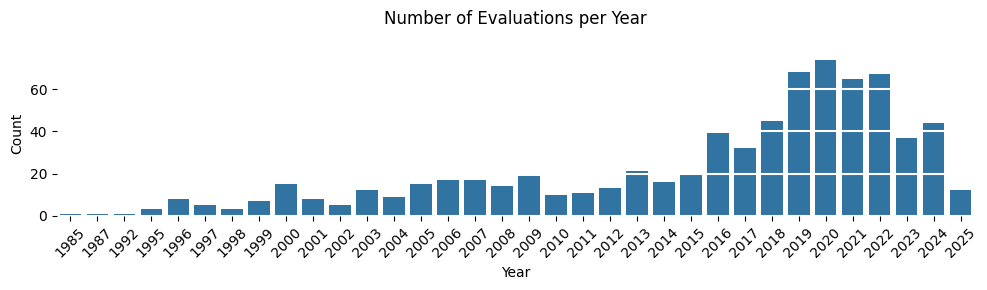
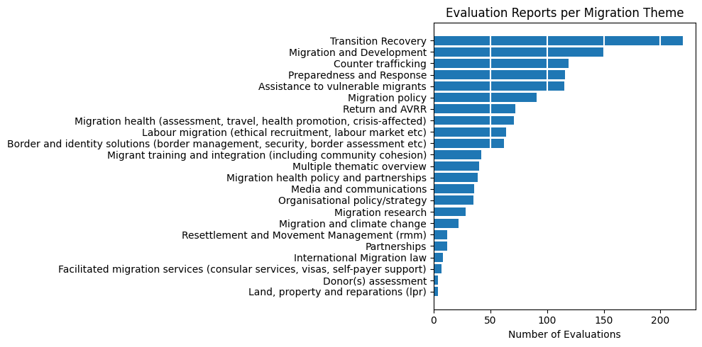
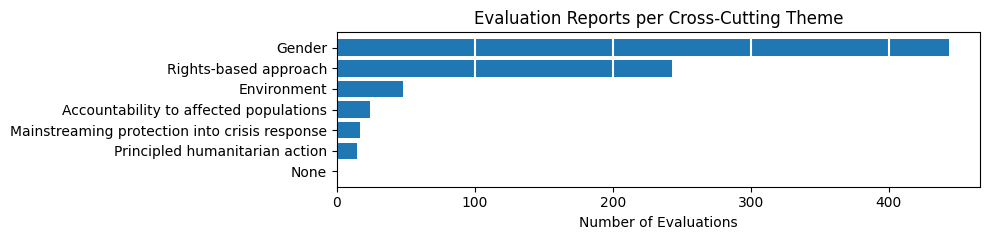

# IOM Reports Exploration

<!-- WARNING: THIS FILE WAS AUTOGENERATED! DO NOT EDIT! -->

## 1. Introduction

This exploratory analysis examines the metadata from IOM’s evaluation
repository as a preliminary step before mapping reports to strategic
frameworks like the Strategic Results Framework (SRF) and Global Compact
for Migration (GCM).

This EDA (Exploratory Data Analysis) helps us understand the structure,
coverage, and characteristics of available evaluation reports before
using the `iomeval` package to create evidence maps that tag reports
against framework components. These maps will serve as knowledge
management tools, making it easier to identify relevant sources, spot
coverage gaps, and determine where synthesis reports would be valuable.

The repository includes various document types, from full evaluation
reports to management responses and annexes.

## 2. Repository Overview

### 2.1 Document Types

    Evaluation report                    745
    Evaluation brief                     284
    Annexes                              198
    Management response                  160
    Special related reports/documents     60
    Evaluation summary                    49
    External evaluation report             2
    nan                                    1
    Internal evaluation report             1
    Name: count, dtype: int64

### 2.2 Evaluation Levels

Distribution (%) of evaluations by organizational scope (project,
country, regional, thematic, strategic).

    Decentralized    85.7
    Centralized      11.6
    Other             2.7
    Name: proportion, dtype: float64

### 2.3 Evaluation Scope

    Programme/Project    664
    Thematic              57
    Strategy              30
    Synthesis             12
    Policy                10
    Name: count, dtype: int64

## 3. Temporal Trends

### 3.1 Publication Timeline

The repository contains evaluations spanning from 1985 to 2025, with
notable variation in publication volume over time.

## 4. Thematic Analysis

Evaluations span 20+ migration themes, with Transition Recovery and
Migration and Development being the most frequently assessed areas.

### 4.1 Primary Migration Themes

### 4.2 Subtheme breakdowns

### 4.3 Cross-Cutting Themes

## 5. Geographic Coverage

### 5.1 Country Coverage

Evaluations cover 150+ countries, with Colombia, Ethiopia, and
multi-country (‘Worldwide’) studies being most common.

