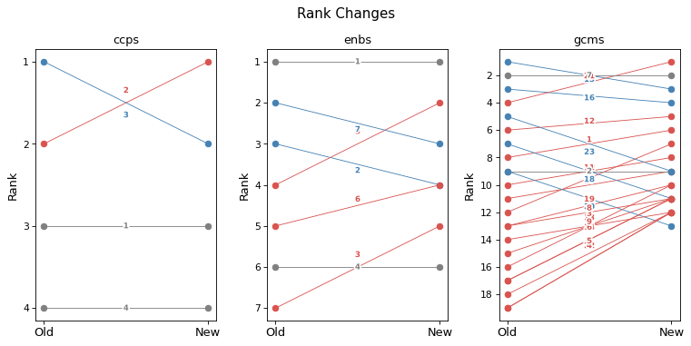
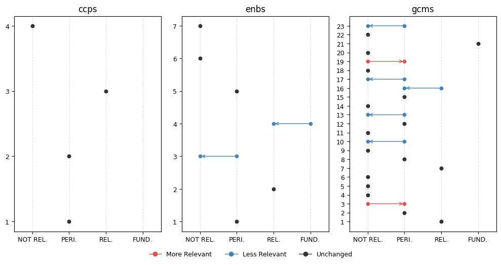
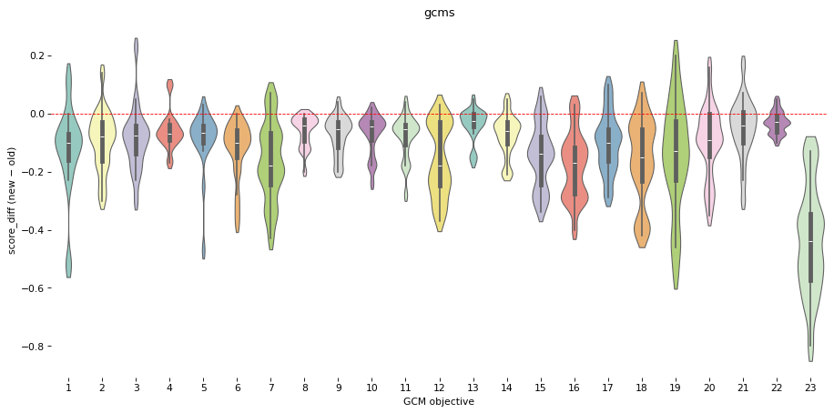
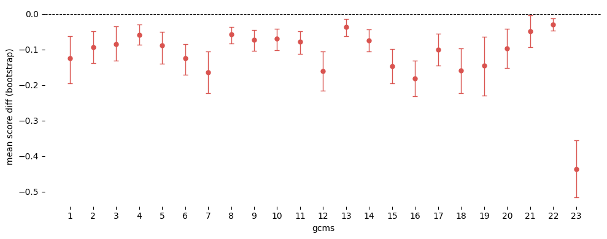
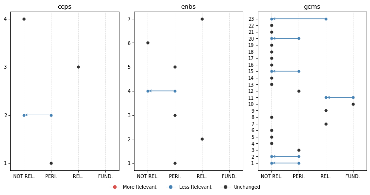

# Changes


<!-- WARNING: THIS FILE WAS AUTOGENERATED! DO NOT EDIT! -->

The mappings of a report change when the prompts, the model or the
pipeline change. This module compares the results saved before and after
such a change, report by report and theme by theme. It computes score
and rank differences, tests them across reports, plots them, and writes
comparison cells into a SolveIt dialog for domain experts to review.

## Setup

``` python
ROOT_PATH = Path.home() / 'iomeval'
DATA_PATH = ROOT_PATH / 'data'
RESULTS_PATH = DATA_PATH/ 'results'
EVALS_PATH = ROOT_PATH / 'nbs/files/test/evaluations.json'

# Contains latest backed up data before new deployment
LATEST_TAG_PATH = Path.home() / 'tagapp/backups/20260311_115159/data'

evals = load_evals(EVALS_PATH)
```

``` python
# Reports requested by IOM CED evaluators for assessment
lut = (Path().home() / 'iomeval/data/requester_by_report_id.json').read_json()
evls_test = L(lut.keys())
evls_test[:2]
```

    ['4341695461234eee3deb51ac68871109', '6c3c2cf3fa479112967612b0baddab72']

``` python
# To be used for usage examples below
evl = evls_test[0]; evl
```

    '4341695461234eee3deb51ac68871109'

## Utils

------------------------------------------------------------------------

<a
href="https://github.com/franckalbinet/iomeval/blob/main/iomeval/llm_eval/changes.py#L31"
target="_blank" style="float:right; font-size:smaller">source</a>

### get_deployed_ids

``` python
def get_deployed_ids(
    dir:pathlib.Path, # source directory
):
```

*List of report IDs currently deployed (from tagapp backup)*

``` python
get_deployed_ids(LATEST_TAG_PATH)[:2]
```

    ['8dd2261100ff5d714e73b411eed043d5', '1d7e6d2d445145d1d350b48b72b36681']

------------------------------------------------------------------------

<a
href="https://github.com/franckalbinet/iomeval/blob/main/iomeval/llm_eval/changes.py#L38"
target="_blank" style="float:right; font-size:smaller">source</a>

### load_result

``` python
def load_result(
    eval_id:str, # evaluation report id
    dir:pathlib.Path, # path to directory containing results `.json` files
):
```

*Load a result JSON by eval_id from base_path*

For instance:

``` python
r = load_result('8dd2261100ff5d714e73b411eed043d5', RESULTS_PATH);
print(r.keys()), print(r['mappings'].keys());
```

    dict_keys(['id', 'report_url', 'meta', 'docs', 'curation_status', 'selected_headings', 'mappings', 'timestamp'])
    dict_keys(['enbs', 'ccps', 'gcms', 'outs'])

------------------------------------------------------------------------

<a
href="https://github.com/franckalbinet/iomeval/blob/main/iomeval/llm_eval/changes.py#L47"
target="_blank" style="float:right; font-size:smaller">source</a>

### is_remapped

``` python
def is_remapped(
    eval_id, # evaluation report id
    dir_new, # path to current results
    dir_old, # path to backup results
):
```

*Check if report mappings differ between current results and deployed
backup*

For instance:

``` python
is_remapped('8dd2261100ff5d714e73b411eed043d5', DATA_PATH/'results', LATEST_TAG_PATH)
```

    True

------------------------------------------------------------------------

<a
href="https://github.com/franckalbinet/iomeval/blob/main/iomeval/llm_eval/changes.py#L58"
target="_blank" style="float:right; font-size:smaller">source</a>

### info_evl

``` python
def info_evl(
    evl_id, # Evaluation ID
):
```

*Find the evaluation `evl_id` in the notebook’s `evals`*

``` python
info_evl('0d4309b702e00faac631be8d609934ce')
```

### Fifth Evaluation of the IOM Development Fund

**Year:** 2025 | **Organization:** IOM | **Countries:** Worldwide

**Documents:** 5 available\
**ID:** `0d4309b702e00faac631be8d609934ce`

## Data processing

------------------------------------------------------------------------

<a
href="https://github.com/franckalbinet/iomeval/blob/main/iomeval/llm_eval/changes.py#L65"
target="_blank" style="float:right; font-size:smaller">source</a>

### mappings2df

``` python
def mappings2df(
    evl_id:str, # evaluation ID
    data_path:pathlib.Path, # path to results data
)->pandas.DataFrame: # one row per (mapping_type, theme)
```

*Flatten a result’s mappings into a DataFrame.*

For instance:

``` python
print(mappings2df(evl, RESULTS_PATH).head())
```

      mapping_type theme_id              theme_title  score
    0         enbs        1                Workforce   0.42
    1         enbs        2              Partnership   0.72
    2         enbs        3                  Funding   0.38
    3         enbs        4        Data and evidence   0.18
    4         enbs        5  Learning and Innovation   0.45

------------------------------------------------------------------------

<a
href="https://github.com/franckalbinet/iomeval/blob/main/iomeval/llm_eval/changes.py#L76"
target="_blank" style="float:right; font-size:smaller">source</a>

### delta_df

``` python
def delta_df(
    evl_id:str, # evaluation ID
    new_path:pathlib.Path, # path to new results
    old_path:pathlib.Path, # path to old results
)->pandas.DataFrame: # merged DataFrame with score_old/score_new
```

*Compare old and new mappings for a report.*

For instance:

``` python
print(delta_df(evl, RESULTS_PATH, LATEST_TAG_PATH).head())
```

      mapping_type theme_id                               theme_title_x  \
    0         ccps        1  Integrity, Transparency and Accountability   
    1         ccps        2             Equality, Diversity & Inclusion   
    2         ccps        3                          Protection-centred   
    3         ccps        4                Environmental Sustainability   
    4         enbs        1                                   Workforce   

       score_old                               theme_title_y  score_new  
    0       0.48  Integrity, Transparency and Accountability       0.52  
    1       0.38             Equality, Diversity & Inclusion       0.30  
    2       0.72                          Protection-centred       0.66  
    3       0.12                Environmental Sustainability       0.05  
    4       0.48                                   Workforce       0.42  

``` python
delta_df(evl, RESULTS_PATH, LATEST_TAG_PATH).query("mapping_type=='gcms' and theme_id=='23'")
```

<div>
<style scoped>
    .dataframe tbody tr th:only-of-type {
        vertical-align: middle;
    }
&#10;    .dataframe tbody tr th {
        vertical-align: top;
    }
&#10;    .dataframe thead th {
        text-align: right;
    }
</style>

<table class="dataframe" data-quarto-postprocess="true" data-border="1">
<thead>
<tr style="text-align: right;">
<th data-quarto-table-cell-role="th"></th>
<th data-quarto-table-cell-role="th">mapping_type</th>
<th data-quarto-table-cell-role="th">theme_id</th>
<th data-quarto-table-cell-role="th">theme_title_x</th>
<th data-quarto-table-cell-role="th">score_old</th>
<th data-quarto-table-cell-role="th">theme_title_y</th>
<th data-quarto-table-cell-role="th">score_new</th>
</tr>
</thead>
<tbody>
<tr>
<td data-quarto-table-cell-role="th">26</td>
<td>gcms</td>
<td>23</td>
<td>Strengthen International Cooperation And Global Partnerships For
Safe, Orderly And Regular Migration</td>
<td>0.72</td>
<td>Strengthen international cooperation and global partnerships for
safe, orderly and regular migration</td>
<td>0.2</td>
</tr>
</tbody>
</table>

</div>

### Transforms

------------------------------------------------------------------------

<a
href="https://github.com/franckalbinet/iomeval/blob/main/iomeval/llm_eval/changes.py#L87"
target="_blank" style="float:right; font-size:smaller">source</a>

### add_diffs

``` python
def add_diffs(
    df:pandas.DataFrame, # dataframe to transform
):
```

*Add score_diff and new/dropped flags to a comparison DataFrame*

------------------------------------------------------------------------

<a
href="https://github.com/franckalbinet/iomeval/blob/main/iomeval/llm_eval/changes.py#L94"
target="_blank" style="float:right; font-size:smaller">source</a>

### add_ranks

``` python
def add_ranks(
    df:pandas.DataFrame, # dataframe to transform
):
```

*Add old/new ranks (within each mapping_type, descending score) and
rank_diff*

------------------------------------------------------------------------

<a
href="https://github.com/franckalbinet/iomeval/blob/main/iomeval/llm_eval/changes.py#L105"
target="_blank" style="float:right; font-size:smaller">source</a>

### add_pct_change

``` python
def add_pct_change(
    df, # dataframe to transform
    min_score:float=0.05, # minimum score to consider for pct change calculations
):
```

*Add percentage change, treating old scores below min_score as NaN to
avoid division noise*

For instance:

``` python
df = delta_df(evl, RESULTS_PATH, LATEST_TAG_PATH).pipe(add_diffs).pipe(add_ranks).pipe(add_pct_change)
```

``` python
df.head()
```

<div>
<style scoped>
    .dataframe tbody tr th:only-of-type {
        vertical-align: middle;
    }
&#10;    .dataframe tbody tr th {
        vertical-align: top;
    }
&#10;    .dataframe thead th {
        text-align: right;
    }
</style>

<table class="dataframe" data-quarto-postprocess="true" data-border="1">
<thead>
<tr style="text-align: right;">
<th data-quarto-table-cell-role="th"></th>
<th data-quarto-table-cell-role="th">mapping_type</th>
<th data-quarto-table-cell-role="th">theme_id</th>
<th data-quarto-table-cell-role="th">theme_title_x</th>
<th data-quarto-table-cell-role="th">score_old</th>
<th data-quarto-table-cell-role="th">theme_title_y</th>
<th data-quarto-table-cell-role="th">score_new</th>
<th data-quarto-table-cell-role="th">score_diff</th>
<th data-quarto-table-cell-role="th">is_new</th>
<th data-quarto-table-cell-role="th">is_dropped</th>
<th data-quarto-table-cell-role="th">rank_old</th>
<th data-quarto-table-cell-role="th">rank_new</th>
<th data-quarto-table-cell-role="th">rank_diff</th>
<th data-quarto-table-cell-role="th">pct_change</th>
</tr>
</thead>
<tbody>
<tr>
<td data-quarto-table-cell-role="th">0</td>
<td>ccps</td>
<td>1</td>
<td>Integrity, Transparency and Accountability</td>
<td>0.48</td>
<td>Integrity, Transparency and Accountability</td>
<td>0.52</td>
<td>0.04</td>
<td>False</td>
<td>False</td>
<td>2</td>
<td>2</td>
<td>0</td>
<td>8.333333</td>
</tr>
<tr>
<td data-quarto-table-cell-role="th">1</td>
<td>ccps</td>
<td>2</td>
<td>Equality, Diversity &amp; Inclusion</td>
<td>0.38</td>
<td>Equality, Diversity &amp; Inclusion</td>
<td>0.30</td>
<td>-0.08</td>
<td>False</td>
<td>False</td>
<td>3</td>
<td>3</td>
<td>0</td>
<td>-21.052632</td>
</tr>
<tr>
<td data-quarto-table-cell-role="th">2</td>
<td>ccps</td>
<td>3</td>
<td>Protection-centred</td>
<td>0.72</td>
<td>Protection-centred</td>
<td>0.66</td>
<td>-0.06</td>
<td>False</td>
<td>False</td>
<td>1</td>
<td>1</td>
<td>0</td>
<td>-8.333333</td>
</tr>
<tr>
<td data-quarto-table-cell-role="th">3</td>
<td>ccps</td>
<td>4</td>
<td>Environmental Sustainability</td>
<td>0.12</td>
<td>Environmental Sustainability</td>
<td>0.05</td>
<td>-0.07</td>
<td>False</td>
<td>False</td>
<td>4</td>
<td>4</td>
<td>0</td>
<td>-58.333333</td>
</tr>
<tr>
<td data-quarto-table-cell-role="th">4</td>
<td>enbs</td>
<td>1</td>
<td>Workforce</td>
<td>0.48</td>
<td>Workforce</td>
<td>0.42</td>
<td>-0.06</td>
<td>False</td>
<td>False</td>
<td>4</td>
<td>4</td>
<td>0</td>
<td>-12.500000</td>
</tr>
</tbody>
</table>

</div>

``` python
df.sort_values('score_diff', key=abs, ascending=False).head(5)
```

<div>
<style scoped>
    .dataframe tbody tr th:only-of-type {
        vertical-align: middle;
    }
&#10;    .dataframe tbody tr th {
        vertical-align: top;
    }
&#10;    .dataframe thead th {
        text-align: right;
    }
</style>

<table class="dataframe" data-quarto-postprocess="true" data-border="1">
<thead>
<tr style="text-align: right;">
<th data-quarto-table-cell-role="th"></th>
<th data-quarto-table-cell-role="th">mapping_type</th>
<th data-quarto-table-cell-role="th">theme_id</th>
<th data-quarto-table-cell-role="th">theme_title_x</th>
<th data-quarto-table-cell-role="th">score_old</th>
<th data-quarto-table-cell-role="th">theme_title_y</th>
<th data-quarto-table-cell-role="th">score_new</th>
<th data-quarto-table-cell-role="th">score_diff</th>
<th data-quarto-table-cell-role="th">is_new</th>
<th data-quarto-table-cell-role="th">is_dropped</th>
<th data-quarto-table-cell-role="th">rank_old</th>
<th data-quarto-table-cell-role="th">rank_new</th>
<th data-quarto-table-cell-role="th">rank_diff</th>
<th data-quarto-table-cell-role="th">pct_change</th>
</tr>
</thead>
<tbody>
<tr>
<td data-quarto-table-cell-role="th">26</td>
<td>gcms</td>
<td>23</td>
<td>Strengthen International Cooperation And Global Partnerships For
Safe, Orderly And Regular Migration</td>
<td>0.72</td>
<td>Strengthen international cooperation and global partnerships for
safe, orderly and regular migration</td>
<td>0.20</td>
<td>-0.52</td>
<td>False</td>
<td>False</td>
<td>5</td>
<td>11</td>
<td>-6</td>
<td>-72.222222</td>
</tr>
<tr>
<td data-quarto-table-cell-role="th">23</td>
<td>gcms</td>
<td>20</td>
<td>Minimize the adverse drivers and structural factors that compel
people to leave their country of origin</td>
<td>0.35</td>
<td>Promote faster, safer and cheaper transfer of remittances and foster
financial inclusion of migrants</td>
<td>0.05</td>
<td>-0.30</td>
<td>False</td>
<td>False</td>
<td>10</td>
<td>16</td>
<td>-6</td>
<td>-85.714286</td>
</tr>
<tr>
<td data-quarto-table-cell-role="th">7</td>
<td>enbs</td>
<td>4</td>
<td>Data and evidence</td>
<td>0.38</td>
<td>Data and evidence</td>
<td>0.18</td>
<td>-0.20</td>
<td>False</td>
<td>False</td>
<td>6</td>
<td>6</td>
<td>0</td>
<td>-52.631579</td>
</tr>
<tr>
<td data-quarto-table-cell-role="th">6</td>
<td>enbs</td>
<td>3</td>
<td>Funding</td>
<td>0.55</td>
<td>Funding</td>
<td>0.38</td>
<td>-0.17</td>
<td>False</td>
<td>False</td>
<td>3</td>
<td>5</td>
<td>-2</td>
<td>-30.909091</td>
</tr>
<tr>
<td data-quarto-table-cell-role="th">27</td>
<td>gcms</td>
<td>3</td>
<td>Provide accurate and timely information at all stages of
migration</td>
<td>0.52</td>
<td>Provide accurate and timely information at all stages of
migration</td>
<td>0.35</td>
<td>-0.17</td>
<td>False</td>
<td>False</td>
<td>7</td>
<td>6</td>
<td>1</td>
<td>-32.692308</td>
</tr>
</tbody>
</table>

</div>

### All evaluations processed

------------------------------------------------------------------------

<a
href="https://github.com/franckalbinet/iomeval/blob/main/iomeval/llm_eval/changes.py#L114"
target="_blank" style="float:right; font-size:smaller">source</a>

### all_deltas

``` python
def all_deltas(
    evl_ids:list, # evaluation IDs to compare
    dir_new:pathlib.Path, # path to new results
    dir_old:pathlib.Path, # path to old results
)->pandas.DataFrame: # combined DataFrame across all reports
```

*Build a combined comparison DataFrame for multiple reports.*

For instance:

``` python
dfs = all_deltas(evls_test, RESULTS_PATH, LATEST_TAG_PATH)
```

``` python
dfs.iloc[0]
```

    mapping_type                                           ccps
    theme_id                                                  1
    theme_title_x    Integrity, Transparency and Accountability
    score_old                                              0.48
    theme_title_y    Integrity, Transparency and Accountability
    score_new                                              0.52
    score_diff                                             0.04
    is_new                                                False
    is_dropped                                            False
    rank_old                                                  2
    rank_new                                                  2
    rank_diff                                                 0
    pct_change                                         8.333333
    evl_id                     4341695461234eee3deb51ac68871109
    Name: 0, dtype: object

``` python
print(dfs[dfs.evl_id == '760568a15e144bcfb88dbbd50247dc51'][['mapping_type', 'theme_id', 'rank_old', 'rank_new', 'rank_diff']].query('mapping_type == "gcms"').head(14))
```

        mapping_type theme_id  rank_old  rank_new  rank_diff
    533         gcms        1        14        13          1
    534         gcms       10        16        14          2
    535         gcms       11        17        18         -1
    536         gcms       12        15        17         -2
    537         gcms       13        21        20          1
    538         gcms       14        18        16          2
    539         gcms       15         8        10         -2
    540         gcms       16         1         3         -2
    541         gcms       17         9         6          3
    542         gcms       18         6         4          2
    543         gcms       19         3         1          2
    544         gcms        2        13        12          1
    545         gcms       20        13         8          5
    546         gcms       21        12        15         -3

------------------------------------------------------------------------

<a
href="https://github.com/franckalbinet/iomeval/blob/main/iomeval/llm_eval/changes.py#L125"
target="_blank" style="float:right; font-size:smaller">source</a>

### theme_stats

``` python
def theme_stats(
    dfs, # pandas dataframe with columns ['mapping_type', 'theme_id', 'score_diff']
    ci:tuple=(2.5, 97.5), # confidence interval percentiles
    n:int=10000, # number of bootstrap samples
):
```

*Bootstrap CI and Wilcoxon test for each (mapping_type, theme_id)*

``` python
print(theme_stats(dfs).head())
```

      mapping_type theme_id      mean  ci_low  ci_high  stat    pvalue
    0         ccps        1 -0.023103 -0.0630   0.0160  66.5  0.407254
    1         ccps        2 -0.024734 -0.0820   0.0330  69.5  0.304564
    2         ccps        3 -0.028679 -0.0775   0.0215  75.5  0.270259
    3         ccps        4 -0.093091 -0.1310  -0.0625   0.0  0.000115
    4         enbs        1 -0.034491 -0.0880   0.0220  49.0  0.192736

## Visualization

### Per eval

------------------------------------------------------------------------

<a
href="https://github.com/franckalbinet/iomeval/blob/main/iomeval/llm_eval/changes.py#L141"
target="_blank" style="float:right; font-size:smaller">source</a>

### plot_score_diffs_bar

``` python
def plot_score_diffs_bar(
    df:pandas.DataFrame, # Deltas from `all_deltas`, for one report
):
```

*Bar chart of score diffs (new - old) per theme, coloured by direction,
one panel per mapping type*

For instance:

``` python
plot_score_diffs_bar(dfs[dfs.evl_id == '0d4309b702e00faac631be8d609934ce'])
```


------------------------------------------------------------------------

<a
href="https://github.com/franckalbinet/iomeval/blob/main/iomeval/llm_eval/changes.py#L154"
target="_blank" style="float:right; font-size:smaller">source</a>

### plot_rank_changes

``` python
def plot_rank_changes(
    df:pandas.DataFrame, # Deltas from `all_deltas`, for one report
    ignore:str | list='outs', # Mapping types to leave out, such as `'outs'` or `['outs', 'ccps']`
    **kwargs
):
```

*Slope chart of rank changes (old -\> new) per mapping type, coloured by
direction*

For instance:

``` python
plot_rank_changes(dfs[dfs.evl_id == '22cac1c000836253adc445993e101560'], ignore='outs', figsize=(10, 5), dpi=77)
```



------------------------------------------------------------------------

<a
href="https://github.com/franckalbinet/iomeval/blob/main/iomeval/llm_eval/changes.py#L185"
target="_blank" style="float:right; font-size:smaller">source</a>

### score_band

``` python
def score_band(
    score, # Relevance score, from 0 to 1
)->str: # `'FUNDAMENTAL'`, `'RELEVANT'`, `'PERIPHERAL'` or `'NOT RELEVANT'`
```

*Name the band of `score`*

------------------------------------------------------------------------

<a
href="https://github.com/franckalbinet/iomeval/blob/main/iomeval/llm_eval/changes.py#L195"
target="_blank" style="float:right; font-size:smaller">source</a>

### is_fundamental

``` python
def is_fundamental(
    score, # Relevance score, from 0 to 1
):
```

*Check whether `score` is in the FUNDAMENTAL band*

[`score_band`](https://franckalbinet.github.io/iomeval/llm_eval/changes.html#score_band)
names the band of a score. The bands match the score ranges in the
mapping prompts: FUNDAMENTAL from 0.84, RELEVANT from 0.66, PERIPHERAL
from 0.34, and NOT RELEVANT below.

------------------------------------------------------------------------

<a
href="https://github.com/franckalbinet/iomeval/blob/main/iomeval/llm_eval/changes.py#L205"
target="_blank" style="float:right; font-size:smaller">source</a>

### plot_band_changes

``` python
def plot_band_changes(
    df, # Deltas from `all_deltas`
    evl_id:NoneType=None, # Report to plot; `None` plots every row of `df`
    ignore:str='outs', # Mapping types to leave out
    **kwargs
):
```

*Dot-arrow plot of score band changes (old -\> new) per theme, one panel
per mapping type*

``` python
plot_band_changes(dfs, evl_id='49d2fba781b6a7c0d94577479636ee6f', figsize=(10, 5))
```



### All

------------------------------------------------------------------------

<a
href="https://github.com/franckalbinet/iomeval/blob/main/iomeval/llm_eval/changes.py#L242"
target="_blank" style="float:right; font-size:smaller">source</a>

### plot_score_diffs

``` python
def plot_score_diffs(
    dfs:pandas.DataFrame, # Deltas from `all_deltas`
    mapping_type, # Mapping type with integer theme IDs, such as `'gcms'`
    xlabel:str='Theme', # x-axis label
    col:str='score_diff', # Column to plot
    **kwargs
):
```

*Violin plot of score diffs (new - old) per theme, for one mapping type*

For instance:

``` python
plot_score_diffs(dfs, 'gcms', 'GCM objective', figsize=(12, 6), dpi=77)
```



------------------------------------------------------------------------

<a
href="https://github.com/franckalbinet/iomeval/blob/main/iomeval/llm_eval/changes.py#L261"
target="_blank" style="float:right; font-size:smaller">source</a>

### plot_theme_stats

``` python
def plot_theme_stats(
    ts, # theme stats dataframe
    mapping_type, # mapping type to plot
    alpha:float=0.05, # alpha threshold for significance
    show_pval:bool=False, # whether to show p-values
    **kwargs
):
```

*Forest plot of bootstrap CIs per theme for a given mapping type,
annotated with p-value*

``` python
df_stats = theme_stats(dfs)
```

``` python
plot_theme_stats(df_stats, 'gcms', figsize=(10, 4))
```



## Reporting

The reporting functions write a comparison of one report’s old and new
mappings into a SolveIt dialog, for domain experts to review. They focus
on the fundamental themes, which score at least `FUNDAMENTAL` (0.84).
They show the old and new reasoning of each such theme side by side.

------------------------------------------------------------------------

<a
href="https://github.com/franckalbinet/iomeval/blob/main/iomeval/llm_eval/changes.py#L285"
target="_blank" style="float:right; font-size:smaller">source</a>

### get_theme

``` python
def get_theme(
    result:dict, # loaded .json tagging result
    mapping_type, # 'gcms', 'enbs', 'ccps', 'outs'
    theme_id:str, # theme ID
):
```

*Get a single theme dict from a result by mapping_type and theme_id*

For instance:

``` python
old_r,new_r = load_result(evl, LATEST_TAG_PATH), load_result(evl, RESULTS_PATH)
get_theme(new_r, 'gcms', '1')
```

    {'theme_id': '1',
     'theme_title': 'Collect and utilize accurate and disaggregated data as a basis for evidence-based policies',
     'relevance_score': 0.3,
     'reasoning': 'The excerpts contain limited but tangible references to data and information systems. The Migration Information and Data Analysis System (MIDAS) is mentioned as a specific activity under BMM Phase III, and digital data platforms (GIZ data platform and IOM SharePoint) are noted as improving monitoring and coordination. However, these references are brief and appear as examples within broader discussions of programme activities rather than as subjects of dedicated analysis. There is no substantive examination of data collection methodologies, disaggregation, or evidence-based policymaking processes that would align with the core actions under Objective 1. A synthesis specialist might note the MIDAS reference as a peripheral data point, but the report does not appear to offer meaningful evidence on this objective based on the excerpts reviewed.'}

------------------------------------------------------------------------

<a
href="https://github.com/franckalbinet/iomeval/blob/main/iomeval/llm_eval/changes.py#L294"
target="_blank" style="float:right; font-size:smaller">source</a>

### theme_md

``` python
def theme_md(
    mapping_type:str, # `'gcms'`, `'enbs'`, `'ccps'` or `'outs'`
    theme_id:str, # Theme ID
    old_r:dict, # Old result, from `load_result`
    new_r:dict, # New result, from `load_result`
    row:pandas.Series, # The theme's row in the deltas
):
```

*Render one theme’s old and new scores, ranks and reasoning as Markdown*

[`theme_md`](https://franckalbinet.github.io/iomeval/llm_eval/changes.html#theme_md)
shows the old and new scores and ranks of a theme in a table, and its
old and new reasoning in collapsible blocks. For instance:

``` python
row = dfs[dfs.evl_id == evl].iloc[0]
print(theme_md(row.mapping_type, row.theme_id, old_r, new_r, row))
```

    #### CCPS 1: Integrity, Transparency and Accountability

    | score_old | score_new | rank_old | rank_new | rank_diff |
    |---|---|---|---|---|
    | 0.48 | 0.52 | 2 | 2 | 0 |

    <details><summary>Reasoning (old)</summary>This report contains some content that touches peripherally on accountability and transparency themes, but these are not primary evaluation foci. The evaluation examines IOM's coordination, reporting mechanisms, and monitoring systems within the BMM programme context. Findings note that 'reporting mechanisms were well-structured' and 'IOM's structured monitoring and reporting systems ensured accountability and adaptive management.' The report also discusses efficiency in coordination and financial management. However, integrity, transparency, and accountability are not evaluated as distinct institutional commitments—they appear as operational attributes when assessing programme efficiency. There is no dedicated analysis of IOM's accountability frameworks, transparency practices, or integrity systems. A synthesis specialist might note the brief mentions of monitoring and reporting effectiveness, but the analytical depth on accountability as an institutional priority is limited. The report's focus is on programme effectiveness, relevance, and sustainability rather than IOM's organizational accountability mechanisms.</details>

    ---

    <details><summary>Reasoning (new)</summary>The excerpts reviewed contain some content that may have marginal relevance for a synthesis on Cross-cutting Priority 1 (Integrity, Transparency and Accountability). The evaluation discusses monitoring and reporting systems, noting that 'reporting mechanisms were well-structured and described as straightforward and manageable by staff,' and that IOM's 'structured monitoring and reporting systems ensured accountability and adaptive management.' Recommendation 4 addresses procurement and financial coordination, touching on transparency in processes and proactive communication of timelines with stakeholders. There are also references to the need for clearer roles and responsibilities, and to improving contingency planning — all of which peripherally relate to accountability practices. However, based on what the excerpts reveal, integrity, transparency, and accountability mechanisms do not appear to be analyzed as distinct institutional commitment themes; they surface as contextual elements within broader discussions of efficiency and programme management. No dedicated findings on IOM's integrity frameworks, whistleblowing mechanisms, or organizational accountability culture are visible in the excerpts. A synthesis specialist might note the brief discussion of monitoring and reporting approaches and the procurement-related recommendations, but would likely prioritize sources with more substantive treatment of this institutional commitment area. It is possible the full report contains more on this topic than the excerpts suggest, but this cannot be assumed.</details>

------------------------------------------------------------------------

<a
href="https://github.com/franckalbinet/iomeval/blob/main/iomeval/llm_eval/changes.py#L316"
target="_blank" style="float:right; font-size:smaller">source</a>

### fundamental_transitions

``` python
def fundamental_transitions(
    df:pandas.DataFrame, # deltas DataFrame for a single report
    exclude_types, # mapping types to exclude
):
```

*Rows where fundamental status changed between old and new score.*

------------------------------------------------------------------------

<a
href="https://github.com/franckalbinet/iomeval/blob/main/iomeval/llm_eval/changes.py#L327"
target="_blank" style="float:right; font-size:smaller">source</a>

### add_theme_cells

``` python
async def add_theme_cells(
    mid, # ID of the dialog message to add after
    label, # Heading for the group of themes
    rows, # `(mapping_type, theme_id, row)` tuples, one per theme
    old_r, # Old result, from `load_result`
    new_r, # New result, from `load_result`
)->str: # ID of the last message added
```

*Add a heading, then one
[`theme_md`](https://franckalbinet.github.io/iomeval/llm_eval/changes.html#theme_md)
cell per theme, to the dialog*

------------------------------------------------------------------------

<a
href="https://github.com/franckalbinet/iomeval/blob/main/iomeval/llm_eval/changes.py#L340"
target="_blank" style="float:right; font-size:smaller">source</a>

### fundamental_themes

``` python
def fundamental_themes(
    df, # Deltas for one report
    score_col, # `'score_old'` or `'score_new'`
    exclude_types, # Mapping types to leave out
)->list: # `(mapping_type, theme_id, theme_title)` tuples
```

*List the themes whose `score_col` is in the FUNDAMENTAL band*

------------------------------------------------------------------------

<a
href="https://github.com/franckalbinet/iomeval/blob/main/iomeval/llm_eval/changes.py#L350"
target="_blank" style="float:right; font-size:smaller">source</a>

### add_fundamental_summary

``` python
async def add_fundamental_summary(
    mid, # ID of the dialog message to add after
    df, # Deltas for one report
    exclude_types, # Mapping types to leave out
    old_r, # Old result, from `load_result`
    new_r, # New result, from `load_result`
)->str: # ID of the message added
```

*Add a table of the fundamental themes, old and new, to the dialog*

------------------------------------------------------------------------

<a
href="https://github.com/franckalbinet/iomeval/blob/main/iomeval/llm_eval/changes.py#L366"
target="_blank" style="float:right; font-size:smaller">source</a>

### gen_report_cells

``` python
async def gen_report_cells(
    rpt_id, # Report ID
    dfs, # Deltas of every report, from `all_deltas`
    old_results_path, # Folder of the old results
    new_results_path, # Folder of the new results
    exclude_types:tuple=('outs',), # Mapping types to leave out
    plot_kwargs:NoneType=None, # Passed to `plot_band_changes`, such as `figsize`
):
```

*Add cells to the current dialog that compare the old and new mappings
of report `rpt_id`*

[`gen_report_cells`](https://franckalbinet.github.io/iomeval/llm_eval/changes.html#gen_report_cells)
adds a comparison of one report to the current
[SolveIt](https://solve.it.com) dialog. It adds the report title, then a
code cell that plots the band changes with
[`plot_band_changes`](https://franckalbinet.github.io/iomeval/llm_eval/changes.html#plot_band_changes),
without running it. It then adds a table of the fundamental themes, old
and new. Last, it adds a comparison cell for each theme that stopped or
started being fundamental. It writes the cells with dialoghelper’s
`add_msg`, which needs a SolveIt dialog.

For instance:

``` python
await gen_report_cells(evl, dfs, LATEST_TAG_PATH, RESULTS_PATH)
```

    '_6240cbb5'

### Final External Evaluation: Better Migration Management Programme Phase III

``` python
plot_band_changes(dfs[dfs.evl_id == '4341695461234eee3deb51ac68871109'], figsize=(10, 5), dpi=77)
```



**Fundamental Themes** | | Mapping | Theme | Score | |—|—|—|—| | old |
gcms | 10: Prevent, Combat And Eradicate Trafficking In Persons In The
Context Of International Migration | 0.88 | | old | gcms | 11: Manage
Borders In An Integrated, Secure And Coordinated Manner | 0.85 | | new |
gcms | 10: Prevent, Combat And Eradicate Trafficking In Persons In The
Context Of International Migration | 0.85 |

**⬇️ No Longer Fundamental**

#### GCMS 11: Manage borders in an integrated, secure and coordinated manner

<table>
<thead>
<tr>
<th>score_old</th>
<th>score_new</th>
<th>rank_old</th>
<th>rank_new</th>
<th>rank_diff</th>
</tr>
</thead>
<tbody>
<tr>
<td>0.85</td>
<td>0.82</td>
<td>2</td>
<td>2</td>
<td>0</td>
</tr>
</tbody>
</table>

<details>

<summary>

Reasoning (old)
</summary>

This report would likely be essential evidence for a synthesis on GCM
Objective 11. Component 2 explicitly focuses on ‘strengthening the
capacity of border authorities and immigration services’ and ‘integrated
border governance.’ The report discusses MIDAS border management
systems, Inter-Agency Border Management Committees (IBMCs) in Somalia,
and cross-border cooperation mechanisms. Findings note that IOM
‘strengthened border management’ and ‘enhanced cross-border
cooperation.’ The Ethiopia-Kenya study tour on border management is
highlighted as a best practice. The conflict response in Sudan required
shifting focus to border management in South Sudan. Key sections for
review: Component 2 intervention logic, findings on border management
capacity building, impact section on IBMCs and cross-border cooperation,
Recommendation 6 on strengthening cross-border mechanisms. Directly
relates to Actions 11a (international cooperation on border management),
11b (efficient border procedures), 11e (child protection at borders),
and 11g (cross-border collaboration).
</details>

------------------------------------------------------------------------

<details>

<summary>

Reasoning (new)
</summary>

Based on the excerpts reviewed, this report would likely contribute
substantial evidence to a synthesis on GCM Objective 11. Integrated
border governance is explicitly Component 2 of the BMM programme, and
the excerpts suggest the evaluation examines border management
capacity-building, cross-border cooperation mechanisms, and training of
border officials across multiple countries. The executive summary notes
that IOM ‘met or exceeded most programme targets’ in ‘strengthening
institutional capacities’ and ‘enhanced migration governance,’ with
specific mention of Inter-Agency Border Management Committees (IBMCs) in
Somalia as examples of improved operational coordination. The evaluation
covers border management in Djibouti, Ethiopia, Kenya, Somalia, South
Sudan, Sudan, and Uganda — providing multi-country evidence relevant to
Objective 11’s actions on international cooperation (11a), integrated
border management structures (11b), and cross-border collaboration
(11g). Training of border officials is specifically mentioned as
surpassing targets. Synthesis specialists would likely want to review
the effectiveness sections on border governance outcomes, the findings
on IBMC functionality, and the recommendations on cross-border
cooperation mechanisms. The conflict in Sudan and its effects on border
management in South Sudan also provides evidence on adaptive border
management in fragile contexts.
</details>
