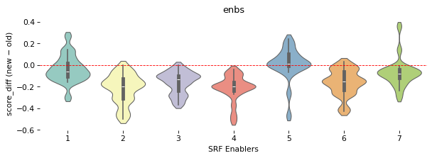
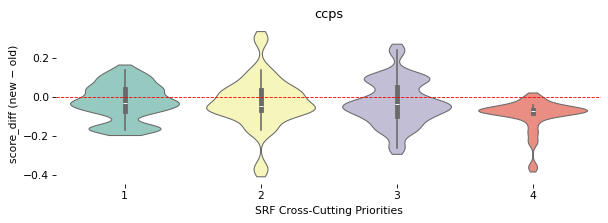
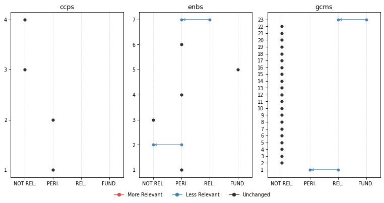
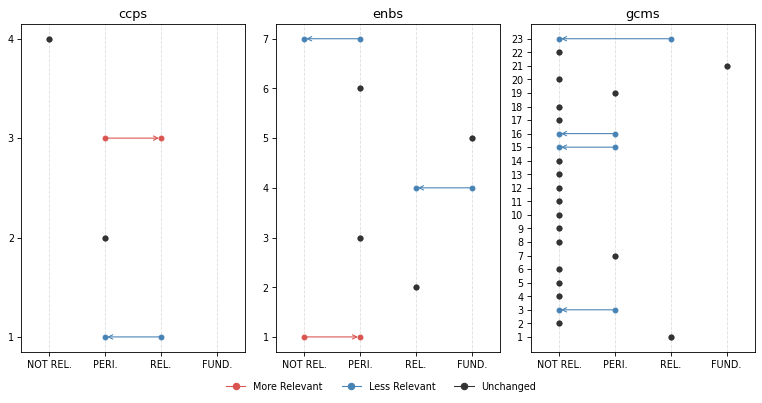
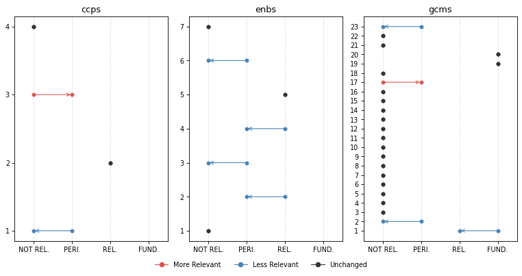
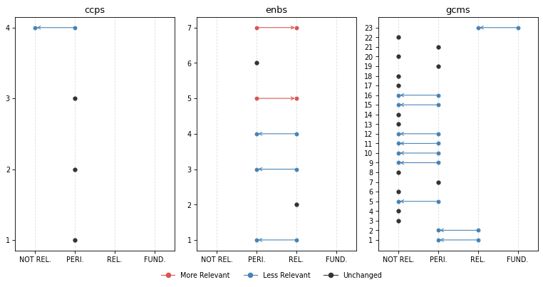
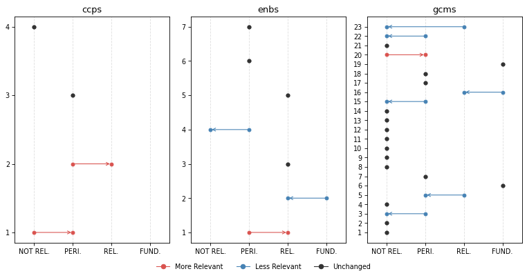

# Change Analysis


<!-- WARNING: THIS FILE WAS AUTOGENERATED! DO NOT EDIT! -->

[Click here](https://iom-tagapp-beta.pla.sh) to access the **IOM TAGGING
(BETA) PLATFORM**

``` python
from iomeval.llm_eval.changes import *

from fastcore.all import *
from iomeval.readers import load_evals
from pathlib import Path
```

``` python
p = Path().home() / 'iomeval/data/requester_by_report_id.json'
lut = p.read_json()
evls_test = L(lut.keys())

ROOT_PATH = Path.home() / 'iomeval'
DATA_PATH = ROOT_PATH / 'data'
RESULTS_PATH = DATA_PATH/ 'results'
EVALS_PATH = ROOT_PATH / 'nbs/files/test/evaluations.json'

# Contains latest backed up data before new deployment
LATEST_TAG_PATH = Path.home() / 'tagapp/backups/20260311_115159/data'

evals = load_evals(EVALS_PATH)
```

``` python
dfs = all_deltas(evls_test, RESULTS_PATH, LATEST_TAG_PATH)
```

``` python
who = set(lut.values())
who
```

    {'Andres', 'Davide', 'elma', 'ljeoma', 'pip', 'rogers'}

``` python
# Automaticall generate changes report cells for all reports
rpts = [k for k,v in lut.items() if v=='Andres']
for rpt in rpts: await gen_report_cells(rpt, dfs, LATEST_TAG_PATH, RESULTS_PATH)
```

## What we have changed?

1.  First of all, we **improved the consistency of what section of an
    evaluation report the model reads**. A “curation” step was added to
    the process in which a human selects the sections of the report that
    are more relevant to the tagging. This step used to be automatic (it
    was based on the “parsing” prompt that you reviewed) but we realized
    that several mistakes were being made by the model (probably because
    of the diversity in formatting and structure of evaluation reports,
    which not always follow a precise template). This is a major change
    with likely general consequences on the tagging. *Feedback from
    testers on which sections of the report should be fed to the model
    was considered*.

Secondly, we made changes to the tagging prompts based on your feedback.
Here are the main modifications (minor ones are not listed here but are
available in the files used for the review):

2.  **Excerpt-based analysis clarification**: Following the point above
    on the new report “curation” step, we asked the model to be explicit
    on the fact that only specific section are accessed (executive
    summary, introduction, background, evaluation scope, conclusions,
    recommendations, lessons learnt) in order not to give a false
    impression that the full report was being fed to the model. Hedged
    language is required throughout (e.g., “the excerpts suggest …”,
    “based on the sections reviewed …”). *This follows up on comments
    from several testers - some asking more precise quotation outputs
    (something not possible at this stage - sorry!). The reasoning now
    is more transparent on the fact that the model is not reading the
    whole report (like a human would do when tagging; remember also that
    in earlier experiments, feeding the whole report to the model was
    inflating scores throughout and making the model unusable)*.

3.  **GCM 23 downgrading**: Added an important note on GCM Objective 23
    clarifying its revised scoring treatment. *This follows up on
    feedback from different testers suggesting that relevance with
    respect to this objective may have been exaggerated by the model*.

4.  **SRF enablers reframing**: Introduced a critical distinction
    between enablers as institutional capacity versus programmatic
    tools. *This follows up on a point raised by Pip*.

5.  **Relevance score range relabelling**: Tags now use “Not Relevant”,
    “Peripheral” (formerly “Supplementary”), “Relevant”, and
    “Fundamental”. *This follows up on suggestion from Andres*.

6.  **Terminology warning on “Findings”** — Analysts must not use
    “finding(s)” in their own analytical language, as this term carries
    a specific formal meaning in IOM evaluation reports. It may only be
    referenced when it appears in report excerpts themselves. *This
    clarification stems from Andres flagging overly broad or imprecise
    uses of “findings” generated by the LLM*.

7.  **GCM descriptions added**: The description of the GCM objective
    used by the model is now fully in line with the GCM UN resolution
    document. *This is something we realized upon auditing the script*.
    For instance:

<!-- -->

    # Objective 1
    ## Title: Collect and utilize accurate and disaggregated data as a basis for evidence-based policies
    We commit to strengthen the global evidence base on international migration by improving and investing in the collection, analysis and dissemination of accurate , ...
    To realize this commitment, we will draw from the following actions:
    ## Associated actions
    - a. Elaborate and implement ...
    - b. ...
    ...

Here are links to
[new](https://github.com/franckalbinet/iomeval/tree/main/nbs/files/prompts)
and
[previous](https://github.com/franckalbinet/iomeval/tree/main/nbs/files/prompts/legacy)
versions of the prompts.

How did these changes affect tagging?

## Score changes overview

**Based on all reports tagged so far (20)**. This is to give you a
general sense of how the behavior of the model changed.

### GCM objectives

*Note: You might be unfamiliar with this type of visualization. It’s
called a [violin plot](https://en.wikipedia.org/wiki/Violin_plot). A
violin plot combines a box plot with a smoothed estimate of the score
distribution, making it easier to spot not just the median and spread,
but also whether scores cluster around one or several values, something
a box plot alone would miss.*

``` python
plot_score_diffs(dfs, 'gcms', 'GCM objective', figsize=(12, 6), dpi=77)
```


### SRF Enablers

``` python
plot_score_diffs(dfs, 'enbs', 'SRF Enablers', figsize=(8, 3), dpi=77)
```



### SRF Cross-Cutting Priorities

``` python
plot_score_diffs(dfs, 'ccps', 'SRF Cross-Cutting Priorities', figsize=(8, 3), dpi=77)
```



## Rank changes overview

Among all themes where previous relevance score was `> 0.83`
(**FUNDAMENTAL**), what percentage of them have undergone a change in
rank (`rank_diff != 0`)

``` python
dfs[dfs.score_old > 0.83].groupby('mapping_type').apply(lambda x: 100 * (x.rank_diff != 0).sum() / len(x)).round(1).sort_values()
```

    mapping_type
    ccps    16.7
    gcms    34.3
    outs    40.7
    enbs    44.4
    dtype: float64

## Our interpretation

The score changes overview charts show a general decrease of the scores.
In other words, the **model became more conservative** following the
various changes made to the prompts.

The reduction in scores is more pronounced and generalized for GCM
objectives, possibly due to the additional details on **GCM objectives**
(change 7 above) that now the model has access to. However, the
reductions yet remain moderate in magnitude, suggesting the prompt
revisions recalibrated the model’s behaviour without disrupting it
fundamentally. The dramatic average score reduction for GCM objective 23
is something intended. *It means that the changes to the prompt worked,
although your feedback will say if further calibration is needed*.

**SRF Enablers** showed the highest rank instability (44.4%). This is
also expected due to their reframing in the prompt (change 4).

**CCPs** were relatively unaffected by the changes in terms of average
scores and ranking, which is consistent with the fact that none of the
changes specifically targeted CCP scoring logic.

**Caveat**: the current general analysis is based on 20 reports only.
Patterns, especially for the objectives less covered by our sample of
reports, should be interpreted with caution.

## Inputs we need from you

- Do you agree with the overall interpretation of the changes?
- Do you find the new behaviour to be improved?
- Please check, in the reports you asked us to tag, how the new
  behaviour has changed the items classified as fundamental. Do you find
  that accuracy and sensitivity have improved? Do you find the new
  reasonings better?

## Per evaluation report

**REMINDER**, our “RELEVANCE SCORE FRAMEWORK” is as follows: - score \>=
0.84: **FUNDAMENTAL** - 0.66 \<= score \< 0.83: **RELEVANT** - 0.34 \<=
score \< 0.66: **PERIPHERAL** - score \< 0.34: **NOT RELEVANT**

### Evaluation of the project “Regional Migration Policy and Knowledge Management Hub in South America”

``` python
plot_band_changes(dfs[dfs.evl_id == '4c04ec0d3e651f7616190c6fc2dcfc18'], figsize=(10, 5), dpi=77)
```



**Fundamental Themes** | | Mapping | Theme | Score | |—|—|—|—| | old |
enbs | 5: Learning and Innovation | 0.92 | | old | gcms | 23: Strengthen
International Cooperation And Global Partnerships For Safe, Orderly And
Regular Migration | 0.85 | | new | enbs | 5: Learning and Innovation |
0.92 |

**⬇️ No Longer Fundamental**

#### GCMS 23: Strengthen international cooperation and global partnerships for safe, orderly and regular migration

<table>
<thead>
<tr>
<th>score_old</th>
<th>score_new</th>
<th>rank_old</th>
<th>rank_new</th>
<th>rank_diff</th>
</tr>
</thead>
<tbody>
<tr>
<td>0.85</td>
<td>0.72</td>
<td>1</td>
<td>1</td>
<td>0</td>
</tr>
</tbody>
</table>

<details>

<summary>

Reasoning (old)
</summary>

This report would likely be essential for a synthesis on GCM Objective
23. The evaluation explicitly examines a regional cooperation mechanism
(KM Hub) designed to strengthen coordination among migration actors in
South America. The project aligns with UN Network on Migration, Global
Compact on Migration, and IOM global mechanisms. Key findings address
regional cooperation mechanisms, multi-stakeholder partnerships,
technical assistance provision, and capacity building for migration
governance. The strategy’s seven pillars include ‘Belonging to a
valuable and growing system’ emphasizing interconnected regional
practice. Particularly valuable are: the findings on leveraging existing
platforms for regional cooperation (Section 7 context); conclusions on
coherence with global KM efforts (Conclusion 2); recommendations on
strengthening regional coordination (Recommendations 3-4); and lessons
learned on systems-level change for KM governance (Lessons 1-2). The
report provides direct evidence on implementation of regional capacity
building mechanisms. Actions 23a (technical assistance), 23c (local
authority involvement), and 23e (bilateral/regional partnerships) are
most relevant. The Executive Summary, Conclusions 1-3, and
Recommendations sections would be particularly valuable for synthesis
work.
</details>

------------------------------------------------------------------------

<details>

<summary>

Reasoning (new)
</summary>

Based on the excerpts reviewed, this report would likely contribute
meaningful evidence to a synthesis on GCM Objective 23, particularly
regarding institutional capacity-building for migration governance and
knowledge management as a foundation for coordinated international
action. The project explicitly positions itself within IOM’s governance
pillar and is aligned with the UN Network on Migration, the Global
Compact on Migration, the IOM Policy Hub, and IOM’s Global Migration
Data Analysis Centre — all mechanisms central to GCM Objective 23’s
vision of strengthened international cooperation architecture. The KM
Hub is designed to support coordination across migration actors and to
position IOM South America as a regional knowledge referent, which
relates to actions 23a (technical assistance for GCM implementation) and
23d (capacity-building mechanisms). The Regional KM Strategy 2022-2027
appears to be an institutional mechanism for building the organizational
infrastructure needed to support coherent, evidence-based migration
governance across a multi-country region — directly relevant to the
spirit of Objective 23. Conclusions 1, 2, and 8-10 in the excerpts
address the strategy’s alignment with global frameworks, its
sustainability, and its role in strengthening IOM’s regional
coordination capacity. Recommendations 1-4 on governance, capacity
development, and indicator frameworks would likely be of interest to
synthesis specialists examining how international organizations build
institutional capacity to support GCM implementation. Specialists should
particularly review the sections on coherence (Conclusions 1-2), the
Theory of Change discussion, and the sustainability conclusions
(Conclusion 10), as these appear most directly relevant to Objective
23’s focus on international cooperation architecture. It should be noted
that this is a borderline case: the report primarily evaluates an
internal IOM organizational initiative rather than an inter-state
cooperation mechanism per se, and the international cooperation
dimension is more contextual than analytical in places. Human reviewers
should assess whether the institutional capacity-building focus provides
sufficient evidence for a synthesis on Objective 23.
</details>

### FINAL EVALUATION OF THE EU-IOM KNOWLEDGE MANAGEMENT HUB (KMH)

``` python
plot_band_changes(dfs[dfs.evl_id == '891448b7a4bf12763ea0579dd67e289d'], figsize=(10, 5), dpi=77)
```



**Fundamental Themes** | | Mapping | Theme | Score | |—|—|—|—| | old |
enbs | 4: Data and evidence | 0.87 | | old | enbs | 5: Learning and
Innovation | 0.91 | | old | gcms | 21: Cooperate In Facilitating Safe
And Dignified Return And Readmission, As Well As Sustainable
Reintegration | 0.95 | | new | enbs | 5: Learning and Innovation | 0.84
| | new | gcms | 21: Cooperate In Facilitating Safe And Dignified Return
And Readmission, As Well As Sustainable Reintegration | 0.95 |

**⬇️ No Longer Fundamental**

#### ENBS 4: Data and evidence

<table>
<thead>
<tr>
<th>score_old</th>
<th>score_new</th>
<th>rank_old</th>
<th>rank_new</th>
<th>rank_diff</th>
</tr>
</thead>
<tbody>
<tr>
<td>0.87</td>
<td>0.78</td>
<td>2</td>
<td>2</td>
<td>0</td>
</tr>
</tbody>
</table>

<details>

<summary>

Reasoning (old)
</summary>

This report would likely be essential for a synthesis on Enabler 4 (Data
and Evidence). The KMH’s core mandate includes ‘cross-regional
harmonisation of M&E activities’ to ensure ‘reliable data for
evidence-based programming’ and ‘comparative analysis across regions.’
The evaluation explicitly assesses the M&E Package development,
harmonized indicators, data collection systems, and evidence generation.
Multiple findings directly address IOM’s organizational capacity in data
systems: Conclusion 6 notes contributions to ‘more comparable data and
more harmonised approaches,’ while Recommendations 3 and 8 specifically
address M&E Package revision and standardization. The evaluation
questions include ‘Quality of internal monitoring system and reporting’
(Green). The report provides direct evidence on how IOM is building
institutional capacity for data collection, management, and evidence use
across reintegration operations. For synthesis specialists, the findings
on M&E Package development, Conclusion 6 on harmonization achievements,
and Recommendations 3 and 8 on future M&E institutionalization would be
particularly valuable.
</details>

------------------------------------------------------------------------

<details>

<summary>

Reasoning (new)
</summary>

Based on the excerpts reviewed, this report would likely contribute
meaningful evidence to a synthesis on Enabler 4 (Data and Evidence), and
importantly, the evidence appears to concern IOM’s organizational
capacity rather than merely data collection as a programmatic tool. The
KMH’s M&E Package and knowledge management functions are evaluated as
institutional capacity-building efforts — the evaluation explicitly
examines how IOM is developing systems for harmonized data collection,
comparable data across operations, and evidence-based monitoring of
reintegration outcomes at an organizational level. Evaluation question
3.2.3 (‘Quality of internal monitoring system and reporting’) and the
associated conclusions (C2, C6) directly address IOM’s data and evidence
systems. The recommendations on completing a Roadmap for revising the
institutional M&E Package, requiring standardized data collection across
reintegration operations, and institutionalizing KM and M&E functions
(C11) suggest substantive analysis of IOM’s organizational data
capacities. The lessons learned section also addresses the importance of
outcome measurement and evidence generation at a systemic level.
Synthesis specialists would likely want to prioritize the effectiveness
section (3.5), the quality of design/monitoring section (3.2), and
conclusions C2, C6, and C11, which appear to contain the most
substantive institutional-level analysis of IOM’s data and evidence
capacities. The full report likely contains additional relevant evidence
beyond what the excerpts reveal.
</details>

### Final Internal Evaluation for Enhancing Knowledge on Remittances and Diaspora Engagement in South Sudan

``` python
plot_band_changes(dfs[dfs.evl_id == '75bad4665ed458cce78740e3d86f72d0'], figsize=(10, 5), dpi=77)
```



**Fundamental Themes** | | Mapping | Theme | Score | |—|—|—|—| | old |
gcms | 1: Collect and utilize accurate and disaggregated data as a basis
for evidence-based policies | 0.88 | | old | gcms | 19: Create
Conditions For Migrants And Diasporas To Fully Contribute To Sustainable
Development In All Countries | 0.91 | | old | gcms | 20: Promote faster,
safer and cheaper transfer of remittances and foster financial inclusion
of migrants | 0.92 | | new | gcms | 19: Create Conditions For Migrants
And Diasporas To Fully Contribute To Sustainable Development In All
Countries | 0.90 | | new | gcms | 20: Promote faster, safer and cheaper
transfer of remittances and foster financial inclusion of migrants |
0.92 |

**⬇️ No Longer Fundamental**

#### GCMS 1: Collect and utilize accurate and disaggregated data as a basis for evidence-based policies

<table>
<thead>
<tr>
<th>score_old</th>
<th>score_new</th>
<th>rank_old</th>
<th>rank_new</th>
<th>rank_diff</th>
</tr>
</thead>
<tbody>
<tr>
<td>0.88</td>
<td>0.82</td>
<td>3</td>
<td>3</td>
<td>0</td>
</tr>
</tbody>
</table>

<details>

<summary>

Reasoning (old)
</summary>

This report appears to be essential evidence for a synthesis on GCM
Objective 1. The project’s core focus is on conducting research to
generate migration data - specifically a holistic survey on diaspora
engagement and remittances in South Sudan. This directly aligns with
Action 1d (collect and analyze data on contributions of migrants and
diasporas to sustainable development) and Action 1j (develop
country-specific migration profiles). The evaluation examines the
effectiveness of a research study commissioned to address a significant
data gap - since 2013, the Bank of South Sudan has not issued
disaggregated data on overseas development assistance and there was no
tracking mechanism for remittances. Key findings include: the
remittances study successfully produced evidence-based resources, though
the survey ‘did not reach as many participants as initially anticipated’
(lesson learned). The impact section notes an unexpected positive
outcome - implementation of a ‘transactional system to systematically
capture inflows and outflows of all remittances’ by the Bank of South
Sudan, inspired by the study results. The recommendations section
emphasizes conducting ‘research feasibility assessments before
commissioning large research projects.’ For synthesis specialists, the
Executive Summary, Findings on Effectiveness, Impact conclusions, and
Lessons Learned sections would be particularly valuable for
understanding challenges and successes in migration data collection in
fragile contexts.
</details>

------------------------------------------------------------------------

<details>

<summary>

Reasoning (new)
</summary>

Based on the excerpts reviewed, this report would likely contribute
meaningful evidence to a synthesis on GCM Objective 1. The project’s
core activity was commissioning a remittances study to address a
significant data gap — the Bank of South Sudan had not issued
disaggregated data on overseas development assistance since 2013, and
there was no tracking mechanism for remittance flows. The evaluation
appears to substantively assess the quality, reach, and impact of this
data collection effort, including disaggregation by gender and
demographic characteristics. The excerpts suggest direct relevance to
Action 1d (collecting data on effects and benefits of migration and
diaspora contributions to sustainable development) and Action 1j
(developing country-specific migration profiles including remittance
transfer costs). The unexpected outcome of the Bank of South Sudan
implementing a transactional system to capture remittance
inflows/outflows — reportedly inspired by the study — is also directly
relevant to Action 1i (enhancing collaboration between state units and
statistical offices). The evaluation’s findings on barriers to data
collection (distrust among diaspora, low survey participation), lessons
learned on feasibility assessment, and recommendations on communication
plans would likely add value to a synthesis on evidence-based migration
policymaking. Reviewers should prioritize the Effectiveness section
(output 1.1 indicators), the Impact section on unintended effects, and
the Lessons Learned section. Note that data collection is a means to an
end in this project rather than the primary programmatic focus, which
slightly limits depth on the mechanics of data systems.
</details>

### Midterm Evaluation of IOM East and Horn of Africa Regional Strategy 2020 – 2024

``` python
plot_band_changes(dfs[dfs.evl_id == 'f409b3f9a0671ec69a8591c425a45c1d'], figsize=(10, 5), dpi=77)
```



**Fundamental Themes** | | Mapping | Theme | Score | |—|—|—|—| | old |
gcms | 23: Strengthen International Cooperation And Global Partnerships
For Safe, Orderly And Regular Migration | 0.85 |

**⬇️ No Longer Fundamental**

#### GCMS 23: Strengthen international cooperation and global partnerships for safe, orderly and regular migration

<table>
<thead>
<tr>
<th>score_old</th>
<th>score_new</th>
<th>rank_old</th>
<th>rank_new</th>
<th>rank_diff</th>
</tr>
</thead>
<tbody>
<tr>
<td>0.85</td>
<td>0.72</td>
<td>1</td>
<td>1</td>
<td>0</td>
</tr>
</tbody>
</table>

<details>

<summary>

Reasoning (old)
</summary>

This report would likely be essential for a synthesis on GCM Objective
23. Regional cooperation and partnerships are central themes throughout
the evaluation. The Regional Strategy explicitly addresses ‘improving
policy capacity and regional cooperation’ as an institutional
development priority. Key findings highlight IOM’s partnerships with
IGAD and EAC (Action 4), the Kampala Ministerial Declaration, and
engagement with Member States, African Union, and Regional Economic
Communities. The evaluation assesses IOM’s ‘regional leadership’ role
and ‘whole-of-government structures, coherent policies and normative
frameworks’ (Priority 6). Recommendations emphasize consolidating
partnerships with RECs, establishing consultation mechanisms, and
maintaining coherence with international frameworks (GCM, SDGs). The
analysis of regional coordination mechanisms, MoUs with regional bodies,
and multi-stakeholder partnerships directly addresses Actions 23a, 23c,
and 23e. For synthesis specialists, the findings on regional partnership
effectiveness, the case studies on REC engagement, and recommendations
on cooperation mechanisms would be particularly valuable - especially
the analysis of how regional strategies facilitate coherent migration
governance across the EHoA region.
</details>

------------------------------------------------------------------------

<details>

<summary>

Reasoning (new)
</summary>

Based on the excerpts reviewed, this report would likely contribute
meaningful evidence to a synthesis on GCM Objective 23, though with
important caveats. The evaluation’s primary subject — the IOM EHoA
Regional Strategy 2020-2024 — is itself a regional governance and
cooperation instrument, and the evaluation explicitly examines how IOM
positions itself as a strategic actor within multilateral migration
governance frameworks. This goes beyond ambient operational language:
the evaluation assesses IOM’s institutional role in shaping regional
migration governance, its partnerships with RECs (IGAD, EAC, African
Union), its alignment with global frameworks (GCM, SDGs, Kampala
Declaration), and its capacity to influence migration policy at regional
and national levels. These themes relate substantively to actions 23a
(supporting collective GCM implementation), 23b (regional cooperation to
address structural migration drivers), and 23e (bilateral/regional
partnerships on migration policy). The excerpts suggest that the
evaluation examines the Regional Strategy as a mechanism for
operationalizing international cooperation — including MoUs with IGAD
and EAC, joint regional programmes, and IOM’s role within UNCTs and with
Member States. The conclusions and recommendations sections appear
particularly relevant, discussing IOM’s leadership role, partnership
consolidation, and alignment with international frameworks. A synthesis
specialist would want to review the conclusions on IOM’s regional
governance role and the recommendations on partnership consolidation and
framework coherence, while noting that the report’s primary focus is on
IOM’s internal strategic planning effectiveness rather than on
inter-state cooperation architecture per se. The full report likely
contains more on this topic than the excerpts reveal.
</details>

### THEMATIC EVALUATION OF IOM’S LABOUR MIGRATION AND MOBILITY STRATEGY AND INITIATIVES

``` python
plot_band_changes(dfs[dfs.evl_id == '760568a15e144bcfb88dbbd50247dc51'], figsize=(10, 5), dpi=77)
```



**Fundamental Themes** | | Mapping | Theme | Score | |—|—|—|—| | old |
enbs | 2: Partnership | 0.84 | | old | gcms | 16: Empower Migrants And
Societies To Realize Full Inclusion And Social Cohesion | 0.91 | | old |
gcms | 19: Create Conditions For Migrants And Diasporas To Fully
Contribute To Sustainable Development In All Countries | 0.85 | | old |
gcms | 6: Facilitate Fair And Ethical Recruitment And Safeguard
Conditions That Ensure Decent Work | 0.88 | | new | gcms | 19: Create
Conditions For Migrants And Diasporas To Fully Contribute To Sustainable
Development In All Countries | 0.88 | | new | gcms | 6: Facilitate Fair
And Ethical Recruitment And Safeguard Conditions That Ensure Decent Work
| 0.85 |

**⬇️ No Longer Fundamental**

#### ENBS 2: Partnership

<table>
<thead>
<tr>
<th>score_old</th>
<th>score_new</th>
<th>rank_old</th>
<th>rank_new</th>
<th>rank_diff</th>
</tr>
</thead>
<tbody>
<tr>
<td>0.84</td>
<td>0.76</td>
<td>1</td>
<td>2</td>
<td>-1</td>
</tr>
</tbody>
</table>

<details>

<summary>

Reasoning (old)
</summary>

This report would likely be essential for a synthesis on Enabler 2
(Partnership). Partnership is explicitly identified as one of the
evaluation’s key themes, with ‘Partnerships building’ listed as a major
finding area in the executive summary. The evaluation examines IOM’s
collaborative work with governments, UN agencies (particularly ILO),
civil society organizations, private sector actors, and diaspora
communities. Key findings address partnership quality, the 2022 retreat
as ‘a milestone in securing stronger inclusion and collaboration,’ and
external partnerships with ‘a wide variety of external partners.’ The
coherence section provides substantive analysis of partnership
effectiveness, noting ‘successful engagement with a wide variety of
external partners’ and ‘increasing engagement with new partner types, in
particular the private sector.’ Multiple recommendations directly
address partnership strengthening: Recommendation 3 (‘Nurture
relationships and maximise complementarity’), Recommendation 7 (staff
awareness of partnership guidance), and Recommendation 2 (systematic
approach to partnerships). The report specifically notes the need to
‘delineate each agency’s remits and added value’ with ILO and discusses
IOM’s role as ‘convener’ in the migration space. For synthesis
specialists, the coherence findings, the analysis of IOM’s convening
role, and recommendations 2, 3, and 7 would be particularly valuable for
understanding IOM’s partnership capacities and areas for organizational
development.
</details>

------------------------------------------------------------------------

<details>

<summary>

Reasoning (new)
</summary>

Based on the excerpts reviewed, this report would likely contribute
meaningful evidence to a synthesis on Enabler 2 (Partnership). The
evaluation appears to examine IOM’s partnership practices at an
organizational level — assessing how the LMI division builds and
sustains relationships with external actors including UN agencies,
governments, civil society, and the private sector — rather than
evaluating partnerships merely as a delivery mechanism for a single
project. The excerpts suggest that partnership is one of the explicit
evaluation dimensions: the Coherence criterion in the OECD-DAC framework
is applied to assess IOM’s engagement with external partners, and the
conclusions note ‘successful engagement with a wide variety of external
partners’ alongside areas for improvement such as creating ‘a more
systematic approach to collaboration.’ Overarching Recommendation 3
specifically addresses maximizing complementarity with ILO, UNDP, and
the World Bank, and strengthening private sector engagement.
Recommendation 2 calls for a ‘centralised, systematic and cohesive
approach to programming’ to address silos and improve institutional
cohesion. The evaluation also highlights IOM’s convening role —
including organizing the Global Diaspora Summit — as an institutional
partnership capacity. However, partnership is one of several themes
covered alongside funding, workforce, and internal systems. For a
synthesis specialist, the Coherence section findings, Overarching
Recommendations 2 and 3, and the discussion of private sector engagement
and UN agency coordination would appear to be the most relevant sections
to prioritize.
</details>

#### GCMS 16: Empower migrants and societies to realize full inclusion and social cohesion

<table>
<thead>
<tr>
<th>score_old</th>
<th>score_new</th>
<th>rank_old</th>
<th>rank_new</th>
<th>rank_diff</th>
</tr>
</thead>
<tbody>
<tr>
<td>0.91</td>
<td>0.82</td>
<td>1</td>
<td>3</td>
<td>-2</td>
</tr>
</tbody>
</table>

<details>

<summary>

Reasoning (old)
</summary>

This report would likely be essential for a synthesis on GCM Objective
16. Social inclusion is explicitly part of the evaluated division’s name
and mandate (‘Labour Mobility and Social Inclusion Division’). The
evaluation’s primary purpose includes assessing IOM’s strategic approach
to ‘social inclusion.’ The report identifies ‘Integration, Social
Inclusion and Cohesion’ as one of six focus areas, aiming to ‘develop
migrants, communities and governments capacities to achieve full
inclusion and social cohesion across the migration continuum.’ Multiple
findings address migrant integration, social cohesion outcomes, and
inclusion programming. Actions 16a (integration best practices), 16c
(inclusion policy goals), and 16f (community centres and migrant
participation) are directly relevant. For a synthesis specialist, the
effectiveness findings on migrant inclusion/integration, the analysis of
IOM’s role in empowering migrants and communities as development agents,
and recommendations on enhancing IOM’s connection with local communities
(Recommendation 14) would be particularly valuable. The conclusions
table explicitly identifies achievements and areas for improvement
related to inclusion programming.
</details>

------------------------------------------------------------------------

<details>

<summary>

Reasoning (new)
</summary>

Based on the excerpts reviewed, this report would likely contribute
meaningful evidence to a synthesis on GCM Objective 16. Social inclusion
and cohesion appear as explicit strategic focus areas of the LMI
division (‘Integration, Social Inclusion and Cohesion: Aiming to develop
migrants, communities and governments capacities to achieve full
inclusion and social cohesion across the migration continuum’). The
report discusses IOM’s efforts to empower migrants as development
agents, amplify migrants’ voices, and foster social cohesion — aligning
with actions 16a, 16c, 16d, and 16f. The evaluation assesses IOM’s
effectiveness in migrant inclusion and integration, with the conclusions
table identifying ‘migrant inclusion/integration’ as an area of strong
impact. The Theory of Change includes outputs on ‘protection-focused,
social programming’ and ‘fiscal inclusion of diversity.’ For a synthesis
specialist, the sections on LMI strategic focus areas, the conclusions
on effectiveness and impact in inclusion/integration, and the
recommendations on cross-cutting themes and community engagement would
appear particularly valuable. The full report likely contains more
programmatic detail on social inclusion initiatives beyond what the
excerpts reveal.
</details>
