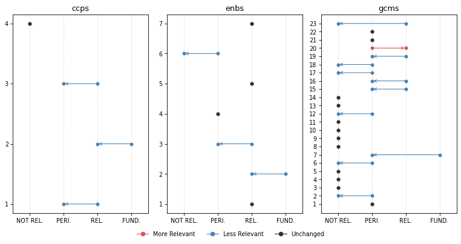

# Change Analysis


<!-- WARNING: THIS FILE WAS AUTOGENERATED! DO NOT EDIT! -->

[Click here](https://iom-tagapp-beta.pla.sh) to access the **IOM TAGGING
(BETA) PLATFORM**

``` python
from iomeval.llm_eval.changes import *

from fastcore.all import *
from iomeval.readers import load_evals
from pathlib import Path
```

``` python
p = Path().home() / 'iomeval/data/requester_by_report_id.json'
lut = p.read_json()
evls_test = L(lut.keys())

ROOT_PATH = Path.home() / 'iomeval'
DATA_PATH = ROOT_PATH / 'data'
RESULTS_PATH = DATA_PATH/ 'results'
EVALS_PATH = ROOT_PATH / 'nbs/files/test/evaluations.json'

# Contains latest backed up data before new deployment
LATEST_TAG_PATH = Path.home() / 'tagapp/backups/20260311_115159/data'

evals = load_evals(EVALS_PATH)
```

``` python
dfs = all_deltas(evls_test, RESULTS_PATH, LATEST_TAG_PATH)
```

``` python
who = set(lut.values())
who
```

    {'Andres', 'Davide', 'elma', 'ljeoma', 'pip', 'rogers'}

``` python
# Automaticall generate changes report cells for all reports
rpts = [k for k,v in lut.items() if v=='elma']
for rpt in rpts: await gen_report_cells(rpt, dfs, LATEST_TAG_PATH, RESULTS_PATH)
```

## What we have changed?

1.  First of all, we **improved the consistency of what section of an
    evaluation report the model reads**. A “curation” step was added to
    the process in which a human selects the sections of the report that
    are more relevant to the tagging. This step used to be automatic (it
    was based on the “parsing” prompt that you reviewed) but we realized
    that several mistakes were being made by the model (probably because
    of the diversity in formatting and structure of evaluation reports,
    which not always follow a precise template). This is a major change
    with likely general consequences on the tagging. *Feedback from
    testers on which sections of the report should be fed to the model
    was considered*.

Secondly, we made changes to the tagging prompts based on your feedback.
Here are the main modifications (minor ones are not listed here but are
available in the files used for the review):

2.  **Excerpt-based analysis clarification**: Following the point above
    on the new report “curation” step, we asked the model to be explicit
    on the fact that only specific section are accessed (executive
    summary, introduction, background, evaluation scope, conclusions,
    recommendations, lessons learnt) in order not to give a false
    impression that the full report was being fed to the model. Hedged
    language is required throughout (e.g., “the excerpts suggest …”,
    “based on the sections reviewed …”). *This follows up on comments
    from several testers - some asking more precise quotation outputs
    (something not possible at this stage - sorry!). The reasoning now
    is more transparent on the fact that the model is not reading the
    whole report (like a human would do when tagging; remember also that
    in earlier experiments, feeding the whole report to the model was
    inflating scores throughout and making the model unusable)*.

3.  **GCM 23 downgrading**: Added an important note on GCM Objective 23
    clarifying its revised scoring treatment. *This follows up on
    feedback from different testers suggesting that relevance with
    respect to this objective may have been exaggerated by the model*.

4.  **SRF enablers reframing**: Introduced a critical distinction
    between enablers as institutional capacity versus programmatic
    tools. *This follows up on a point raised by Pip*.

5.  **Relevance score range relabelling**: Tags now use “Not Relevant”,
    “Peripheral” (formerly “Supplementary”), “Relevant”, and
    “Fundamental”. *This follows up on suggestion from Andres*.

6.  **Terminology warning on “Findings”** — Analysts must not use
    “finding(s)” in their own analytical language, as this term carries
    a specific formal meaning in IOM evaluation reports. It may only be
    referenced when it appears in report excerpts themselves. *This
    clarification stems from Andres flagging overly broad or imprecise
    uses of “findings” generated by the LLM*.

7.  **GCM descriptions added**: The description of the GCM objective
    used by the model is now fully in line with the GCM UN resolution
    document. *This is something we realized upon auditing the script*.
    For instance:

<!-- -->

    # Objective 1
    ## Title: Collect and utilize accurate and disaggregated data as a basis for evidence-based policies
    We commit to strengthen the global evidence base on international migration by improving and investing in the collection, analysis and dissemination of accurate , ...
    To realize this commitment, we will draw from the following actions:
    ## Associated actions
    - a. Elaborate and implement ...
    - b. ...
    ...

Here are links to
[new](https://github.com/franckalbinet/iomeval/tree/main/nbs/files/prompts)
and
[previous](https://github.com/franckalbinet/iomeval/tree/main/nbs/files/prompts/legacy)
versions of the prompts.

How did these changes affect tagging?

## Score changes overview

**Based on all reports tagged so far (20)**. This is to give you a
general sense of how the behavior of the model changed.

### GCM objectives

*Note: You might be unfamiliar with this type of visualization. It’s
called a [violin plot](https://en.wikipedia.org/wiki/Violin_plot). A
violin plot combines a box plot with a smoothed estimate of the score
distribution, making it easier to spot not just the median and spread,
but also whether scores cluster around one or several values, something
a box plot alone would miss.*

``` python
plot_score_diffs(dfs, 'gcms', 'GCM objective', figsize=(12, 6), dpi=77)
```


### SRF Enablers

``` python
plot_score_diffs(dfs, 'enbs', 'SRF Enablers', figsize=(8, 3), dpi=77)
```


### SRF Cross-Cutting Priorities

``` python
plot_score_diffs(dfs, 'ccps', 'SRF Cross-Cutting Priorities', figsize=(8, 3), dpi=77)
```


## Rank changes overview

Among all themes where previous relevance score was `> 0.83`
(**FUNDAMENTAL**), what percentage of them have undergone a change in
rank (`rank_diff != 0`)

``` python
dfs[dfs.score_old > 0.83].groupby('mapping_type').apply(lambda x: 100 * (x.rank_diff != 0).sum() / len(x)).round(1).sort_values()
```

    mapping_type
    ccps    16.7
    gcms    34.3
    outs    40.7
    enbs    44.4
    dtype: float64

## Our interpretation

The score changes overview charts show a general decrease of the scores.
In other words, the **model became more conservative** following the
various changes made to the prompts.

The reduction in scores is more pronounced and generalized for GCM
objectives, possibly due to the additional details on **GCM objectives**
(change 7 above) that now the model has access to. However, the
reductions yet remain moderate in magnitude, suggesting the prompt
revisions recalibrated the model’s behaviour without disrupting it
fundamentally. The dramatic average score reduction for GCM objective 23
is something intended. *It means that the changes to the prompt worked,
although your feedback will say if further calibration is needed*.

**SRF Enablers** showed the highest rank instability (44.4%). This is
also expected due to their reframing in the prompt (change 4).

**CCPs** were relatively unaffected by the changes in terms of average
scores and ranking, which is consistent with the fact that none of the
changes specifically targeted CCP scoring logic.

**Caveat**: the current general analysis is based on 20 reports only.
Patterns, especially for the objectives less covered by our sample of
reports, should be interpreted with caution.

## Inputs we need from you

- Do you agree with the overall interpretation of the changes?
- Do you find the new behaviour to be improved?
- Please check, in the reports you asked us to tag, how the new
  behaviour has changed the items classified as fundamental. Do you find
  that accuracy and sensitivity have improved? Do you find the new
  reasonings better?

## Per evaluation report

**REMINDER**, our “RELEVANCE SCORE FRAMEWORK” is as follows: - score \>=
0.84: **FUNDAMENTAL** - 0.66 \<= score \< 0.83: **RELEVANT** - 0.34 \<=
score \< 0.66: **PERIPHERAL** - score \< 0.34: **NOT RELEVANT**

### EVALUATION OF IOM CASH-BASED INTERVENTIONS (CBI)

``` python
plot_band_changes(dfs[dfs.evl_id == '316c47c9dc19c820f3217434d4b93b28'], figsize=(10, 5), dpi=77)
```



**Fundamental Themes** | | Mapping | Theme | Score | |—|—|—|—| | old |
ccps | 2: Equality, Diversity & Inclusion | 0.88 | | old | enbs | 2:
Partnership | 0.88 | | old | gcms | 7: Address and reduce
vulnerabilities in migration | 0.88 |

**⬇️ No Longer Fundamental**

#### CCPS 2: Equality, Diversity & Inclusion

<table>
<thead>
<tr>
<th>score_old</th>
<th>score_new</th>
<th>rank_old</th>
<th>rank_new</th>
<th>rank_diff</th>
</tr>
</thead>
<tbody>
<tr>
<td>0.88</td>
<td>0.72</td>
<td>1</td>
<td>1</td>
<td>0</td>
</tr>
</tbody>
</table>

<details>

<summary>

Reasoning (old)
</summary>

This report would likely be essential for a synthesis on Cross-cutting
Priority 2 (Equality, Diversity & Inclusion). The evaluation explicitly
examines IOM’s integration of gender equality, disability inclusion, and
broader diversity considerations across CBI programming, with these
themes appearing prominently in evaluation objectives, findings, and
recommendations. The executive summary states that ‘The CBI approach has
made significant progress in integrating cross-cutting priorities like
gender equality and inclusion, but addressing operational
inconsistencies is essential to ensure equitable and inclusive
outcomes.’ Multiple findings directly assess gender mainstreaming
practices, disability-specific measures, and the targeting of vulnerable
populations including women, children, elderly persons, and persons with
disabilities. Dedicated recommendations (8 and 9) specifically address
enhancing disability integration and incorporating gender equality
measures into all CBI programming phases. For a synthesis specialist,
the analysis in the findings section of how CBIs address diverse needs
of vulnerable groups, the assessment of gender-sensitive approaches and
participation of women and girls, and the evaluation of inclusion
mechanisms for persons with disabilities would be particularly valuable.
The report provides direct evidence on IOM’s EDI implementation
effectiveness, identifies operational gaps in disability mainstreaming,
and offers concrete recommendations for strengthening equality and
inclusion practices. Pay close attention to the cross-cutting issues
discussion in the findings and recommendations 8-9 on disability and
gender integration.
</details>

------------------------------------------------------------------------

<details>

<summary>

Reasoning (new)
</summary>

Based on the excerpts reviewed, this report would likely contribute
meaningful evidence to a synthesis on Cross-cutting Priority 2
(Equality, Diversity & Inclusion). Gender equality and inclusion are
explicitly listed as cross-cutting themes within the evaluation scope,
and the excerpts indicate these were assessed as part of the evaluation
criteria. The executive summary notes that the evaluation incorporated
‘key humanitarian evaluation criteria, including… GEWE, inclusion,
protection, AAP, diversity and inclusion.’ Two dedicated recommendations
directly address EDI commitments: Recommendation 8 calls for
institutionalizing disability-specific guidelines in SOPs and
operational frameworks, and Recommendation 9 explicitly requires
incorporating gender equality measures into all phases of CBI
programming. The evaluation also references gender-sensitive approaches
and participation of women and girls as areas of examination. However,
EDI appears to be one of several cross-cutting themes evaluated
alongside protection, accountability, and operational effectiveness — it
does not appear to be the central focus of the evaluation. The excerpts
suggest some substantive analysis exists on gender inclusion and
disability integration within CBI programming, though the depth of
dedicated analysis is not fully visible from the excerpts alone. A
synthesis specialist would likely want to review the findings sections
on gender mainstreaming and disability inclusion, as well as the
relevant recommendations, as starting points. It is possible the full
report contains additional EDI-specific evidence beyond what the
excerpts reveal.
</details>

#### ENBS 2: Partnership

<table>
<thead>
<tr>
<th>score_old</th>
<th>score_new</th>
<th>rank_old</th>
<th>rank_new</th>
<th>rank_diff</th>
</tr>
</thead>
<tbody>
<tr>
<td>0.88</td>
<td>0.75</td>
<td>1</td>
<td>2</td>
<td>-1</td>
</tr>
</tbody>
</table>

<details>

<summary>

Reasoning (old)
</summary>

This report would likely be essential for a synthesis on Enabler 2
(Partnership). Partnership effectiveness appears as a primary evaluation
criterion (coherence - external), with multiple findings directly
assessing IOM’s partnership model with local actors, international
organizations, and the private sector. The evaluation explicitly
examines IOM’s active participation in global coordination platforms
(Global Cash Advisory Group, CALP Network, cash working groups),
collaborative efforts in contexts like Türkiye and Peru, and
partnerships with financial service providers through long-term
agreements. The executive summary emphasizes that ‘active engagement…has
supported alignment with broader social protection systems’ while noting
that ‘many partnerships remain ad hoc, and institutionalization is
limited.’ Multiple recommendations specifically address strengthening
collaboration with stakeholders (Recommendation 7). For a synthesis
specialist, the analysis of partnership institutionalization challenges
in the findings section, the discussion of coordination mechanisms and
their effectiveness across different contexts, the examination of
private sector partnerships (particularly with FSPs), and the
recommendations on fostering equitable partnerships would be
particularly valuable. This report provides direct evidence on IOM’s
partnership development capacities and identifies specific areas where
partnership approaches require organizational strengthening.
</details>

------------------------------------------------------------------------

<details>

<summary>

Reasoning (new)
</summary>

Based on the excerpts reviewed, this report would likely contribute
meaningful evidence to a synthesis on Enabler 2 (Partnership). The
evaluation appears to examine IOM’s partnership practices at an
organizational level — assessing how IOM engages with cash working
groups, the CALP Network, the Global Cash Advisory Group, financial
service providers, local organizations, and government actors — rather
than merely describing partnerships as a delivery mechanism for a single
programme. The excerpts suggest that partnership coherence and
institutionalization are substantive analytical themes: the executive
summary explicitly notes that ‘many partnerships remain ad hoc, and
institutionalization is limited, constraining scalability,’ and that
‘institutionalizing partnerships and addressing office level capacity
gaps remain critical.’ These are organizational-level assessments of
IOM’s partnership capacity. Recommendation 7 directly addresses
strengthening collaboration with internal and external stakeholders and
increasing joint initiatives. Country-level examples (Peru, Türkiye,
South Sudan, Senegal) appear to be used to assess the quality and
sustainability of IOM’s partnership frameworks rather than to evaluate
specific programmes. However, partnership is one of several themes
covered alongside workforce, funding, and monitoring, so it does not
appear to be the singular focus. For a synthesis specialist, the
sections on external coherence, coordination platforms, private sector
engagement, and the recommendations on partnership institutionalization
would appear most relevant as starting points for deeper review.
</details>

#### GCMS 7: Address and reduce vulnerabilities in migration

<table>
<thead>
<tr>
<th>score_old</th>
<th>score_new</th>
<th>rank_old</th>
<th>rank_new</th>
<th>rank_diff</th>
</tr>
</thead>
<tbody>
<tr>
<td>0.88</td>
<td>0.55</td>
<td>1</td>
<td>3</td>
<td>-2</td>
</tr>
</tbody>
</table>

<details>

<summary>

Reasoning (old)
</summary>

This report would likely be highly valuable for a synthesis on
addressing vulnerabilities in migration, as vulnerability is a central
theme throughout the evaluation. The IOM CBI approach explicitly targets
‘vulnerable individuals and communities affected by crisis,
displacements and other primarily humanitarian and emergency but also
increasingly developmental challenges’ (page 14), directly relating to
Action 7b (identification and assistance to migrants in vulnerable
situations). The evaluation extensively analyzes how CBIs address
vulnerabilities across different migrant categories including IDPs,
refugees, victims of trafficking, women, children, elderly, persons with
disabilities, and migrants in irregular situations (page 14). Multiple
findings assess the effectiveness of vulnerability-focused
interventions, including protection-centered approaches and
gender-responsive programming. The report dedicates substantial analysis
to cross-cutting issues including protection, gender equality, and
inclusion (pages 9, 24-58), examining how CBIs integrate vulnerability
considerations. Recommendations 8 and 9 specifically address enhancing
disability inclusion and gender equality measures. For a synthesis
specialist, the sections on effectiveness (particularly protection
outcomes), cross-cutting themes, and the analysis of how CBIs empower
vulnerable populations and reduce precariousness would be particularly
valuable. The case studies from Türkiye, Peru, and other contexts
provide concrete examples of vulnerability-focused CBI programming. This
report provides direct evidence on implementation approaches,
challenges, and effectiveness factors for vulnerability-responsive
interventions.
</details>

------------------------------------------------------------------------

<details>

<summary>

Reasoning (new)
</summary>

The excerpts reviewed suggest some peripheral-to-moderate relevance for
GCM Objective 7. The evaluation explicitly addresses vulnerable
populations as the primary target group for IOM CBIs, including IDPs,
refugees, asylum-seekers, migrants in vulnerable situations, victims of
trafficking, persons with disabilities, women, children, and elderly
persons. The report discusses protection-centered approaches, gender
equality and inclusion as cross-cutting themes, and Recommendation 8
specifically addresses disability-specific guidelines. Recommendation 9
addresses gender equality measures across CBI programming phases.
However, the report’s focus is on the delivery mechanism (cash
transfers) rather than on vulnerability identification, referral
systems, or protection frameworks as such. The content on protection
integration and gender-responsive approaches (particularly in the
findings sections on cross-cutting themes and the recommendations on
disability and gender) may be worth reviewing for a synthesis on Actions
7b and 7c, though vulnerability is treated as a targeting criterion
rather than as the primary analytical subject.
</details>
