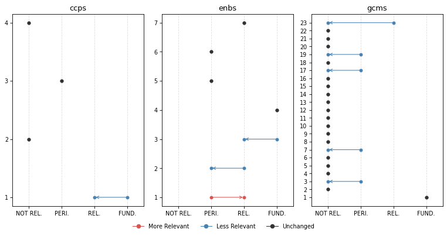
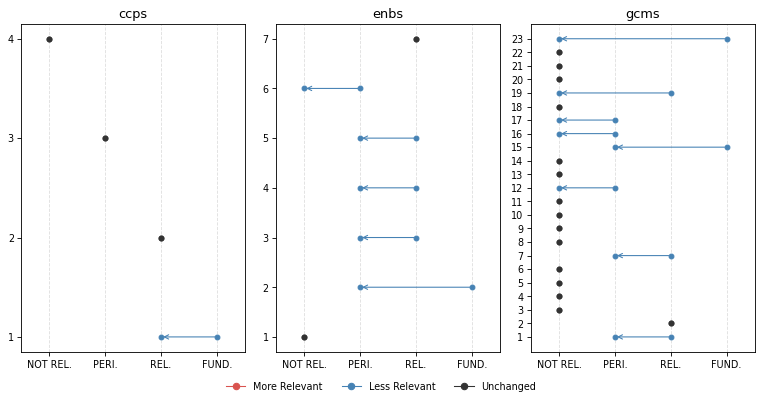
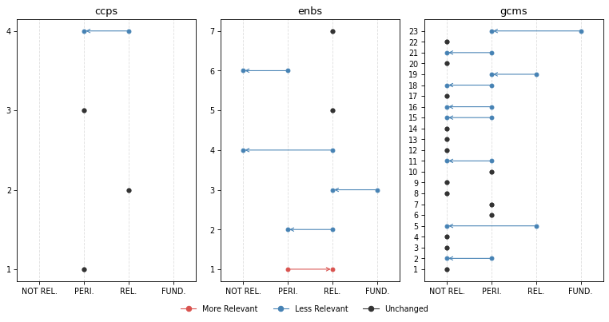

# Change Analysis


<!-- WARNING: THIS FILE WAS AUTOGENERATED! DO NOT EDIT! -->

[Click here](https://iom-tagapp-beta.pla.sh) to access the **IOM TAGGING
(BETA) PLATFORM**

``` python
from iomeval.llm_eval.changes import *

from fastcore.all import *
from iomeval.readers import load_evals
from pathlib import Path
```

``` python
p = Path().home() / 'iomeval/data/requester_by_report_id.json'
lut = p.read_json()
evls_test = L(lut.keys())

ROOT_PATH = Path.home() / 'iomeval'
DATA_PATH = ROOT_PATH / 'data'
RESULTS_PATH = DATA_PATH/ 'results'
EVALS_PATH = ROOT_PATH / 'nbs/files/test/evaluations.json'

# Contains latest backed up data before new deployment
LATEST_TAG_PATH = Path.home() / 'tagapp/backups/20260311_115159/data'

evals = load_evals(EVALS_PATH)
```

``` python
dfs = all_deltas(evls_test, RESULTS_PATH, LATEST_TAG_PATH)
```

``` python
who = set(lut.values())
who
```

    {'Andres', 'Davide', 'elma', 'ljeoma', 'pip', 'rogers'}

``` python
# Automatically generate changes report cells for all reports
rpts = [k for k,v in lut.items() if v=='pip']
for rpt in rpts: await gen_report_cells(rpt, dfs, LATEST_TAG_PATH, RESULTS_PATH)
```

## What we have changed?

1.  First of all, we **improved the consistency of what section of an
    evaluation report the model reads**. A “curation” step was added to
    the process in which a human selects the sections of the report that
    are more relevant to the tagging. This step used to be automatic (it
    was based on the “parsing” prompt that you reviewed) but we realized
    that several mistakes were being made by the model (probably because
    of the diversity in formatting and structure of evaluation reports,
    which not always follow a precise template). This is a major change
    with likely general consequences on the tagging. *Feedback from
    testers on which sections of the report should be fed to the model
    was considered*.

Secondly, we made changes to the tagging prompts based on your feedback.
Here are the main modifications (minor ones are not listed here but are
available in the files used for the review):

2.  **Excerpt-based analysis clarification**: Following the point above
    on the new report “curation” step, we asked the model to be explicit
    on the fact that only specific section are accessed (executive
    summary, introduction, background, evaluation scope, conclusions,
    recommendations, lessons learnt) in order not to give a false
    impression that the full report was being fed to the model. Hedged
    language is required throughout (e.g., “the excerpts suggest …”,
    “based on the sections reviewed …”). *This follows up on comments
    from several testers - some asking more precise quotation outputs
    (something not possible at this stage - sorry!). The reasoning now
    is more transparent on the fact that the model is not reading the
    whole report (like a human would do when tagging; remember also that
    in earlier experiments, feeding the whole report to the model was
    inflating scores throughout and making the model unusable)*.

3.  **GCM 23 downgrading**: Added an important note on GCM Objective 23
    clarifying its revised scoring treatment. *This follows up on
    feedback from different testers suggesting that relevance with
    respect to this objective may have been exaggerated by the model*.

4.  **SRF enablers reframing**: Introduced a critical distinction
    between enablers as institutional capacity versus programmatic
    tools. *This follows up on a point raised by Pip*.

5.  **Relevance score range relabelling**: Tags now use “Not Relevant”,
    “Peripheral” (formerly “Supplementary”), “Relevant”, and
    “Fundamental”. *This follows up on suggestion from Andres*.

6.  **Terminology warning on “Findings”** — Analysts must not use
    “finding(s)” in their own analytical language, as this term carries
    a specific formal meaning in IOM evaluation reports. It may only be
    referenced when it appears in report excerpts themselves. *This
    clarification stems from Andres flagging overly broad or imprecise
    uses of “findings” generated by the LLM*.

7.  **GCM descriptions added**: The description of the GCM objective
    used by the model is now fully in line with the GCM UN resolution
    document. *This is something we realized upon auditing the script*.
    For instance:

<!-- -->

    # Objective 1
    ## Title: Collect and utilize accurate and disaggregated data as a basis for evidence-based policies
    We commit to strengthen the global evidence base on international migration by improving and investing in the collection, analysis and dissemination of accurate , ...
    To realize this commitment, we will draw from the following actions:
    ## Associated actions
    - a. Elaborate and implement ...
    - b. ...
    ...

Here are links to
[new](https://github.com/franckalbinet/iomeval/tree/main/nbs/files/prompts)
and
[previous](https://github.com/franckalbinet/iomeval/tree/main/nbs/files/prompts/legacy)
versions of the prompts.

How did these changes affect tagging?

## Score changes overview

**Based on all reports tagged so far (20)**. This is to give you a
general sense of how the behavior of the model changed.

### GCM objectives

*Note: You might be unfamiliar with this type of visualization. It’s
called a [violin plot](https://en.wikipedia.org/wiki/Violin_plot). A
violin plot combines a box plot with a smoothed estimate of the score
distribution, making it easier to spot not just the median and spread,
but also whether scores cluster around one or several values, something
a box plot alone would miss.*

``` python
plot_score_diffs(dfs, 'gcms', 'GCM objective', figsize=(12, 6), dpi=77)
```


### SRF Enablers

``` python
plot_score_diffs(dfs, 'enbs', 'SRF Enablers', figsize=(8, 3), dpi=77)
```


### SRF Cross-Cutting Priorities

``` python
plot_score_diffs(dfs, 'ccps', 'SRF Cross-Cutting Priorities', figsize=(8, 3), dpi=77)
```


## Rank changes overview

Among all themes where previous relevance score was `> 0.83`
(**FUNDAMENTAL**), what percentage of them have undergone a change in
rank (`rank_diff != 0`)

``` python
dfs[dfs.score_old > 0.83].groupby('mapping_type').apply(lambda x: 100 * (x.rank_diff != 0).sum() / len(x)).round(1).sort_values()
```

    mapping_type
    ccps    16.7
    gcms    34.3
    outs    40.7
    enbs    44.4
    dtype: float64

## Our interpretation

The score changes overview charts show a general decrease of the scores.
In other words, the **model became more conservative** following the
various changes made to the prompts.

The reduction in scores is more pronounced and generalized for GCM
objectives, possibly due to the additional details on **GCM objectives**
(change 7 above) that now the model has access to. However, the
reductions yet remain moderate in magnitude, suggesting the prompt
revisions recalibrated the model’s behaviour without disrupting it
fundamentally. The dramatic average score reduction for GCM objective 23
is something intended. *It means that the changes to the prompt worked,
although your feedback will say if further calibration is needed*.

**SRF Enablers** showed the highest rank instability (44.4%). This is
also expected due to their reframing in the prompt (change 4).

**CCPs** were relatively unaffected by the changes in terms of average
scores and ranking, which is consistent with the fact that none of the
changes specifically targeted CCP scoring logic.

**Caveat**: the current general analysis is based on 20 reports only.
Patterns, especially for the objectives less covered by our sample of
reports, should be interpreted with caution.

## Inputs we need from you

- Do you agree with the overall interpretation of the changes?
- Do you find the new behaviour to be improved?
- Please check, in the reports you asked us to tag, how the new
  behaviour has changed the items classified as fundamental. Do you find
  that accuracy and sensitivity have improved? Do you find the new
  reasonings better?

## Per evaluation report

**REMINDER**, our “RELEVANCE SCORE FRAMEWORK” is as follows: - score \>=
0.84: **FUNDAMENTAL** - 0.66 \<= score \< 0.83: **RELEVANT** - 0.34 \<=
score \< 0.66: **PERIPHERAL** - score \< 0.34: **NOT RELEVANT**

### EVALUATION OF IOM’S MIGRATION DATA STRATEGY

``` python
plot_band_changes(dfs[dfs.evl_id == '9992310969aa2f428bc8aba29f865cf3'], figsize=(10, 5), dpi=77)
```



**Fundamental Themes** | | Mapping | Theme | Score | |—|—|—|—| | old |
ccps | 1: Integrity, Transparency and Accountability | 0.88 | | old |
enbs | 3: Funding | 0.88 | | old | enbs | 4: Data and evidence | 0.96 |
| old | gcms | 1: Collect and utilize accurate and disaggregated data as
a basis for evidence-based policies | 0.96 | | new | enbs | 4: Data and
evidence | 0.92 | | new | gcms | 1: Collect and utilize accurate and
disaggregated data as a basis for evidence-based policies | 0.95 |

**⬇️ No Longer Fundamental**

#### CCPS 1: Integrity, Transparency and Accountability

<table>
<thead>
<tr>
<th>score_old</th>
<th>score_new</th>
<th>rank_old</th>
<th>rank_new</th>
<th>rank_diff</th>
</tr>
</thead>
<tbody>
<tr>
<td>0.88</td>
<td>0.72</td>
<td>1</td>
<td>1</td>
<td>0</td>
</tr>
</tbody>
</table>

<details>

<summary>

Reasoning (old)
</summary>

This report would likely be essential for a synthesis on Cross-cutting
Priority 1 (Integrity, Transparency and Accountability). The evaluation
explicitly examines IOM’s Migration Data Strategy implementation, with
accountability mechanisms—or their absence—as a central finding.
Multiple findings directly address the lack of monitoring systems,
unclear responsibilities, and absence of progress tracking for the MDS
(Findings 4, 8). The report dedicates substantial analysis to governance
gaps, noting ‘no robust system to track MDS progress or enforce its use’
and ‘no single point of accountability.’ Key conclusions (5, 6)
emphasize that the MDS ‘was never actively managed or championed’ and
lacked ‘unified data governance.’ Recommendations 2 and 7 specifically
call for establishing ‘clear internal leadership and governance’ and
‘concrete implementation road map with assigned responsibilities and
monitoring indicators’—directly addressing accountability system
strengthening. For a synthesis specialist, the detailed analysis of
governance failures in Findings 4 and 8, Conclusions 5-6, and the
accountability-focused Recommendations 2 and 7 would be particularly
valuable. This provides direct evidence on IOM’s organizational
accountability challenges in strategic implementation and offers
insights into systemic transparency and monitoring gaps across the
institution.
</details>

------------------------------------------------------------------------

<details>

<summary>

Reasoning (new)
</summary>

Based on the excerpts reviewed, this report would likely contribute
meaningful evidence to a synthesis on Cross-cutting Priority 1
(Integrity, Transparency and Accountability). The evaluation of the IOM
Migration Data Strategy 2020–2025 appears to substantively examine
accountability and transparency mechanisms — or more precisely, their
absence — as a recurring analytical thread throughout the report. The
excerpts suggest that the lack of monitoring systems, unclear lines of
responsibility, and absence of performance indicators are treated as
core implementation failures of the MDS, not merely contextual
observations. Conclusions 5 and 7 explicitly address the absence of
accountability structures and the lack of active management of the
strategy, while Recommendation 7 directly calls for concrete
implementation roadmaps with assigned responsibilities and monitoring
indicators. The executive summary also highlights that the MDS ‘lacked
any monitoring or accountability system’ as a key effectiveness concern.
These elements appear to engage directly with IOM’s institutional
commitment to measuring progress against clearly defined goals,
facilitating transparent discussions about results, and taking
corrective actions — all central to Cross-cutting Priority 1. However,
the report’s primary focus is on data governance and migration data
strategy implementation rather than on organizational integrity or
accountability systems as standalone institutional commitments. The
accountability dimension surfaces as an explanatory factor for strategic
underperformance rather than as the central evaluand. A synthesis
specialist would likely want to review the Conclusions section
(particularly Conclusions 5, 7, and 16) and Recommendations 2 and 7,
which appear most directly relevant to accountability and transparency
practices. The excerpts I accessed suggest this is a secondary but
substantive theme, making it a useful — if not essential — source for a
synthesis on this Priority.
</details>

#### ENBS 3: Funding

<table>
<thead>
<tr>
<th>score_old</th>
<th>score_new</th>
<th>rank_old</th>
<th>rank_new</th>
<th>rank_diff</th>
</tr>
</thead>
<tbody>
<tr>
<td>0.88</td>
<td>0.78</td>
<td>2</td>
<td>2</td>
<td>0</td>
</tr>
</tbody>
</table>

<details>

<summary>

Reasoning (old)
</summary>

This report would likely be essential for a synthesis on Funding. The
evaluation explicitly examines IOM’s funding model for data initiatives
as a primary constraint on strategy implementation, with funding
challenges appearing prominently throughout findings, conclusions, and
recommendations. Conclusion 9 directly states that ‘inadequate and
fragmented funding seriously constrained the implementation of the MDS,’
analyzing how reliance on short-term project funds proved incompatible
with strategic goals. Finding 13 and Conclusion 11 provide detailed
analysis of sustainability risks stemming from the funding model, noting
that ‘IOM’s key data programs are typically financed by specific donors
on fixed-term grants’ with ‘minimal core budget commitment.’ The report
examines resource mobilization challenges, the absence of pooled funding
mechanisms, and member state funding patterns (Conclusion 12).
Recommendation 4 explicitly addresses securing dedicated and sustainable
funding through core budget allocation, pooled funds, or donor trust
funds. For a synthesis specialist, the analysis of funding constraints
in Findings 13 and 15, the sustainability discussion in Conclusions
11-12, and the detailed funding recommendations would provide direct
evidence on IOM’s organizational funding capacities and structural
financial challenges. The executive summary’s identification of ‘funding
and capacity gaps’ as a key conclusion further underscores this theme’s
centrality.
</details>

------------------------------------------------------------------------

<details>

<summary>

Reasoning (new)
</summary>

Based on the excerpts reviewed, this report would likely contribute
meaningful evidence to a synthesis on Enabler 3 (Funding). The
evaluation appears to examine IOM’s funding model as an organizational
capacity constraint — not merely as contextual background for a specific
programme. The excerpts suggest substantive institutional-level analysis
of how IOM’s reliance on short-term, fragmented project funding
undermined the implementation of a strategic initiative. Conclusion 9
explicitly addresses how ‘inadequate and fragmented funding seriously
constrained the implementation of the MDS,’ and Conclusions 11 and 12
examine the sustainability risks posed by the absence of multi-year
funding mechanisms and member state financial commitments.
Recommendation 4 calls for creating ‘dedicated budget lines or pooled
donor funding mechanisms’ — framing this as an organization-wide
structural challenge. The lessons learned section similarly identifies
the absence of a dedicated budget and reliance on short-term grants as
key barriers. This analysis appears to go beyond mentioning funding as
context: it examines IOM’s funding architecture as an institutional
capacity that either enables or constrains strategic implementation. A
synthesis specialist focused on IOM’s Funding Enabler would likely want
to review Conclusions 9, 11, and 12, Recommendation 4, and the
efficiency and sustainability sections. The excerpts suggest this report
could contribute evidence on IOM’s challenges in securing flexible,
multi-year funding and the institutional consequences of projectized
financing — though the full report may contain additional relevant
content beyond what the excerpts reveal.
</details>

### INTER-AGENCY HUMANITARIAN EVALUATION OF THE RESPONSE TO THE HUMANITARIAN CRISIS IN SOMALIA

``` python
plot_band_changes(dfs[dfs.evl_id == 'e21305a89aeb76fafa8f4270392d463a'], figsize=(10, 5), dpi=77)
```



**Fundamental Themes** | | Mapping | Theme | Score | |—|—|—|—| | old |
ccps | 1: Integrity, Transparency and Accountability | 0.88 | | old |
enbs | 2: Partnership | 0.88 | | old | gcms | 15: Provide access to
basic services for migrants | 0.88 | | old | gcms | 23: Strengthen
international cooperation and global partnerships for safe, orderly and
regular migration | 0.92 |

**⬇️ No Longer Fundamental**

#### CCPS 1: Integrity, Transparency and Accountability

<table>
<thead>
<tr>
<th>score_old</th>
<th>score_new</th>
<th>rank_old</th>
<th>rank_new</th>
<th>rank_diff</th>
</tr>
</thead>
<tbody>
<tr>
<td>0.88</td>
<td>0.72</td>
<td>1</td>
<td>1</td>
<td>0</td>
</tr>
</tbody>
</table>

<details>

<summary>

Reasoning (old)
</summary>

This report would likely be essential for a synthesis on Cross-cutting
Priority 1 (Integrity, Transparency and Accountability). The evaluation
explicitly examines accountability mechanisms in Somalia’s humanitarian
response, with accountability to affected people (AAP) appearing as a
primary evaluation question (EQ 1.3) and a dedicated major finding. The
report provides substantial analysis of feedback mechanisms,
transparency in coordination, data reliability, and follow-up to
recommendations—all directly addressing accountability commitments. Key
findings reveal critical gaps: 65% of people who provided feedback
received no response, limited transparency in resource allocation (with
‘UN-confidential’ as the second largest funding recipient), and lack of
systematic follow-up to recurring evaluation recommendations. The
executive summary explicitly states ‘The response lacked accountability’
as a major conclusion. Recommendation 4 is entirely dedicated to
strengthening accountability through transparency, engagement of
affected people, and systematic follow-up mechanisms. For a synthesis
specialist, the detailed analysis of feedback mechanism effectiveness
(Section 3.1.3, Finding 16), the assessment of coordination transparency
and data reliability (Section 4.2), and the comprehensive accountability
recommendation would be particularly valuable. This report provides
direct evidence on humanitarian system accountability gaps and proposes
concrete reform measures, making it core evidence for understanding
accountability implementation challenges in complex humanitarian
contexts.
</details>

------------------------------------------------------------------------

<details>

<summary>

Reasoning (new)
</summary>

Based on the excerpts reviewed, this report would likely contribute
meaningful evidence to a synthesis on Cross-cutting Priority 1
(Integrity, Transparency and Accountability). The evaluation appears to
dedicate substantive analysis to accountability mechanisms, transparency
of the humanitarian response, and systemic follow-up to recurring
recommendations — themes that map closely onto this institutional
commitment area. The excerpts suggest that accountability to affected
people (AAP) is one of the evaluation’s explicit sub-questions (EQ 1.3),
and the executive summary and conclusions sections devote considerable
space to the inadequacy of feedback mechanisms, the lack of transparency
in decision-making, and the absence of systematic follow-up to prior
evaluation recommendations. Recommendation 4 explicitly calls for
‘making the humanitarian response more accountable’ through increased
transparency, streamlined feedback mechanisms, and systematic follow-up
— all of which touch on accountability and transparency practices. The
aid diversion reform process (Recommendation 6 and EQ 5) also engages
with integrity-related themes, including risk management, beneficiary
registration integrity, and data-sharing transparency. However, it is
important to note that this is not an IOM-specific evaluation — it
covers the collective IASC response in Somalia — so the evidence it
provides on IOM’s own institutional implementation of accountability and
transparency commitments may be limited or indirect. A synthesis
specialist would likely want to review the sections on AAP (Section 2.3
equivalent), the conclusions on lack of accountability (para. 259), and
Recommendation 4, while keeping in mind that the institutional actor is
the broader humanitarian system rather than IOM specifically. The
excerpts I accessed suggest this is a relevant but not fundamental
source for this Priority.
</details>

#### ENBS 2: Partnership

<table>
<thead>
<tr>
<th>score_old</th>
<th>score_new</th>
<th>rank_old</th>
<th>rank_new</th>
<th>rank_diff</th>
</tr>
</thead>
<tbody>
<tr>
<td>0.88</td>
<td>0.55</td>
<td>1</td>
<td>3</td>
<td>-2</td>
</tr>
</tbody>
</table>

<details>

<summary>

Reasoning (old)
</summary>

This report would likely be essential for a synthesis on Partnership.
The evaluation explicitly examines partnership dynamics in humanitarian
response, with substantial analysis of relationships between
international organizations, national/local NGOs, government entities,
and affected communities—directly addressing organizational partnership
capacities. Multiple findings assess partnership quality: the report
analyzes localization efforts (noting local/national NGOs received
60-70% of Somalia Humanitarian Fund allocations), challenges in direct
funding to local partners, trust dynamics between international and
local actors, and the role of national organizations in reaching
hard-to-reach areas. The executive summary dedicates significant space
to partnership outcomes, noting progress in strengthening local
organizations’ roles in coordination bodies while acknowledging
persistent challenges in securing direct funding. Key recommendations
explicitly address partnership equity and localization (Recommendation
5). For a synthesis specialist, the analysis of localization challenges
in Section 3.4.6, findings on trust between international and local
actors (Figure 1 shows affected people’s trust preferences), and the
discussion of multi-stakeholder task forces for reform (Recommendation
6) would be particularly valuable. This provides direct evidence on
humanitarian partnership models and organizational capacity for
equitable partnership development.
</details>

------------------------------------------------------------------------

<details>

<summary>

Reasoning (new)
</summary>

The excerpts reviewed contain content that is partially relevant to the
Partnership Enabler, though it requires careful interpretation. The
evaluation addresses localisation — the role of national and local
organizations in the humanitarian response — with some substantive
analysis. The excerpts note that local and national organizations have
strengthened their roles in coordination and decision-making bodies,
face challenges in securing direct funding, and played key roles in
hard-to-reach areas. Recommendation 5 explicitly addresses continuing
and expanding support for local organizations. However, this is an
evaluation of the collective inter-agency humanitarian response in
Somalia, not an evaluation of IOM’s partnership frameworks as an
organizational capacity. The partnership-related content describes the
broader humanitarian system’s approach to localisation rather than IOM’s
institutional partnership practices, equity frameworks, or
network-building capacities. A synthesis specialist focused on IOM’s
Partnership Enabler might find some peripheral evidence here —
particularly around localisation dynamics and the tensions between
international and local actors — but should note that the institutional
framing is absent and IOM is not the primary subject. This is a case of
scraping the barrel if evidence on localisation and partnership equity
is scarce from other sources.
</details>

#### GCMS 15: Provide access to basic services for migrants

<table>
<thead>
<tr>
<th>score_old</th>
<th>score_new</th>
<th>rank_old</th>
<th>rank_new</th>
<th>rank_diff</th>
</tr>
</thead>
<tbody>
<tr>
<td>0.88</td>
<td>0.58</td>
<td>2</td>
<td>3</td>
<td>-1</td>
</tr>
</tbody>
</table>

<details>

<summary>

Reasoning (old)
</summary>

This report would likely be essential evidence for a synthesis on GCM
Objective 15. Access to basic services is a central theme throughout the
evaluation. The report extensively analyzes the delivery of prioritized
services (food security, health, nutrition, WASH) to affected
populations, with detailed findings on sectoral coverage and gaps.
Finding 12-14 document critical gaps in WASH services despite
prioritization, noting that ‘the WASH cluster lagged behind the other
priority sectors throughout 2022’ with demonstrable health impacts. The
evaluation presents data showing differential reach across sectors
(Figure 2) and discusses integrated service delivery (Finding 24).
Finding 15 addresses service provision to people in hard-to-reach areas.
The report also examines inclusion and non-discrimination in service
access (Findings 17-19), relating to Action 15a. While the context is
humanitarian emergency response rather than routine service provision to
migrants, the analysis of service delivery challenges, coordination
mechanisms, sectoral gaps, and inclusion barriers would be highly
valuable for a synthesis on basic service access. For synthesis
specialists, the sections on sectoral priorities and gaps (paras 12-14,
Figure 2), integrated response (para 24), and inclusion (paras 17-19)
would be particularly relevant, along with Recommendation 5 on
addressing sectoral gaps.
</details>

------------------------------------------------------------------------

<details>

<summary>

Reasoning (new)
</summary>

The excerpts reviewed contain content with some relevance to GCM
Objective 15, particularly regarding access to basic services for
internally displaced persons. The report discusses critical gaps in WASH
services (paragraphs 12-14), health services, nutrition, and food
security for displaced populations. Paragraph 14 explicitly links
inadequate WASH services to child mortality among IDPs. The report notes
that ‘the delivery of protection services to internally displaced people
was also well below target’ (paragraph 10). The discussion of minority
clan exclusion from assistance (paragraphs 17-19) touches on
non-discriminatory access to services (Action 15a). The report also
discusses how IDPs in informal camps had ‘little access to livelihoods
and essential infrastructure.’ These themes connect to Actions 15a
(non-discriminatory service delivery), 15c (accessible service points),
and 15e (health needs of migrants). However, the report addresses these
issues in a humanitarian response context rather than as a migration
governance or service delivery policy framework. The ‘migrants’ in
question are IDPs within Somalia, which may or may not align with the
GCM’s focus on international migrants depending on the synthesis scope.
A synthesis specialist might find the WASH gap analysis and the
discussion of service access for marginalised groups useful,
particularly in paragraphs 12-14 and the inclusion sections, but should
note the humanitarian framing and internal displacement context.
</details>

#### GCMS 23: Strengthen international cooperation and global partnerships for safe, orderly and regular migration

<table>
<thead>
<tr>
<th>score_old</th>
<th>score_new</th>
<th>rank_old</th>
<th>rank_new</th>
<th>rank_diff</th>
</tr>
</thead>
<tbody>
<tr>
<td>0.92</td>
<td>0.12</td>
<td>1</td>
<td>9</td>
<td>-8</td>
</tr>
</tbody>
</table>

<details>

<summary>

Reasoning (old)
</summary>

This report would likely be essential evidence for a synthesis on GCM
Objective 23. International cooperation and coordination are central
analytical themes throughout the evaluation. The report extensively
examines coordination mechanisms, with Finding 22 dedicated to
‘Coordination and Leadership’ noting both innovations and shortcomings.
The evaluation documents ‘important new approaches developed or piloted’
in Somalia including ‘risk management mechanisms,’ ‘third-party
monitoring,’ and ‘joint reform process to address aid
diversion’—examples of international cooperation and capacity building
(relating to Action 23d). However, Finding 22 also identifies that
‘coordination structures are very complex and involve some parallel and
duplicative structures,’ with ‘too many coordination meetings’ having
‘low attendance and no systematic documentation.’ Recommendation 3
proposes streamlining coordination by ‘reducing the number of
coordination forums and meetings by at least half.’ The report analyzes
multi-stakeholder cooperation through the HCT reform process (Finding
27-28), donor coordination, and partnerships between UN agencies, NGOs,
and local actors. Finding 26 addresses localization and partnerships
with national actors. The evaluation also examines resource mobilization
(Finding 4) and funding mechanisms including pooled funds. For a
synthesis specialist, the entire section on coordination (paras 22-26,
Findings 22-26), the analysis of the reform process (paras 27-28,
Finding 27-28), Recommendation 3 on coordination, and Recommendation 6
on multi-stakeholder reform approaches would be particularly valuable
for understanding both effective practices and persistent challenges in
international cooperation for migration governance.
</details>

------------------------------------------------------------------------

<details>

<summary>

Reasoning (new)
</summary>

The excerpts reviewed contain extensive discussion of international
cooperation and coordination in the humanitarian response context — IASC
coordination, inter-agency mechanisms, donor coordination, and UN system
cooperation. However, applying the test outlined in the guidance: this
language describes the operational context of a humanitarian response,
not an evaluation of international cooperation mechanisms for migration
governance as envisioned by GCM Objective 23. The report evaluates the
collective humanitarian response of IASC member agencies to a
drought/famine emergency, not multilateral migration governance
frameworks or GCM implementation mechanisms. The coordination discussed
is humanitarian coordination (clusters, HCT, OCHA), not migration
governance cooperation. The connections to Actions 23a-23e are ambient
and operational rather than substantive. Recommend not reviewing this
report for a synthesis on GCM Objective 23.
</details>

### Fifth Evaluation of the IOM Development Fund

``` python
plot_band_changes(dfs[dfs.evl_id == '0d4309b702e00faac631be8d609934ce'], figsize=(10, 5), dpi=77)
```



**Fundamental Themes** | | Mapping | Theme | Score | |—|—|—|—| | old |
enbs | 3: Funding | 0.88 | | old | gcms | 23: Strengthen international
cooperation and global partnerships for safe, orderly and regular
migration | 0.88 |

**⬇️ No Longer Fundamental**

#### ENBS 3: Funding

<table>
<thead>
<tr>
<th>score_old</th>
<th>score_new</th>
<th>rank_old</th>
<th>rank_new</th>
<th>rank_diff</th>
</tr>
</thead>
<tbody>
<tr>
<td>0.88</td>
<td>0.78</td>
<td>1</td>
<td>2</td>
<td>-1</td>
</tr>
</tbody>
</table>

<details>

<summary>

Reasoning (old)
</summary>

This report would likely be essential for a synthesis on Funding. The
evaluation explicitly examines the IOM Development Fund as a funding
mechanism, with the Fund’s financing model, budget allocation, and
resource mobilization appearing as primary evaluation subjects. The
report title itself identifies this as an evaluation of a ‘Development
Fund,’ and multiple evaluation questions directly address funding
adequacy, allocation efficiency, and financial sustainability.
Substantive findings assess the Fund’s budget scope (declining from
0.98% to 0.44% of IOM total budget), budget ceilings, the 30% staff cost
cap, burn rates (90%), and co-financing perspectives. The Efficiency
section provides detailed analysis of financial resource allocation and
utilization. Multiple recommendations explicitly address funding
mechanisms: increasing the Fund budget to $20 million (Recommendation
1.1), raising project ceilings (1.1), creating a contingency fund (1.2),
and changing budget rules (5.2-5.3). The Sustainability findings discuss
funding dependency as a key challenge. For a synthesis specialist, the
analysis of internal funding mechanisms, seed funding effectiveness,
budget constraints, and the relationship between funding flexibility and
project outcomes would be particularly valuable. Pay close attention to
the Efficiency section, Sustainability findings, and Recommendations
1.1-1.4 and 5.2-5.3.
</details>

------------------------------------------------------------------------

<details>

<summary>

Reasoning (new)
</summary>

Based on the excerpts reviewed, this report would likely contribute
meaningful evidence to a synthesis on Enabler 3 (Funding). Critically,
the IOM Development Fund is itself a funding mechanism — the
evaluation’s primary object is an internal IOM financing instrument
designed to provide seed funding for migration initiatives. This means
the evaluation is examining IOM’s funding capacity at an organizational
level, not merely referencing funding as project context. The excerpts
suggest substantive analysis of funding architecture: budget ceilings,
allocation models, co-financing perspectives, burn rates, budget caps
(the 30 percent staff cost ceiling), no-cost extensions, and the Fund’s
overall budget trajectory (from USD 1.4 million to USD 16.5 million).
Recommendation 1 directly addresses funding structure — proposing
increases to the overall budget, revised ceilings, contingency funds,
and extended timelines — indicating that funding mechanisms are treated
as an institutional capacity issue. The evaluation also examines the
Fund’s financing model in relation to sustainability and impact, and
considers co-financing perspectives for stronger outcomes. However, the
Fund is a specific internal mechanism rather than IOM’s broader resource
mobilization or innovative financing capacity, which somewhat limits its
direct applicability to the full scope of the Funding Enabler. A
synthesis specialist would likely find the Efficiency and Sustainability
findings sections, along with Recommendation 1, most relevant as
starting points for deeper review.
</details>

#### GCMS 23: Strengthen international cooperation and global partnerships for safe, orderly and regular migration

<table>
<thead>
<tr>
<th>score_old</th>
<th>score_new</th>
<th>rank_old</th>
<th>rank_new</th>
<th>rank_diff</th>
</tr>
</thead>
<tbody>
<tr>
<td>0.88</td>
<td>0.38</td>
<td>1</td>
<td>3</td>
<td>-2</td>
</tr>
</tbody>
</table>

<details>

<summary>

Reasoning (old)
</summary>

This report would likely be essential for a synthesis on international
cooperation and capacity-building for migration management. The Fund’s
core purpose is to ‘provide accountable and effective seed funding for
innovative migration-focused initiatives to address the capacity
development needs of eligible Member States’ (page 5), which directly
relates to Actions 23a (technical assistance) and 23d (capacity-building
mechanism). The evaluation explicitly examines how the Fund strengthened
MS capacity through ‘policy development, institutional strengthening,
capacity development and training’ (page 5), aligning with Action 23a on
supporting States to implement migration commitments. Key findings
indicate the Fund ‘bolstered IOM institutional capacity by enhancing
staff capacity in project management and piloting initiatives such as
SRF alignment’ (page 7), demonstrating organizational capacity
development. The report notes the Fund ‘served as a source of seed
funding for innovative migration-focused initiatives’ (page 7) and was
‘recognized as critical for funding migration-related areas where other
donors were less willing to’ (page 6), which relates to Action 23b on
innovative partnerships and financing. The evaluation assesses
cooperation between IOM headquarters, regional offices, and country
offices in delivering capacity support, examining coordination
mechanisms and technical assistance modalities. Substantial analysis
addresses the Fund’s financing model, resource allocation, and
effectiveness in building national migration management capacity. For a
synthesis specialist, the findings on capacity-building effectiveness
(pages 9-49), the discussion of the Fund’s role in strengthening MS
institutional capacity (pages 5-7), and the recommendations on improving
technical assistance delivery (pages 49-53) would be particularly
valuable. The evaluation provides direct evidence on implementation
challenges and effectiveness factors for capacity-building and technical
cooperation in migration management. Synthesis specialists should pay
close attention to: the findings on institutional strengthening and
capacity development outcomes; the analysis of the Fund’s seed funding
model and its effectiveness; the discussion of cooperation mechanisms
between IOM units; and the recommendations on enhancing
capacity-building support (Recommendations 1-7, pages 50-53).
</details>

------------------------------------------------------------------------

<details>

<summary>

Reasoning (new)
</summary>

The excerpts reviewed contain substantial language about international
cooperation, partnerships, and IOM’s institutional role — but applying
the test outlined in the guidance, this language largely describes the
operational context of Fund projects rather than examining international
cooperation mechanisms as a primary object of inquiry. The report does,
however, contain some content that goes slightly beyond ambient
operational language: it evaluates the Fund as a mechanism for
strengthening Member State capacities across multiple countries,
examines co-financing and partnership models, and assesses the Fund’s
contribution to IOM’s global institutional capacity and strategic
positioning. The Fund itself functions as a multilateral
capacity-building mechanism supporting GCM implementation across
eligible Member States, which connects to Action 23d (capacity-building
mechanisms). The evaluation’s assessment of the Fund’s coherence with
other migration initiatives and its role in fostering inter-agency
cooperation touches peripherally on Action 23e. However, the report does
not examine global governance architecture or multilateral cooperation
frameworks as its primary analytical focus. A synthesis specialist might
find the sections on Fund coherence, partnership models, and
institutional capacity contributions marginally relevant, but should
note that this is not a report primarily about international cooperation
governance.
</details>
