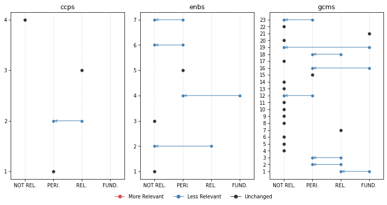
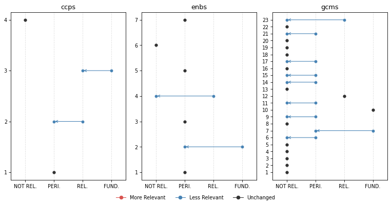
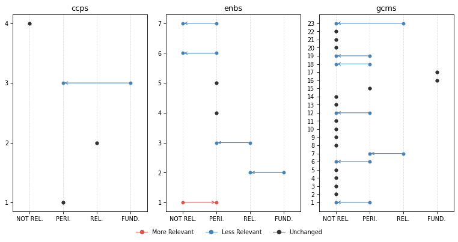
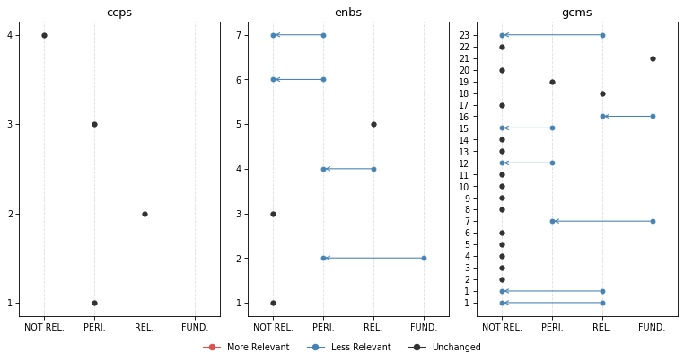

# Change Analysis


<!-- WARNING: THIS FILE WAS AUTOGENERATED! DO NOT EDIT! -->

[Click here](https://iom-tagapp-beta.pla.sh) to access the **IOM TAGGING
(BETA) PLATFORM**

``` python
from iomeval.llm_eval.changes import *

from fastcore.all import *
from iomeval.readers import load_evals
from pathlib import Path
```

``` python
p = Path().home() / 'iomeval/data/requester_by_report_id.json'
lut = p.read_json()
evls_test = L(lut.keys())

ROOT_PATH = Path.home() / 'iomeval'
DATA_PATH = ROOT_PATH / 'data'
RESULTS_PATH = DATA_PATH/ 'results'
EVALS_PATH = ROOT_PATH / 'nbs/files/test/evaluations.json'

# Contains latest backed up data before new deployment
LATEST_TAG_PATH = Path.home() / 'tagapp/backups/20260311_115159/data'

evals = load_evals(EVALS_PATH)
```

``` python
dfs = all_deltas(evls_test, RESULTS_PATH, LATEST_TAG_PATH)
```

``` python
who = set(lut.values())
who
```

    {'Andres', 'Davide', 'elma', 'ljeoma', 'pip', 'rogers'}

``` python
# Automatically generate changes report cells for all reports
rpts = [k for k,v in lut.items() if v=='rogers']
for rpt in rpts: await gen_report_cells(rpt, dfs, LATEST_TAG_PATH, RESULTS_PATH)
```

## What we have changed?

1.  First of all, we **improved the consistency of what section of an
    evaluation report the model reads**. A “curation” step was added to
    the process in which a human selects the sections of the report that
    are more relevant to the tagging. This step used to be automatic (it
    was based on the “parsing” prompt that you reviewed) but we realized
    that several mistakes were being made by the model (probably because
    of the diversity in formatting and structure of evaluation reports,
    which not always follow a precise template). This is a major change
    with likely general consequences on the tagging. *Feedback from
    testers on which sections of the report should be fed to the model
    was considered*.

Secondly, we made changes to the tagging prompts based on your feedback.
Here are the main modifications (minor ones are not listed here but are
available in the files used for the review):

2.  **Excerpt-based analysis clarification**: Following the point above
    on the new report “curation” step, we asked the model to be explicit
    on the fact that only specific section are accessed (executive
    summary, introduction, background, evaluation scope, conclusions,
    recommendations, lessons learnt) in order not to give a false
    impression that the full report was being fed to the model. Hedged
    language is required throughout (e.g., “the excerpts suggest …”,
    “based on the sections reviewed …”). *This follows up on comments
    from several testers - some asking more precise quotation outputs
    (something not possible at this stage - sorry!). The reasoning now
    is more transparent on the fact that the model is not reading the
    whole report (like a human would do when tagging; remember also that
    in earlier experiments, feeding the whole report to the model was
    inflating scores throughout and making the model unusable)*.

3.  **GCM 23 downgrading**: Added an important note on GCM Objective 23
    clarifying its revised scoring treatment. *This follows up on
    feedback from different testers suggesting that relevance with
    respect to this objective may have been exaggerated by the model*.

4.  **SRF enablers reframing**: Introduced a critical distinction
    between enablers as institutional capacity versus programmatic
    tools. *This follows up on a point raised by Pip*.

5.  **Relevance score range relabelling**: Tags now use “Not Relevant”,
    “Peripheral” (formerly “Supplementary”), “Relevant”, and
    “Fundamental”. *This follows up on suggestion from Andres*.

6.  **Terminology warning on “Findings”** — Analysts must not use
    “finding(s)” in their own analytical language, as this term carries
    a specific formal meaning in IOM evaluation reports. It may only be
    referenced when it appears in report excerpts themselves. *This
    clarification stems from Andres flagging overly broad or imprecise
    uses of “findings” generated by the LLM*.

7.  **GCM descriptions added**: The description of the GCM objective
    used by the model is now fully in line with the GCM UN resolution
    document. *This is something we realized upon auditing the script*.
    For instance:

<!-- -->

    # Objective 1
    ## Title: Collect and utilize accurate and disaggregated data as a basis for evidence-based policies
    We commit to strengthen the global evidence base on international migration by improving and investing in the collection, analysis and dissemination of accurate , ...
    To realize this commitment, we will draw from the following actions:
    ## Associated actions
    - a. Elaborate and implement ...
    - b. ...
    ...

Here are links to
[new](https://github.com/franckalbinet/iomeval/tree/main/nbs/files/prompts)
and
[previous](https://github.com/franckalbinet/iomeval/tree/main/nbs/files/prompts/legacy)
versions of the prompts.

How did these changes affect tagging?

## Score changes overview

**Based on all reports tagged so far (20)**. This is to give you a
general sense of how the behavior of the model changed.

### GCM objectives

*Note: You might be unfamiliar with this type of visualization. It’s
called a [violin plot](https://en.wikipedia.org/wiki/Violin_plot). A
violin plot combines a box plot with a smoothed estimate of the score
distribution, making it easier to spot not just the median and spread,
but also whether scores cluster around one or several values, something
a box plot alone would miss.*

``` python
plot_score_diffs(dfs, 'gcms', 'GCM objective', figsize=(12, 6), dpi=77)
```


### SRF Enablers

``` python
plot_score_diffs(dfs, 'enbs', 'SRF Enablers', figsize=(8, 3), dpi=77)
```


### SRF Cross-Cutting Priorities

``` python
plot_score_diffs(dfs, 'ccps', 'SRF Cross-Cutting Priorities', figsize=(8, 3), dpi=77)
```


## Rank changes overview

Among all themes where previous relevance score was `> 0.83`
(**FUNDAMENTAL**), what percentage of them have undergone a change in
rank (`rank_diff != 0`)

``` python
dfs[dfs.score_old > 0.83].groupby('mapping_type').apply(lambda x: 100 * (x.rank_diff != 0).sum() / len(x)).round(1).sort_values()
```

    mapping_type
    ccps    16.7
    gcms    34.3
    outs    40.7
    enbs    44.4
    dtype: float64

## Our interpretation

The score changes overview charts show a general decrease of the scores.
In other words, the **model became more conservative** following the
various changes made to the prompts.

The reduction in scores is more pronounced and generalized for GCM
objectives, possibly due to the additional details on **GCM objectives**
(change 7 above) that now the model has access to. However, the
reductions yet remain moderate in magnitude, suggesting the prompt
revisions recalibrated the model’s behaviour without disrupting it
fundamentally. The dramatic average score reduction for GCM objective 23
is something intended. *It means that the changes to the prompt worked,
although your feedback will say if further calibration is needed*.

**SRF Enablers** showed the highest rank instability (44.4%). This is
also expected due to their reframing in the prompt (change 4).

**CCPs** were relatively unaffected by the changes in terms of average
scores and ranking, which is consistent with the fact that none of the
changes specifically targeted CCP scoring logic.

**Caveat**: the current general analysis is based on 20 reports only.
Patterns, especially for the objectives less covered by our sample of
reports, should be interpreted with caution.

## Inputs we need from you

- Do you agree with the overall interpretation of the changes?
- Do you find the new behaviour to be improved?
- Please check, in the reports you asked us to tag, how the new
  behaviour has changed the items classified as fundamental. Do you find
  that accuracy and sensitivity have improved? Do you find the new
  reasonings better?

## Per evaluation report

**REMINDER**, our “RELEVANCE SCORE FRAMEWORK” is as follows: - score \>=
0.84: **FUNDAMENTAL** - 0.66 \<= score \< 0.83: **RELEVANT** - 0.34 \<=
score \< 0.66: **PERIPHERAL** - score \< 0.34: **NOT RELEVANT**

### FINAL EVALUATION REPORT MULTI-SECTORIAL LIVELIHOOD SUPPORT TO VULNERABLE COMMUNITIES IN ZIMBABWE

``` python
plot_band_changes(dfs[dfs.evl_id == '56e6f2bc9f55a0c6d07341ddde1283db'], figsize=(10, 5), dpi=77)
```



**Fundamental Themes** | | Mapping | Theme | Score | |—|—|—|—| | old |
enbs | 4: Data and evidence | 0.88 | | old | gcms | 1: Collect and
utilize accurate and disaggregated data as a basis for evidence-based
policies | 0.88 | | old | gcms | 16: Empower migrants and societies to
realize full inclusion and social cohesion | 0.92 | | old | gcms | 19:
Create conditions for migrants and diasporas to fully contribute to
sustainable development in all countries | 0.85 | | old | gcms | 21:
Cooperate in facilitating safe and dignified return and readmission, as
well as sustainable reintegration | 0.95 | | new | gcms | 21: Cooperate
in facilitating safe and dignified return and readmission, as well as
sustainable reintegration | 0.88 |

**⬇️ No Longer Fundamental**

#### ENBS 4: Data and evidence

<table>
<thead>
<tr>
<th>score_old</th>
<th>score_new</th>
<th>rank_old</th>
<th>rank_new</th>
<th>rank_diff</th>
</tr>
</thead>
<tbody>
<tr>
<td>0.88</td>
<td>0.62</td>
<td>1</td>
<td>1</td>
<td>0</td>
</tr>
</tbody>
</table>

<details>

<summary>

Reasoning (old)
</summary>

This report would likely be essential for a synthesis on Enabler 4 (Data
and Evidence). The evaluation explicitly examines IOM’s Displacement
Tracking Matrix (DTM) as a core component of the intervention, with DTM
appearing prominently in project objectives (‘provide critical
information on vulnerabilities and needs of returnees, IDPs and host
communities through IOM’s DTM’). Multiple findings directly assess IOM’s
data collection systems, data quality, and evidence use: the evaluation
notes that DTM ‘increased access to information on IDPs, returnees and
host communities to government and humanitarian community’ with six
reports produced and distributed. The methodology section details
extensive use of DTM datasets (over 4,400 household interviews across
three datasets) for impact assessment, demonstrating IOM’s data systems
in practice. Conclusions explicitly state that ‘the project through the
IOM DTM has to a greater extent increased access to information.’ For a
synthesis specialist, the sections on Information Management and
Assessments (2.2.1), the detailed description of DTM datasets used
(Table 2), the findings on DTM report production and distribution, and
the analysis of how DTM data informed programming decisions would be
particularly valuable. This report provides direct evidence on IOM’s
organizational capacity in data collection, storage, sharing, and
application for evidence-based decision-making.
</details>

------------------------------------------------------------------------

<details>

<summary>

Reasoning (new)
</summary>

The excerpts reviewed suggest this report may contain content of
peripheral-to-moderate relevance for a synthesis on Enabler 4 (Data and
Evidence), though the institutional versus programmatic distinction
requires careful consideration. The IOM Displacement Tracking Matrix
(DTM) is described as a core component of the project — used to track
IDPs, migrant returnees, and host communities — and the evaluation
explicitly assesses its performance as part of the project’s information
management component. The evaluation notes that DTM reports were
produced and distributed to government and humanitarian partners to
improve access to primary data for targeted response. This goes somewhat
beyond purely programmatic data collection: the DTM is an IOM
institutional tool, and the evaluation’s assessment of how it functioned
to provide data for humanitarian decision-making could offer limited
evidence relevant to IOM’s data systems capacity. However, the
evaluation’s primary object remains the livelihood support programme,
and the DTM assessment appears to be one sub-component rather than a
central focus. A synthesis specialist focused on IOM’s Data and Evidence
Enabler might find the sections on Information Management and
Assessments (Section 2.2.1) and the DTM datasets described in Section
3.4.3 worth a closer look, particularly for evidence on how DTM data
informed programming decisions and was shared with partners — but should
note that this is not an institutional-level evaluation of IOM’s data
systems. The value added to a synthesis would likely be marginal unless
evidence on DTM’s organizational role is scarce elsewhere.
</details>

#### GCMS 1: Collect and utilize accurate and disaggregated data as a basis for evidence-based policies

<table>
<thead>
<tr>
<th>score_old</th>
<th>score_new</th>
<th>rank_old</th>
<th>rank_new</th>
<th>rank_diff</th>
</tr>
</thead>
<tbody>
<tr>
<td>0.88</td>
<td>0.72</td>
<td>3</td>
<td>2</td>
<td>1</td>
</tr>
</tbody>
</table>

<details>

<summary>

Reasoning (old)
</summary>

This report would likely be essential for a synthesis on GCM
Objective 1. The evaluation explicitly examines IOM’s Displacement
Tracking Matrix (DTM) as a core project component, with substantial
analysis of data collection, analysis, and dissemination on IDPs,
migrant returnees, and host communities. The report directly addresses
Actions 1a (comprehensive strategy for improving migration data), 1b
(improving comparability of migration statistics), 1d (collecting data
on effects and benefits of migration), and 1j (developing
country-specific migration profiles with disaggregated data). Multiple
findings assess the DTM’s effectiveness in providing data to government
and humanitarian partners, with specific discussion of baseline
assessments, multi-sectoral village assessments, and return intention
surveys. The evaluation methodology section (pages 15-17) details the
use of DTM datasets collected between August-November 2022 from over
1,150 household interviews, demonstrating systematic data collection
approaches. For a synthesis specialist, the sections on Information
Management and Assessments (page 11), the detailed evaluation
methodology describing DTM data sources (page 16, Table 2), and findings
on DTM’s contribution to evidence-based programming would be
particularly valuable. This provides direct evidence on implementation
of migration data systems and their utility for policy development.
</details>

------------------------------------------------------------------------

<details>

<summary>

Reasoning (new)
</summary>

Based on the excerpts reviewed, this report would likely contribute
meaningful evidence to a synthesis on GCM Objective 1. The project
explicitly uses IOM’s Displacement Tracking Matrix (DTM) as a core
component — described as one of three distinct project components — to
track IDPs, migrant returnees, and vulnerable host communities. The
excerpts indicate that baseline assessments, multi-sectoral village
assessments, return intention surveys, and progress monitoring reports
were conducted and used to generate disaggregated data on displaced
populations. The evaluation itself draws on multiple DTM datasets (over
1,500–1,700 respondents each) collected at different points. This
appears to relate to GCM actions 1c (building national capacities in
data collection), 1d (collecting data on effects of migration), and 1j
(developing country-specific migration profiles). However, data
collection is one of three project components rather than the sole
focus, and the depth of analysis on data systems per se — as opposed to
using data for program management — is unclear from the excerpts.
Synthesis specialists would likely want to review Section 2.2.1
(Information Management and Assessments) and Section 3.4.3 (IOM DTM
Secondary Data) as starting points, as well as the conclusions section
referencing DTM report production and distribution. It is possible the
full report contains more substantive analysis of the DTM methodology
and its contribution to evidence-based policymaking than the excerpts
reveal.
</details>

#### GCMS 16: Empower migrants and societies to realize full inclusion and social cohesion

<table>
<thead>
<tr>
<th>score_old</th>
<th>score_new</th>
<th>rank_old</th>
<th>rank_new</th>
<th>rank_diff</th>
</tr>
</thead>
<tbody>
<tr>
<td>0.92</td>
<td>0.62</td>
<td>2</td>
<td>4</td>
<td>-2</td>
</tr>
</tbody>
</table>

<details>

<summary>

Reasoning (old)
</summary>

This report would likely be essential for a synthesis on GCM Objective
16. The evaluation explicitly examines social cohesion and reintegration
as core project objectives, with the overarching goal to ‘help
internally displaced persons (IDPs), migrant returnees, and host
communities reintegrate into society and strengthen their resilience’
(page 9). Multiple components directly address Actions 16a (promoting
mutual respect and social cohesion), 16d (inclusive labour markets and
employment), 16f (community centres facilitating participation), and 16g
(peer-to-peer training and skills development). The project provided
income-generating activities to 1,800 households to promote economic
self-sufficiency and social stability (page 12), established peer
support groups as community-level forums for social cohesion (page 41),
and delivered skills training for livelihood development. The evaluation
findings explicitly assess ‘the extent to which the project increased
level of economic self-sufficiency, social stability, and psychosocial
wellbeing among IDPs, returnees and host communities’ (page 41). The
MHPSS component through peer support groups created spaces for mutual
support and social integration. For a synthesis specialist, the sections
on project objectives (pages 11-12), findings on economic
self-sufficiency and social stability outcomes (page 41), the analysis
of peer support groups as social cohesion mechanisms (page 41), findings
on IGA effectiveness in enabling community participation (page 41), and
recommendations on capacity building and market linkages for sustainable
integration (pages 42-43) would be particularly valuable. This provides
direct evidence on reintegration programming approaches, the interplay
between economic empowerment and social inclusion, and factors affecting
sustainable reintegration outcomes.
</details>

------------------------------------------------------------------------

<details>

<summary>

Reasoning (new)
</summary>

The excerpts suggest this report has meaningful peripheral-to-relevant
content for GCM Objective 16. The project explicitly aims at social
reintegration and social cohesion — peer support groups are described as
fostering ‘resilience and social cohesion,’ and the project targets both
returnees and host communities together to facilitate reintegration.
This connects to GCM actions 16a (promoting mutual respect and social
cohesion), 16c (developing policy goals for inclusion), and 16d (working
towards inclusive labour markets through IGA support). The IGA component
supporting income-generating activities and economic participation also
relates to action 16d. The evaluation’s focus on ‘social stability’ as
an outcome dimension and the peer support group model as a community
integration mechanism appear relevant. However, the report’s primary
framing is humanitarian assistance and resilience-building rather than
integration policy per se. Synthesis specialists might find the
conclusions on ICRS effectiveness for social cohesion and the IGA
outcomes sections worth reviewing, with the caveat that social cohesion
appears as one of several outcome dimensions rather than the central
analytical focus.
</details>

#### GCMS 19: Create conditions for migrants and diasporas to fully contribute to sustainable development in all countries

<table>
<thead>
<tr>
<th>score_old</th>
<th>score_new</th>
<th>rank_old</th>
<th>rank_new</th>
<th>rank_diff</th>
</tr>
</thead>
<tbody>
<tr>
<td>0.85</td>
<td>0.3</td>
<td>4</td>
<td>9</td>
<td>-5</td>
</tr>
</tbody>
</table>

<details>

<summary>

Reasoning (old)
</summary>

This report would likely be essential for a synthesis on GCM Objective
19. The evaluation explicitly examines how returnees and IDPs contribute
to sustainable development through economic reintegration and community
participation, directly addressing Actions 19a (implementing the 2030
Agenda), 19b (integrating migration into development planning), and 19h
(facilitating diaspora contributions through flexible modalities). The
project’s overarching objective to ‘help internally displaced persons
(IDPs), migrant returnees, and host communities reintegrate into society
and strengthen their resilience’ (page 9) aligns with creating
conditions for migrants to contribute to development. The
income-generating activities enabled 1,800 households to generate
additional income and diversify investments, strengthening the local
economy (page 41). The evaluation findings note that ‘the
income-generating activities have had a significant knock-on effect, not
only providing financial security to vulnerable households but also
allowing individuals to diversify their investments and strengthen the
local economy’ (page 41). The context section discusses how the project
addresses structural development challenges including poverty, food
insecurity, and economic fragility (pages 10-11). For a synthesis
specialist, the sections on project objectives and development context
(pages 9-12), findings on economic contributions and multiplier effects
of IGAs (page 41), the analysis of how livelihood support enables
community participation and local economic strengthening, and
recommendations on market linkages and value chain development (pages
42-43) would be particularly valuable. This provides direct evidence on
how reintegration programming can facilitate migrant contributions to
local development, the economic impacts of returnee support, and factors
affecting sustainable development outcomes in migration contexts.
</details>

------------------------------------------------------------------------

<details>

<summary>

Reasoning (new)
</summary>

The project’s IGA component aims to support economic reintegration and
contribution to local economies by returnees, which connects loosely to
GCM Objective 19’s theme of migrants contributing to sustainable
development. The conclusions note that IGAs have had ‘knock-on effects’
on the local economy. However, the report focuses on humanitarian
assistance to vulnerable returnees rather than on diaspora engagement,
remittance investment, or the broader development contributions of
migrants that are central to GCM Objective 19. The connection is
tangential — the report addresses survival-level economic reintegration
rather than the development contribution mechanisms (diaspora bonds,
investment funds, knowledge transfer) that GCM Objective 19 emphasizes.
A synthesis specialist would likely find insufficient depth here for a
synthesis on GCM Objective 19.
</details>

### FINAL INTERNAL INDEPENDENT EVALUATION OF THE CAPACITY ENHANCEMENT FOR INSTITUTIONALIZED VICTIM CENTERED INVESTIGATIONS AND PROSECUTIONS OF TRAFFICKING IN PERSONS (TIP) CASES IN SOUTH AFRICA PROJECT

``` python
plot_band_changes(dfs[dfs.evl_id == '1d7e6d2d445145d1d350b48b72b36681'], figsize=(10, 5), dpi=77)
```



**Fundamental Themes** | | Mapping | Theme | Score | |—|—|—|—| | old |
ccps | 3: Protection-centred | 0.88 | | old | enbs | 2: Partnership |
0.88 | | old | gcms | 10: Prevent, combat and eradicate trafficking in
persons in the context of international migration | 0.95 | | old | gcms
| 7: Address and reduce vulnerabilities in migration | 0.88 | | new |
gcms | 10: Prevent, combat and eradicate trafficking in persons in the
context of international migration | 0.97 |

**⬇️ No Longer Fundamental**

#### CCPS 3: Protection-centred

<table>
<thead>
<tr>
<th>score_old</th>
<th>score_new</th>
<th>rank_old</th>
<th>rank_new</th>
<th>rank_diff</th>
</tr>
</thead>
<tbody>
<tr>
<td>0.88</td>
<td>0.78</td>
<td>1</td>
<td>1</td>
<td>0</td>
</tr>
</tbody>
</table>

<details>

<summary>

Reasoning (old)
</summary>

This report would likely be essential for a synthesis on
Protection-centred approaches. The evaluation explicitly examines a
project designed to promote ‘victim centered investigations and
prosecution’ of trafficking cases, with victim protection and
rights-based approaches appearing prominently in the project title,
objectives, and throughout the evaluation. Multiple findings directly
assess IOM’s implementation of protection-centered commitments: the
report evaluates direct assistance provided to 29 victims of trafficking
(VOTs), analyzes the development of Standard Operating Procedures for
victim care and referral, and examines capacity building aimed at
ensuring ‘relevant officers understand TIP and victim centered
assistance.’ The executive summary emphasizes that ‘victim support,
especially assistance in voluntary international repatriation were the
most appreciated aspects of IOM’s work.’ Key findings address whether
‘victims of TIP were now better protected or managed as a result of the
project’ and assess the extent to which the intervention upheld ‘the
rights of VOT’ and placed ‘the human rights and well-being of all
migrants at the centre.’ The evaluation also examines stakeholder
coordination mechanisms designed to improve protection outcomes. For a
synthesis specialist, the analysis of victim-centered approaches in the
effectiveness section (4.3), the discussion of direct assistance to
VOTs, the assessment of SOPs for victim protection and referral, and the
findings on rights-based capacity building would be particularly
valuable. This report provides direct evidence on IOM’s implementation
of protection-centered programming in the counter-trafficking context,
including both strengths (victim assistance delivery) and gaps (limited
scale of reach).
</details>

------------------------------------------------------------------------

<details>

<summary>

Reasoning (new)
</summary>

Based on the excerpts reviewed, this report would likely contribute
meaningful evidence to a synthesis on Cross-cutting Priority 3
(Protection-centred). The project evaluated — ‘Capacity Enhancement for
Institutionalized Victim Centered Investigations and Prosecution of
Trafficking in Persons Cases in South Africa’ — is explicitly framed
around victim-centered approaches to TIP management, placing the
protection and wellbeing of trafficking victims at the center of its
design and implementation. The excerpts suggest that protection-centred
approaches are woven throughout the evaluation’s objectives, findings,
and conclusions. Key elements relevant to this Priority include: the
development of Standard Operating Procedures for victim care and
referral; direct assistance provided to 29 Victims of Trafficking (VOTs)
covering protection and welfare needs; capacity building of government
officials on victim identification and victim-centered assistance; and
the evaluation’s assessment of whether the project contributed to an
‘institutionalized victim centered approach to TIP management.’ The
conclusions explicitly discuss the project’s contribution to
victim-centered TIP management as the overarching goal, and
recommendations address scaling up victim assistance and protection
mechanisms. The rights-based framing — referencing the Palermo Protocol,
the TIP Act, and IOM’s mandate to uphold human dignity — also aligns
with this Priority’s emphasis on rights-based approaches. However,
protection-centred approaches here are assessed primarily through the
lens of TIP programming effectiveness rather than as a standalone
institutional commitment of IOM, which somewhat limits its direct
applicability to a synthesis on IOM’s organizational protection-centred
commitments. Synthesis specialists would likely want to review the
effectiveness and impact sections (Chapter 4, sections 4.3 and 4.5), the
conclusions on victim-centered TIP management (section 5.1), and the
recommendations on scaling victim assistance (section 5.2) as starting
points for deeper review.
</details>

#### ENBS 2: Partnership

<table>
<thead>
<tr>
<th>score_old</th>
<th>score_new</th>
<th>rank_old</th>
<th>rank_new</th>
<th>rank_diff</th>
</tr>
</thead>
<tbody>
<tr>
<td>0.88</td>
<td>0.55</td>
<td>1</td>
<td>2</td>
<td>-1</td>
</tr>
</tbody>
</table>

<details>

<summary>

Reasoning (old)
</summary>

This report would likely be essential for a synthesis on Partnership.
The evaluation explicitly examines IOM’s partnership approach with
government departments and civil society organizations in
counter-trafficking work, with stakeholder coordination appearing as a
primary project objective and evaluation focus. Multiple findings
directly assess partnership quality, noting ‘very participatory nature
of project implementation enhanced ownership’ and ‘effective stakeholder
mobilization was a pivotal aspect to timely project delivery.’ The
coherence and effectiveness sections provide substantive analysis of
IOM’s coordination with national (NICTIP) and provincial (PTTs)
structures, examining both strengths and weaknesses in multi-stakeholder
engagement. Key recommendations specifically address sustaining
partnerships (‘Remain connected with PTTs but most especially NICTIP’)
and elevating engagement to higher political levels. For a synthesis
specialist, the analysis of partnership models with government entities
in Chapter 4 (sections 4.2 Coherence and 4.3 Effectiveness), the
discussion of stakeholder ownership and coordination challenges, and
recommendations 3-4 on political engagement and maintaining partnerships
would be particularly valuable for understanding IOM’s partnership
development capacities in government-facing programming.
</details>

------------------------------------------------------------------------

<details>

<summary>

Reasoning (new)
</summary>

The excerpts reviewed suggest that stakeholder engagement and
coordination feature prominently in this evaluation, but on closer
examination these appear to be programmatic delivery mechanisms rather
than an evaluation of IOM’s institutional partnership capacity. The
project’s core design involved engaging government departments (SAPS,
DHA, DSD, NPA, DEL, DoJ, DoH), provincial task teams, and civil society
organizations as implementation partners. The evaluation assesses how
effectively IOM mobilized and engaged these stakeholders to deliver
project outputs — SOPs, training manuals, capacity building.
Recommendations 3 and 4 address maintaining engagement with NICTIP and
PTTs, and Recommendation 5 calls for greater regional technical support.
These touch on IOM’s relational positioning with government
counterparts. However, the evaluation’s object appears to be the TIP
programme’s effectiveness, not IOM’s institutional partnership
frameworks, equity of partnerships, or organization-wide partnership
systems. The partnership content here is primarily about programme
delivery coordination rather than IOM’s partnership capacity as an
organizational enabler. A synthesis specialist on the Partnership
Enabler might find some peripheral value in the sections on stakeholder
engagement approaches and the recommendations on maintaining government
relationships, but should approach this with caution given the
programmatic framing.
</details>

#### GCMS 7: Address and reduce vulnerabilities in migration

<table>
<thead>
<tr>
<th>score_old</th>
<th>score_new</th>
<th>rank_old</th>
<th>rank_new</th>
<th>rank_diff</th>
</tr>
</thead>
<tbody>
<tr>
<td>0.88</td>
<td>0.62</td>
<td>2</td>
<td>3</td>
<td>-1</td>
</tr>
</tbody>
</table>

<details>

<summary>

Reasoning (old)
</summary>

This report would likely be essential for a synthesis on GCM Objective
7, particularly Actions 7b (identification and assistance of vulnerable
migrants) and 7c (gender-responsive policies addressing needs of migrant
women and girls). The entire project explicitly focuses on
victim-centered approaches to trafficking, which is fundamentally about
addressing vulnerabilities in migration. The evaluation extensively
analyzes vulnerability identification, protection mechanisms, and
assistance to victims of trafficking—a core vulnerability category. Key
relevant sections include: the executive summary’s discussion of ‘victim
support, especially assistance in the voluntary international
repatriation’; findings on effectiveness of victim assistance (29 VOTs
assisted with ‘lifesaving assistance’); analysis of gender-responsive
approaches throughout; and the detailed discussion of protection and
referral mechanisms in the SOPs. The evaluation explicitly examines
‘holistic TIP management (Prevention, Protection, Prosecution,
Partnership)’ with Protection being directly relevant to vulnerability
response. The findings on stakeholder coordination for victim care and
the development of SOPs for victim management provide concrete evidence
on vulnerability response systems. For a synthesis specialist, pay close
attention to: the sections on direct assistance to VOTs, the analysis of
protection mechanisms in the SOPs, findings on victim-centered
approaches, and recommendations on scaling assistance. The gender
dimension is particularly strong, with specific attention to
vulnerabilities of women and girls in trafficking contexts.
</details>

------------------------------------------------------------------------

<details>

<summary>

Reasoning (new)
</summary>

The excerpts reviewed suggest moderate relevance for a synthesis on GCM
Objective 7, particularly around the identification, protection, and
assistance of vulnerable migrants — specifically victims of trafficking.
The project explicitly provided direct assistance to 29 Victims of
Trafficking (VOTs), and the evaluation discusses victim-centered
approaches, referral mechanisms, and protection and welfare assistance.
Actions 7b (comprehensive policies for migrants in vulnerable
situations) and 7k (involving local authorities in identification and
referral) appear particularly related. However, vulnerability is
addressed specifically through the TIP lens rather than as a broader
migration vulnerability framework, and the analytical depth on
vulnerability per se is limited compared to the institutional
capacity-building focus. The sections on direct VOT assistance and the
discussion of victim-centered TIP management in the effectiveness and
impact chapters would be the most relevant for human reviewers to
examine, though this report would likely be secondary to sources with
broader vulnerability frameworks.
</details>

### INDEPENDENT EVALUATION OF THE UNITED NATIONS PILOT PROJECT FOR STRENGTHENING MIGRANT INTEGRATION AND SOCIAL COHESION IN SOUTH AFRICA

``` python
plot_band_changes(dfs[dfs.evl_id == 'dba9eb1220368d28682d8531108e767d'], figsize=(10, 5), dpi=77)
```



**Fundamental Themes** | | Mapping | Theme | Score | |—|—|—|—| | old |
ccps | 3: Protection-centred | 0.88 | | old | enbs | 2: Partnership |
0.88 | | old | gcms | 16: Empower migrants and societies to realize full
inclusion and social cohesion | 0.94 | | old | gcms | 17: Eliminate all
forms of discrimination and promote evidence-based public discourse to
shape perceptions of migration | 0.88 | | new | gcms | 16: Empower
migrants and societies to realize full inclusion and social cohesion |
0.97 | | new | gcms | 17: Eliminate all forms of discrimination and
promote evidence-based public discourse to shape perceptions of
migration | 0.88 |

**⬇️ No Longer Fundamental**

#### CCPS 3: Protection-centred

<table>
<thead>
<tr>
<th>score_old</th>
<th>score_new</th>
<th>rank_old</th>
<th>rank_new</th>
<th>rank_diff</th>
</tr>
</thead>
<tbody>
<tr>
<td>0.88</td>
<td>0.62</td>
<td>1</td>
<td>2</td>
<td>-1</td>
</tr>
</tbody>
</table>

<details>

<summary>

Reasoning (old)
</summary>

This report would likely be essential for a synthesis on
Protection-centred approaches. The Joint Programme’s core objective was
to strengthen protection for migrants, refugees, and asylum seekers
facing xenophobic violence and discrimination—directly addressing IOM’s
commitment to placing human rights and well-being of migrants at the
centre of operations. The evaluation explicitly examines rights-based
approaches across migration programming, with the programme designed
around GCM Objective 7 (address and reduce vulnerabilities in migration)
and Objective 16 (empower migrants and societies to realize full
inclusion). Multiple findings assess protection outcomes: establishment
of early warning systems to prevent xenophobic violence, conflict
resolution mechanisms, community-level peace initiatives, and a 70%
reduction in reported xenophobia. The report analyzes community feedback
mechanisms, multi-stakeholder forums for addressing protection risks,
and the programme’s responsiveness to protection crises (July 2021
riots, KZN floods). The three-pronged implementation approach of
Prevention, Protection, and Empowerment is explicitly
protection-centred. For a synthesis specialist, the analysis of early
warning systems and conflict prevention mechanisms in the effectiveness
section, the discussion of protection outcomes in vulnerable
communities, the findings on community participation in decision-making,
and recommendations on strengthening early warning systems would be
particularly valuable. This provides direct evidence on IOM’s
implementation of protection-centred commitments in contexts of
xenophobic violence.
</details>

------------------------------------------------------------------------

<details>

<summary>

Reasoning (new)
</summary>

The excerpts reviewed contain content with some relevance to a synthesis
on Cross-cutting Priority 3 (Protection-centred), though it appears to
be peripheral rather than a primary focus. The Joint Programme
explicitly targets protection of migrants, refugees, and asylum seekers
from xenophobic violence, and the three-pronged implementation approach
of ‘Prevention, Protection, and Empowerment’ directly invokes protection
language. References to early warning systems, conflict and crisis
resolution mechanisms, and support for communities affected by the July
2021 riots and KwaZulu-Natal floods suggest some analysis of
protection-oriented programming. The legislative context section
discusses South Africa’s NAP and the GCM’s Objective 7 (addressing
vulnerabilities in migration), which aligns with rights-based protection
approaches. However, based on the excerpts reviewed, the evaluation does
not appear to deeply analyze IOM’s protection-centred institutional
commitments — such as child safeguarding, PSEAH mechanisms, or community
participation in decision-making — as distinct evaluation themes.
Protection surfaces more as a programme design element than as a subject
of dedicated evaluative analysis. A synthesis specialist might find the
discussion of early warning systems and crisis response adaptations
marginally useful, but would likely prioritize sources with more direct
treatment of protection-centred approaches as an institutional
commitment. The full report may contain more relevant content than the
excerpts suggest.
</details>

#### ENBS 2: Partnership

<table>
<thead>
<tr>
<th>score_old</th>
<th>score_new</th>
<th>rank_old</th>
<th>rank_new</th>
<th>rank_diff</th>
</tr>
</thead>
<tbody>
<tr>
<td>0.88</td>
<td>0.72</td>
<td>1</td>
<td>1</td>
<td>0</td>
</tr>
</tbody>
</table>

<details>

<summary>

Reasoning (old)
</summary>

This report would likely be essential for a synthesis on Enabler 2
(Partnership). The evaluation explicitly examines partnership dynamics
across multiple dimensions: UN inter-agency collaboration (five PUNOs
working jointly), partnerships with government departments (DOJ&CD, DSD,
DSAC), engagement with civil society organizations and community-based
organizations, and relationships with host and migrant communities.
Partnership effectiveness appears prominently throughout the evaluation
questions, findings, and recommendations. Multiple findings directly
assess partnership quality, coordination mechanisms (Steering Committee,
PMT structures), and sustainability of partnerships—all addressing
organizational capacity in partnership development and management. The
coherence section (findings 3.2) provides substantive analysis of
complementarities with other UN initiatives. Key recommendations (4.2.3,
4.2.9, 4.2.10, 4.2.11) specifically address strengthening partnership
frameworks, joint work planning, and inter-agency collaboration. For a
synthesis specialist, the analysis of multi-stakeholder forums, the
‘whole-of-society’ and ‘whole-of-government’ approaches, partnership
challenges in joint implementation, and recommendations on improving
partnership equity and coordination would be particularly valuable. This
report provides direct evidence on IOM’s partnership capacities within
complex multi-actor environments.
</details>

------------------------------------------------------------------------

<details>

<summary>

Reasoning (new)
</summary>

Based on the excerpts reviewed, this report would likely contribute
meaningful evidence to a synthesis on Enabler 2 (Partnership), though
with important caveats about the institutional versus programmatic
distinction. The Joint Programme is itself a multi-agency partnership
construct involving five PUNOs (IOM, UNHCR, UNDP, OHCHR, UN Women), and
the evaluation appears to examine how well these agencies collaborated,
coordinated, and leveraged their comparative advantages — which touches
on IOM’s institutional partnership capacity in a UN system context. The
excerpts suggest substantive analysis of inter-agency coordination
quality, the challenges of siloed implementation, and the effectiveness
of joint governance structures (Steering Committee, PMT, EMC).
Recommendations 4.2.7 through 4.2.11 appear to directly address
partnership architecture — joint budgeting, shared work planning,
cross-agency teambuilding, and collaboration culture — at an
organizational level rather than merely as programme delivery tools. The
programme’s explicit ‘whole-of-society’ and ‘whole-of-government’
approach, and its engagement with civil society, government departments,
and community organizations as implementing partners, also provides some
institutional-level evidence on partnership models. The sections most
likely worth reviewing for a synthesis specialist would be the
efficiency and sustainability findings, the conclusions on inter-agency
coherence, and Recommendations 4.2.3, 4.2.7–4.2.11. That said,
partnership here is partly a delivery mechanism for the programme, so
the institutional-level evidence is mixed rather than purely
organizational.
</details>

### Socio-Economic Reintegration of Returnees and other Vulnerable Households in migration affected areas severely impacted by COVID-19 Pandemic

``` python
plot_band_changes(dfs[dfs.evl_id == '8dd2261100ff5d714e73b411eed043d5'], figsize=(10, 5), dpi=77)
```



**Fundamental Themes** | | Mapping | Theme | Score | |—|—|—|—| | old |
enbs | 2: Partnership | 0.88 | | old | gcms | 16: Empower migrants and
societies to realize full inclusion and social cohesion | 0.92 | | old |
gcms | 21: Cooperate in facilitating safe and dignified return and
readmission, as well as sustainable reintegration | 0.94 | | old | gcms
| 7: Address and reduce vulnerabilities in migration | 0.88 | | new |
gcms | 21: Cooperate in facilitating safe and dignified return and
readmission, as well as sustainable reintegration | 0.92 |

**⬇️ No Longer Fundamental**

#### ENBS 2: Partnership

<table>
<thead>
<tr>
<th>score_old</th>
<th>score_new</th>
<th>rank_old</th>
<th>rank_new</th>
<th>rank_diff</th>
</tr>
</thead>
<tbody>
<tr>
<td>0.88</td>
<td>0.42</td>
<td>1</td>
<td>2</td>
<td>-1</td>
</tr>
</tbody>
</table>

<details>

<summary>

Reasoning (old)
</summary>

This report would likely be essential for a synthesis on Partnership.
The evaluation explicitly examines IOM’s partnership model with
government entities at multiple levels (national ministries, DISCOSEC,
NACOSEC, district administrators, community leaders) and with
implementing partners (vocational schools, NGOs like Skillshare,
external consultants). Partnership effectiveness appears prominently
throughout the report structure. Multiple findings directly assess
partnership quality and coordination mechanisms—the project design
section emphasizes ‘extensive consultations, deliberations and
collaboration with key stakeholders at national, district and community
level.’ The conclusions highlight how the project ‘bolstered its
efficiency by leveraging on the successes and lessons learnt’ from
previous partnerships. Key recommendations address improving partnership
processes, particularly the suggestion to work ‘together with district
and community leaders to develop a scoring system’ and the
recommendation to work ‘together with one or few ministries like Social
Development and Local Government’ following DISCOSEC dismantlement. For
a synthesis specialist, the detailed analysis of multi-level government
partnerships in Section 2.2 (Project Overview - Partnerships
subsection), the findings on stakeholder collaboration effectiveness,
and the recommendations on streamlining partnership structures would be
particularly valuable for understanding IOM’s partnership development
and management capacities in emergency response contexts.
</details>

------------------------------------------------------------------------

<details>

<summary>

Reasoning (new)
</summary>

The excerpts reviewed contain some content related to partnerships, but
on closer examination the partnerships described appear to function
primarily as delivery mechanisms for the reintegration programme rather
than as the object of evaluation. The report describes collaboration
with multiple government ministries (MoLG, MoSD, MoLE), DISCOSEC,
NACOSEC, community leaders, and vocational schools as implementation
partners. There is some discussion of how these partnerships were
structured and their role in project design and delivery. However, based
on the excerpts, there is no substantive analysis of IOM’s institutional
partnership frameworks, equity of partnerships with national/local
actors, or sustainability of partnership models at an organizational
level. The recommendation about working with specific ministries in
future programming (MoSD and Local Government) touches on partnership
strategy but remains programmatic in framing. A synthesis specialist
focused on IOM’s Partnership Enabler would find limited institutional
evidence here, though the multi-stakeholder coordination model described
might marginally warrant attention if evidence from other sources is
scarce.
</details>

#### GCMS 16: Empower migrants and societies to realize full inclusion and social cohesion

<table>
<thead>
<tr>
<th>score_old</th>
<th>score_new</th>
<th>rank_old</th>
<th>rank_new</th>
<th>rank_diff</th>
</tr>
</thead>
<tbody>
<tr>
<td>0.92</td>
<td>0.72</td>
<td>2</td>
<td>2</td>
<td>0</td>
</tr>
</tbody>
</table>

<details>

<summary>

Reasoning (old)
</summary>

This report would likely be essential for a synthesis on GCM Objective
16, particularly Actions 16a (promoting mutual respect and social
cohesion), 16c (developing integration policy goals), 16d (promoting
labour market integration), and 16f (establishing community-level
integration programs). Social cohesion and community integration are
explicit primary objectives of the project, appearing prominently in
Outcome 3: ‘Government of Lesotho - through Ministry of Local Government
has improved its ability to enhance social unity/cohesion through
community development initiatives’ (page 12). The evaluation provides
substantial analysis of community development projects/cooperatives
designed specifically to promote social cohesion among COVID-19-affected
communities. Key findings demonstrate strong commitment and
collaboration in community projects, with members determined to support
their cooperatives through monthly subscriptions, marketing products to
friends and relatives, and protecting project sites (page 32). The
vocational training component directly addresses labour market
integration (Action 16d), with 99% of trainees graduating and receiving
start-up kits and capital to establish businesses (page 32). The report
documents comprehensive pre-departure and post-arrival support (Action
16b) through business coaching covering ‘stock control, record keeping
and costing’ (page 22). Gender empowerment (Action 16e) is explicitly
addressed, with 60% of trainees being female and deliberate efforts to
eliminate gender-based restrictions on economic participation (page 33).
For a synthesis specialist, the sections on community development
projects (pages 17-18, 32), the analysis of social cohesion outcomes in
visited cooperatives (page 32), the vocational training and business
coaching components (pages 20-22), and the conclusions on promoting
collaboration among severely impacted communities (page 32) would be
particularly valuable. This represents a well-documented case study of
community-based integration and social cohesion programming in a return
and reintegration context.
</details>

------------------------------------------------------------------------

<details>

<summary>

Reasoning (new)
</summary>

Based on the excerpts reviewed, this report appears likely to contribute
meaningful evidence to a synthesis on GCM Objective 16. Social cohesion
is an explicit project outcome (Outcome 3: Government of Lesotho
improved ability to enhance social unity/cohesion through community
development initiatives), and the evaluation assesses community
development cooperatives specifically designed to promote social
cohesion among returnees and host communities. Actions 16a (mutual
respect and integration policies), 16d (labour market integration), and
16f (community centres/programmes for migrant participation) appear most
related. The conclusions section discusses community commitment and
collaboration as indicators of social cohesion progress. The community
development projects section and the conclusions on social cohesion
outcomes would appear particularly valuable for human reviewers to
prioritize. The report likely offers evidence on what community-level
reintegration and social cohesion programming looks like in a
low-income, migration-affected context, though the short project
duration limits depth of impact evidence.
</details>

#### GCMS 7: Address and reduce vulnerabilities in migration

<table>
<thead>
<tr>
<th>score_old</th>
<th>score_new</th>
<th>rank_old</th>
<th>rank_new</th>
<th>rank_diff</th>
</tr>
</thead>
<tbody>
<tr>
<td>0.88</td>
<td>0.45</td>
<td>3</td>
<td>4</td>
<td>-1</td>
</tr>
</tbody>
</table>

<details>

<summary>

Reasoning (old)
</summary>

This report would likely be essential for a synthesis on GCM Objective
7, particularly Actions 7b (providing support to migrants in vulnerable
situations) and 7h (facilitating transitions to regular status and
reducing precariousness). The evaluation explicitly examines a
comprehensive vulnerability-focused intervention targeting returnees
‘severely impacted by COVID-19’ who faced ‘loss of livelihood,’ food
insecurity, and destitution (pages 10-11). Multiple rapid assessments
documented specific vulnerabilities: 73% lacked food, 56% lost
employment, and returnees faced ongoing challenges including lack of
income (90%), unemployment (70%), and poor health (28%) (Table 7, page
19). The project design deliberately targeted vulnerable populations
through rigorous selection criteria and provided multi-dimensional
support including humanitarian assistance, skills training, start-up
capital, and psychosocial support. Gender dimensions are explicitly
addressed, with 60% of trainees being female (page 33). The findings
section documents outcomes for 200 vulnerable returnees who received
vocational training, with 99% graduating and 97% participating in
business coaching (page 32). For a synthesis specialist, the sections on
beneficiary identification and assessment (pages 17-19), the
comprehensive support model combining immediate humanitarian assistance
with longer-term livelihood support (pages 11, 20-22), and the
conclusions on vulnerability reduction (pages 32-33) would be
particularly valuable. This represents a well-documented case study of
addressing migrant vulnerabilities through integrated reintegration
programming.
</details>

------------------------------------------------------------------------

<details>

<summary>

Reasoning (new)
</summary>

The excerpts suggest meaningful, though not primary, content relevant to
GCM Objective 7. The project explicitly targets vulnerable returnees and
COVID-19-affected households, with rapid assessments identifying
vulnerability profiles (food insecurity, unemployment, lack of PPEs).
Gender-responsive targeting is discussed, with women identified as
disproportionately affected. The evaluation assesses how well the
project identified and assisted migrants in vulnerable situations.
Actions 7b (comprehensive policies for migrants in vulnerability) and 7c
(gender-responsive migration policies) appear most related. However,
vulnerability is addressed primarily as a targeting criterion for
livelihood support rather than as a standalone analytical theme. A
synthesis specialist might find the targeting methodology and
vulnerability profiling sections worth reviewing, but should note this
is not the central analytical focus of the evaluation.
</details>
