<!-- WARNING: THIS FILE WAS AUTOGENERATED! DO NOT EDIT! -->

``` python
from fastcore.all import *
from iomeval.readers import find_eval, load_evals, eval_url, get_report_urls
from mistocr.core import read_pgs

import pandas as pd
from iomeval.pipeline import run_pipeline, batch_run

import seaborn as sns
import matplotlib.pyplot as plt
from matplotlib.patheffects import withStroke

pd.set_option('display.max_colwidth', None)
```

## Plan

When IOM evaluation reports are re-tagged after any changes: updated
prompts, evaluation frameworks (gcms, srf enablers (enbs), …), I want
to: - have an overview of what changed scores, ranks per and accross
reports - identify most critical changes to be further investigated by
domain experts

``` python
models = [
    'claude-sonnet-4-5',
    'claude-sonnet-4-6', 
    'claude-opus-4-5-20251101'
    ]
```

## Setup

``` python
ROOT_PATH = Path.home() / 'iomeval'
DATA_PATH = ROOT_PATH / 'data'
RESULTS_PATH = DATA_PATH/ 'results'
EVALS_PATH = ROOT_PATH / 'nbs/files/test/evaluations.json'

# Contains latest backed up data before new deployment
LATEST_TAG_PATH = Path.home() / 'tagapp/backups/20260311_115159/data'

evals = load_evals(EVALS_PATH)
```

## Utils

``` python
def get_deployed_ids(backup_path):
    "List of report IDs currently deployed (from tagapp backup)"
    return Path(backup_path).ls(file_exts='.json').map(lambda p: p.stem)
```

``` python
get_deployed_ids(LATEST_TAG_PATH)[:2]
```

    ['8dd2261100ff5d714e73b411eed043d5', '1d7e6d2d445145d1d350b48b72b36681']

``` python
def load_result(eval_id, base_path):
    "Load a result JSON by eval_id from base_path"
    return (Path(base_path)/f'{eval_id}.json').read_json()
```

``` python
def is_remapped(eval_id, base_path, backup_path):
    "Check if report mappings differ between current results and deployed backup"
    current = load_result(eval_id, base_path)
    deployed = load_result(eval_id, backup_path)
    return current.get('mappings') != deployed.get('mappings')
```

``` python
def info_evl(evl_id): return first([o for o in evals if o.id == evl_id])
```

``` python
info_evl('0d4309b702e00faac631be8d609934ce')
```

### Fifth Evaluation of the IOM Development Fund

**Year:** 2025 | **Organization:** IOM | **Countries:** Worldwide

**Documents:** 5 available\
**ID:** `0d4309b702e00faac631be8d609934ce`

## Data loading

``` python
lut_id_staff = {
    '4341695461234eee3deb51ac68871109': 'Davide',
    '6c3c2cf3fa479112967612b0baddab72': 'Davide',
    '49d2fba781b6a7c0d94577479636ee6f': 'Davide',
    '22cac1c000836253adc445993e101560': 'Davide',
    'e8d9427f4a9094f68e17307faa567d8b': 'Davide',
    '9992310969aa2f428bc8aba29f865cf3': 'Davide',
    'a493c447cff3e03ca94024335d5c5c7a': 'Davide',
    '06fd0949dc874f388686461c19d2669c': 'Davide',
    '4c04ec0d3e651f7616190c6fc2dcfc18': 'Andres',
    '891448b7a4bf12763ea0579dd67e289d': 'Andres',
    '75bad4665ed458cce78740e3d86f72d0': 'Andres',
    'f409b3f9a0671ec69a8591c425a45c1d': 'Andres',
    '760568a15e144bcfb88dbbd50247dc51': 'Andres',
    '56e6f2bc9f55a0c6d07341ddde1283db': 'rogers',
    '1d7e6d2d445145d1d350b48b72b36681': 'rogers',
    'dba9eb1220368d28682d8531108e767d': 'rogers',
    '8dd2261100ff5d714e73b411eed043d5': 'rogers',
    '316c47c9dc19c820f3217434d4b93b28': 'elma',
    '9992310969aa2f428bc8aba29f865cf3': 'pip',
    'e21305a89aeb76fafa8f4270392d463a': 'pip',
    '0d4309b702e00faac631be8d609934ce': 'pip'
}
```

``` python
# Reports requested by IOM CED evaluators for assessment
evls_test = ['8dd2261100ff5d714e73b411eed043d5', '1d7e6d2d445145d1d350b48b72b36681', '760568a15e144bcfb88dbbd50247dc51', '22cac1c000836253adc445993e101560', '4341695461234eee3deb51ac68871109', '9992310969aa2f428bc8aba29f865cf3', '316c47c9dc19c820f3217434d4b93b28', '0d4309b702e00faac631be8d609934ce', 'e8d9427f4a9094f68e17307faa567d8b', '75bad4665ed458cce78740e3d86f72d0', 'f409b3f9a0671ec69a8591c425a45c1d', 'dba9eb1220368d28682d8531108e767d', '56e6f2bc9f55a0c6d07341ddde1283db', '49d2fba781b6a7c0d94577479636ee6f', 'a493c447cff3e03ca94024335d5c5c7a', '06fd0949dc874f388686461c19d2669c', '6c3c2cf3fa479112967612b0baddab72', '891448b7a4bf12763ea0579dd67e289d', '4c04ec0d3e651f7616190c6fc2dcfc18', 'e21305a89aeb76fafa8f4270392d463a']
```

``` python
#is_remapped('8dd2261100ff5d714e73b411eed043d5', DATA_PATH/'results', LATEST_TAG_PATH)
```

``` python
evl = evls_test[0]; evl
```

    '8dd2261100ff5d714e73b411eed043d5'

``` python
DATA_PATH /'results'/f'{evl}.json'
```

    Path('/app/data/iomeval/data/results/8dd2261100ff5d714e73b411eed043d5.json')

``` python
is_remapped(evl, DATA_PATH/'results', LATEST_TAG_PATH)
```

    True

## Data processing

``` python
def mappings2df(
    evl_id:str,  # evaluation ID
    data_path:Path,  # path to results data
) -> pd.DataFrame:  # one row per (mapping_type, theme)
    "Flatten a result's mappings into a DataFrame."
    result = load_result(evl_id, data_path)
    rows = [dict(mapping_type=mt, theme_id=m['theme_id'], theme_title=m['theme_title'], score=m['relevance_score'])
            for mt,maps in result.get('mappings', {}).items() for m in maps]
    return pd.DataFrame(rows)
```

``` python
print(mappings2df(evl, RESULTS_PATH).head())
```

      mapping_type theme_id              theme_title  score
    0         enbs        1                Workforce   0.15
    1         enbs        2              Partnership   0.42
    2         enbs        3                  Funding   0.18
    3         enbs        4        Data and evidence   0.35
    4         enbs        5  Learning and Innovation   0.72

``` python
def delta_df(
    evl_id:str,   # evaluation ID
    base_path:Path,   # path to new results
    backup_path:Path, # path to old results
) -> pd.DataFrame: # merged DataFrame with score_old/score_new
    "Compare old and new mappings for a report."
    old = mappings2df(evl_id, backup_path).rename(columns=dict(score='score_old'))
    new = mappings2df(evl_id, base_path).rename(columns=dict(score='score_new'))
    return old.merge(new, on=['mapping_type','theme_id'], how='outer')
```

``` python
print(delta_df(evl, RESULTS_PATH, LATEST_TAG_PATH).head())
```

      mapping_type theme_id                               theme_title_x  \
    0         ccps        1  Integrity, Transparency and Accountability   
    1         ccps        2             Equality, Diversity & Inclusion   
    2         ccps        3                          Protection-centred   
    3         ccps        4                Environmental Sustainability   
    4         enbs        1                                   Workforce   

       score_old                               theme_title_y  score_new  
    0       0.45  Integrity, Transparency and Accountability       0.38  
    1       0.72             Equality, Diversity & Inclusion       0.66  
    2       0.38                          Protection-centred       0.42  
    3       0.12                Environmental Sustainability       0.05  
    4       0.28                                   Workforce       0.15  

``` python
delta_df(evl, RESULTS_PATH, LATEST_TAG_PATH).query("mapping_type=='gcms' and theme_id=='23'")
```

<div>
<style scoped>
    .dataframe tbody tr th:only-of-type {
        vertical-align: middle;
    }
&#10;    .dataframe tbody tr th {
        vertical-align: top;
    }
&#10;    .dataframe thead th {
        text-align: right;
    }
</style>

<table class="dataframe" data-quarto-postprocess="true" data-border="1">
<thead>
<tr style="text-align: right;">
<th data-quarto-table-cell-role="th"></th>
<th data-quarto-table-cell-role="th">mapping_type</th>
<th data-quarto-table-cell-role="th">theme_id</th>
<th data-quarto-table-cell-role="th">theme_title_x</th>
<th data-quarto-table-cell-role="th">score_old</th>
<th data-quarto-table-cell-role="th">theme_title_y</th>
<th data-quarto-table-cell-role="th">score_new</th>
</tr>
</thead>
<tbody>
<tr>
<td data-quarto-table-cell-role="th">27</td>
<td>gcms</td>
<td>23</td>
<td>Strengthen international cooperation and global partnerships for
safe, orderly and regular migration</td>
<td>0.68</td>
<td>Strengthen international cooperation and global partnerships for
safe, orderly and regular migration</td>
<td>0.1</td>
</tr>
</tbody>
</table>

</div>

### Transforms

``` python
def add_diffs(df):
    "Add score_diff and new/dropped flags to a comparison DataFrame"
    return df.assign(score_diff=df.score_new - df.score_old, is_new=df.score_old.isna(), is_dropped=df.score_new.isna())
```

``` python
def add_ranks(df):
    "Add old/new ranks (within each mapping_type, descending score) and rank_diff"
    df = df.copy()
    df['rank_old'] = df.groupby('mapping_type')['score_old'].rank(ascending=False, method='dense')
    df['rank_new'] = df.groupby('mapping_type')['score_new'].rank(ascending=False, method='dense')
    df['rank_diff'] = df['rank_old'] - df['rank_new']
    return df
```

``` python
def add_pct_change(df, min_score=0.05):
    "Add percentage change, treating old scores below min_score as NaN to avoid division noise"
    safe_old = df.score_old.where(df.score_old >= min_score)
    return df.assign(pct_change=(df.score_new - df.score_old) / safe_old * 100)
```

``` python
df = delta_df(evl, RESULTS_PATH, LATEST_TAG_PATH).pipe(add_diffs).pipe(add_ranks).pipe(add_pct_change)
```

``` python
df.head()
```

<div>
<style scoped>
    .dataframe tbody tr th:only-of-type {
        vertical-align: middle;
    }
&#10;    .dataframe tbody tr th {
        vertical-align: top;
    }
&#10;    .dataframe thead th {
        text-align: right;
    }
</style>

<table class="dataframe" data-quarto-postprocess="true" data-border="1">
<thead>
<tr style="text-align: right;">
<th data-quarto-table-cell-role="th"></th>
<th data-quarto-table-cell-role="th">mapping_type</th>
<th data-quarto-table-cell-role="th">theme_id</th>
<th data-quarto-table-cell-role="th">theme_title_x</th>
<th data-quarto-table-cell-role="th">score_old</th>
<th data-quarto-table-cell-role="th">theme_title_y</th>
<th data-quarto-table-cell-role="th">score_new</th>
<th data-quarto-table-cell-role="th">score_diff</th>
<th data-quarto-table-cell-role="th">is_new</th>
<th data-quarto-table-cell-role="th">is_dropped</th>
<th data-quarto-table-cell-role="th">rank_old</th>
<th data-quarto-table-cell-role="th">rank_new</th>
<th data-quarto-table-cell-role="th">rank_diff</th>
<th data-quarto-table-cell-role="th">pct_change</th>
</tr>
</thead>
<tbody>
<tr>
<td data-quarto-table-cell-role="th">0</td>
<td>ccps</td>
<td>1</td>
<td>Integrity, Transparency and Accountability</td>
<td>0.45</td>
<td>Integrity, Transparency and Accountability</td>
<td>0.38</td>
<td>-0.07</td>
<td>False</td>
<td>False</td>
<td>2.0</td>
<td>3.0</td>
<td>-1.0</td>
<td>-15.555556</td>
</tr>
<tr>
<td data-quarto-table-cell-role="th">1</td>
<td>ccps</td>
<td>2</td>
<td>Equality, Diversity &amp; Inclusion</td>
<td>0.72</td>
<td>Equality, Diversity &amp; Inclusion</td>
<td>0.66</td>
<td>-0.06</td>
<td>False</td>
<td>False</td>
<td>1.0</td>
<td>1.0</td>
<td>0.0</td>
<td>-8.333333</td>
</tr>
<tr>
<td data-quarto-table-cell-role="th">2</td>
<td>ccps</td>
<td>3</td>
<td>Protection-centred</td>
<td>0.38</td>
<td>Protection-centred</td>
<td>0.42</td>
<td>0.04</td>
<td>False</td>
<td>False</td>
<td>3.0</td>
<td>2.0</td>
<td>1.0</td>
<td>10.526316</td>
</tr>
<tr>
<td data-quarto-table-cell-role="th">3</td>
<td>ccps</td>
<td>4</td>
<td>Environmental Sustainability</td>
<td>0.12</td>
<td>Environmental Sustainability</td>
<td>0.05</td>
<td>-0.07</td>
<td>False</td>
<td>False</td>
<td>4.0</td>
<td>4.0</td>
<td>0.0</td>
<td>-58.333333</td>
</tr>
<tr>
<td data-quarto-table-cell-role="th">4</td>
<td>enbs</td>
<td>1</td>
<td>Workforce</td>
<td>0.28</td>
<td>Workforce</td>
<td>0.15</td>
<td>-0.13</td>
<td>False</td>
<td>False</td>
<td>6.0</td>
<td>6.0</td>
<td>0.0</td>
<td>-46.428571</td>
</tr>
</tbody>
</table>

</div>

``` python
df.sort_values('score_diff', key=abs, ascending=False).head(10)
```

<div>
<style scoped>
    .dataframe tbody tr th:only-of-type {
        vertical-align: middle;
    }
&#10;    .dataframe tbody tr th {
        vertical-align: top;
    }
&#10;    .dataframe thead th {
        text-align: right;
    }
</style>

<table class="dataframe" data-quarto-postprocess="true" data-border="1">
<thead>
<tr style="text-align: right;">
<th data-quarto-table-cell-role="th"></th>
<th data-quarto-table-cell-role="th">mapping_type</th>
<th data-quarto-table-cell-role="th">theme_id</th>
<th data-quarto-table-cell-role="th">theme_title_x</th>
<th data-quarto-table-cell-role="th">score_old</th>
<th data-quarto-table-cell-role="th">theme_title_y</th>
<th data-quarto-table-cell-role="th">score_new</th>
<th data-quarto-table-cell-role="th">score_diff</th>
<th data-quarto-table-cell-role="th">is_new</th>
<th data-quarto-table-cell-role="th">is_dropped</th>
<th data-quarto-table-cell-role="th">rank_old</th>
<th data-quarto-table-cell-role="th">rank_new</th>
<th data-quarto-table-cell-role="th">rank_diff</th>
<th data-quarto-table-cell-role="th">pct_change</th>
</tr>
</thead>
<tbody>
<tr>
<td data-quarto-table-cell-role="th">27</td>
<td>gcms</td>
<td>23</td>
<td>Strengthen international cooperation and global partnerships for
safe, orderly and regular migration</td>
<td>0.68</td>
<td>Strengthen international cooperation and global partnerships for
safe, orderly and regular migration</td>
<td>0.10</td>
<td>-0.58</td>
<td>False</td>
<td>False</td>
<td>6.0</td>
<td>10.0</td>
<td>-4.0</td>
<td>-85.294118</td>
</tr>
<tr>
<td data-quarto-table-cell-role="th">11</td>
<td>gcms</td>
<td>1</td>
<td>Collect and utilize accurate and disaggregated data as a basis for
evidence-based policies</td>
<td>0.72</td>
<td>Collect and utilize accurate and disaggregated data as a basis for
evidence-based policies</td>
<td>0.20</td>
<td>-0.52</td>
<td>False</td>
<td>False</td>
<td>5.0</td>
<td>7.0</td>
<td>-2.0</td>
<td>-72.222222</td>
</tr>
<tr>
<td data-quarto-table-cell-role="th">12</td>
<td>gcms</td>
<td>1</td>
<td>Collect and utilize accurate and disaggregated data as a basis for
evidence-based policies</td>
<td>0.72</td>
<td>Collect and utilize accurate and disaggregated data as a basis for
evidence-based policies</td>
<td>0.20</td>
<td>-0.52</td>
<td>False</td>
<td>False</td>
<td>5.0</td>
<td>7.0</td>
<td>-2.0</td>
<td>-72.222222</td>
</tr>
<tr>
<td data-quarto-table-cell-role="th">5</td>
<td>enbs</td>
<td>2</td>
<td>Partnership</td>
<td>0.88</td>
<td>Partnership</td>
<td>0.42</td>
<td>-0.46</td>
<td>False</td>
<td>False</td>
<td>1.0</td>
<td>2.0</td>
<td>-1.0</td>
<td>-52.272727</td>
</tr>
<tr>
<td data-quarto-table-cell-role="th">32</td>
<td>gcms</td>
<td>7</td>
<td>Address and reduce vulnerabilities in migration</td>
<td>0.88</td>
<td>Address and reduce vulnerabilities in migration</td>
<td>0.45</td>
<td>-0.43</td>
<td>False</td>
<td>False</td>
<td>3.0</td>
<td>4.0</td>
<td>-1.0</td>
<td>-48.863636</td>
</tr>
<tr>
<td data-quarto-table-cell-role="th">7</td>
<td>enbs</td>
<td>4</td>
<td>Data and evidence</td>
<td>0.72</td>
<td>Data and evidence</td>
<td>0.35</td>
<td>-0.37</td>
<td>False</td>
<td>False</td>
<td>3.0</td>
<td>3.0</td>
<td>0.0</td>
<td>-51.388889</td>
</tr>
<tr>
<td data-quarto-table-cell-role="th">10</td>
<td>enbs</td>
<td>7</td>
<td>Internal systems</td>
<td>0.52</td>
<td>Internal systems</td>
<td>0.22</td>
<td>-0.30</td>
<td>False</td>
<td>False</td>
<td>4.0</td>
<td>4.0</td>
<td>0.0</td>
<td>-57.692308</td>
</tr>
<tr>
<td data-quarto-table-cell-role="th">15</td>
<td>gcms</td>
<td>12</td>
<td>Strengthen certainty and predictability in migration procedures for
appropriate screening, assessment and referral</td>
<td>0.42</td>
<td>Strengthen certainty and predictability in migration procedures for
appropriate screening, assessment and referral</td>
<td>0.12</td>
<td>-0.30</td>
<td>False</td>
<td>False</td>
<td>8.0</td>
<td>9.0</td>
<td>-1.0</td>
<td>-71.428571</td>
</tr>
<tr>
<td data-quarto-table-cell-role="th">9</td>
<td>enbs</td>
<td>6</td>
<td>Communication</td>
<td>0.38</td>
<td>Communication</td>
<td>0.10</td>
<td>-0.28</td>
<td>False</td>
<td>False</td>
<td>5.0</td>
<td>7.0</td>
<td>-2.0</td>
<td>-73.684211</td>
</tr>
<tr>
<td data-quarto-table-cell-role="th">24</td>
<td>gcms</td>
<td>20</td>
<td>Promote faster, safer and cheaper transfer of remittances and foster
financial inclusion of migrants</td>
<td>0.32</td>
<td>Promote faster, safer and cheaper transfer of remittances and foster
financial inclusion of migrants</td>
<td>0.06</td>
<td>-0.26</td>
<td>False</td>
<td>False</td>
<td>10.0</td>
<td>12.0</td>
<td>-2.0</td>
<td>-81.250000</td>
</tr>
</tbody>
</table>

</div>

### All evaluations processed

``` python
def all_deltas(
    evl_ids:list,  # evaluation IDs to compare
    base_path:Path,   # path to new results
    backup_path:Path, # path to old results
) -> pd.DataFrame:  # combined DataFrame across all reports
    "Build a combined comparison DataFrame for multiple reports."
    return pd.concat([
        delta_df(d, base_path, backup_path).pipe(add_diffs).pipe(add_ranks).pipe(add_pct_change).assign(evl_id=d)
        for d in evl_ids], ignore_index=True)
```

``` python
dfs = all_deltas(evls_test, RESULTS_PATH, LATEST_TAG_PATH)
```

``` python
dfs.iloc[0]
```

    mapping_type                                           ccps
    theme_id                                                  1
    theme_title_x    Integrity, Transparency and Accountability
    score_old                                              0.45
    theme_title_y    Integrity, Transparency and Accountability
    score_new                                              0.38
    score_diff                                            -0.07
    is_new                                                False
    is_dropped                                            False
    rank_old                                                2.0
    rank_new                                                3.0
    rank_diff                                              -1.0
    pct_change                                       -15.555556
    evl_id                     8dd2261100ff5d714e73b411eed043d5
    Name: 0, dtype: object

``` python
print(dfs[dfs.evl_id == '760568a15e144bcfb88dbbd50247dc51'][['mapping_type', 'theme_id', 'rank_old', 'rank_new', 'rank_diff']].query('mapping_type == "gcms"').head(14))
```

        mapping_type theme_id  rank_old  rank_new  rank_diff
    97          gcms        1      14.0      13.0        1.0
    98          gcms       10      16.0      14.0        2.0
    99          gcms       11      17.0      18.0       -1.0
    100         gcms       12      15.0      17.0       -2.0
    101         gcms       13      21.0      20.0        1.0
    102         gcms       14      18.0      16.0        2.0
    103         gcms       15       8.0      10.0       -2.0
    104         gcms       16       1.0       3.0       -2.0
    105         gcms       17       9.0       6.0        3.0
    106         gcms       18       6.0       4.0        2.0
    107         gcms       19       3.0       1.0        2.0
    108         gcms        2      13.0      12.0        1.0
    109         gcms       20      13.0       8.0        5.0
    110         gcms       21      12.0      15.0       -3.0

## Visualization

### Per eval

``` python
def plot_score_diffs_bar(df):
    "Bar chart of score diffs (new − old) per theme, coloured by direction, faceted by mapping type"
    fig, axes = plt.subplots(1, df.mapping_type.nunique(), figsize=(20, 8), sharey=False)
    for ax, (mt, grp) in zip(axes, df.groupby('mapping_type')):
        ax.barh(grp.theme_id.astype(str), grp.score_diff, color=['#d9534f' if x > 0 else 'steelblue' for x in grp.score_diff])
        ax.axvline(0, color='black', linewidth=0.8)
        ax.set(title=mt, xlabel='Score diff', ylabel='Theme ID')
    plt.tight_layout()
    plt.show()
```

``` python
plot_score_diffs_bar(dfs[dfs.evl_id == '0d4309b702e00faac631be8d609934ce'])
```

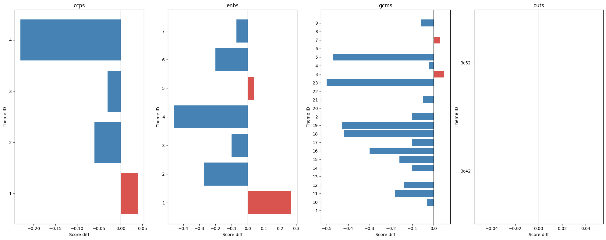

``` python
def plot_rank_changes(df):
    "Slope chart of rank changes (old → new) per mapping type, coloured by direction"
    fig, axes = plt.subplots(1, df.mapping_type.nunique(), figsize=(20, 8), sharey=False)
    for ax, (mt, grp) in zip(axes, df.groupby('mapping_type')):
        for _, row in grp.iterrows():
            color = 'steelblue' if row.rank_diff < 0 else '#d9534f' if row.rank_diff > 0 else 'grey'
            ax.plot([0, 1], [row.rank_old, row.rank_new], marker='o', color=color, alpha=0.7)
            ax.text(0.5, (row.rank_old + row.rank_new) / 2 + (-0.15 * row.rank_diff), row.theme_id,
                    ha='center', va='center', fontsize=8, fontweight='bold', color=color,
                    path_effects=[withStroke(linewidth=3, foreground='white')])
        ax.set_xticks([0, 1])
        ax.set_xticklabels(['Old', 'New'], fontsize=12)
        ax.invert_yaxis()
        ax.yaxis.set_major_locator(plt.MaxNLocator(integer=True))
        ax.set_title(mt, fontsize=14, fontweight='bold')
        ax.set_ylabel('Rank', fontsize=12)
    plt.tight_layout()
    plt.show()
```

``` python
plot_rank_changes(dfs[dfs.evl_id == '0d4309b702e00faac631be8d609934ce'])
```


### All

``` python
def plot_score_diffs(dfs, mapping_type, xlabel='Theme', col='score_diff'):
    "Violin plot of score diffs (new − old) per theme for a given mapping type"
    d = dfs[dfs.mapping_type==mapping_type].copy()
    d['theme_id'] = d['theme_id'].astype(int)
    d = d.sort_values('theme_id')
    f, ax = plt.subplots(figsize=(14, 6))
    sns.violinplot(data=d, x='theme_id', y=col, hue='theme_id', legend=False, bw_adjust=.5, cut=1, linewidth=1, palette="Set3")
    ax.axhline(0, color='red', linewidth=0.8, linestyle='--')
    ax.set(xlabel=xlabel, ylabel=f'{col} (new − old)', title=mapping_type)
    sns.despine(left=True, bottom=True)
    plt.tight_layout()
```

``` python
plot_score_diffs(dfs, 'gcms', 'GCM objective')
```


## Reporting

``` python
import contextkit.read as rd
```

``` python
dh_doc = rd.read_text('https://answerdotai.github.io/dialoghelper/core.html.md')
print(dh_doc[:200])
```

    # dialoghelper


    <!-- WARNING: THIS FILE WAS AUTOGENERATED! DO NOT EDIT! -->

    ``` python
    from dialoghelper import *
    ```

    ``` python
    from fastcore import tools
    from fastcore.test import *
    ```

    ## Helpe

- how to create a nb via dialogheper?
- how to create a cell?
- nice markdown template
- what to put in?
  - overview
  - explaining what has been changed
  - title
  - rank changed
  - score changed
  - for top ranked (top 2) items changed
    - previous reasoning
    - new reasoning

``` python
from dialoghelper.stdtools import *
```

``` python
find_dname()
```

    '/iomeval/nbs/processing/changes/changes_analysis'

``` python
await create_or_run_dialog('test_dialog')
```

    {'success': '"iomeval/nbs/processing/changes/test_dialog" is now running'}

``` python
_id = await add_msg('testing', dname='test_dialog')
```

``` python
_id
```

    '_e699dd4b'

## Analysis

### Top rank changed

``` python
def top_theme(dfs, rank_col): return dfs[dfs[rank_col]==1].set_index(['evl_id','mapping_type'])['theme_id']
```

``` python
top_old = top_theme(dfs, 'rank_old')
top_new = top_theme(dfs, 'rank_new')
top_changed = (top_old != top_new).rename('changed')
top_changed.groupby('mapping_type').mean().mul(100).round(1).rename('% reports where top theme changed')
```

    mapping_type
    ccps    20.0
    enbs    55.0
    gcms    25.0
    outs    20.0
    Name: % reports where top theme changed, dtype: float64

``` python
top_changed
```

    evl_id                            mapping_type
    8dd2261100ff5d714e73b411eed043d5  ccps            False
                                      enbs             True
                                      gcms            False
                                      outs            False
    1d7e6d2d445145d1d350b48b72b36681  ccps            False
                                                      ...  
    4c04ec0d3e651f7616190c6fc2dcfc18  outs            False
    e21305a89aeb76fafa8f4270392d463a  ccps            False
                                      enbs             True
                                      gcms             True
                                      outs             True
    Name: changed, Length: 80, dtype: bool

``` python
top_changed[top_changed].xs('enbs', level='mapping_type')
```

    evl_id
    8dd2261100ff5d714e73b411eed043d5    True
    1d7e6d2d445145d1d350b48b72b36681    True
    760568a15e144bcfb88dbbd50247dc51    True
    316c47c9dc19c820f3217434d4b93b28    True
    0d4309b702e00faac631be8d609934ce    True
    e8d9427f4a9094f68e17307faa567d8b    True
    75bad4665ed458cce78740e3d86f72d0    True
    f409b3f9a0671ec69a8591c425a45c1d    True
    a493c447cff3e03ca94024335d5c5c7a    True
    06fd0949dc874f388686461c19d2669c    True
    e21305a89aeb76fafa8f4270392d463a    True
    Name: changed, dtype: bool

``` python
gcms_top_changed = top_changed[top_changed].xs('gcms', level='mapping_type')
gcms_top_changedc
```

    evl_id
    760568a15e144bcfb88dbbd50247dc51    True
    22cac1c000836253adc445993e101560    True
    316c47c9dc19c820f3217434d4b93b28    True
    0d4309b702e00faac631be8d609934ce    True
    e21305a89aeb76fafa8f4270392d463a    True
    Name: changed, dtype: bool

``` python
[lut_id_staff[i] for i in gcms_top_changed.index if i in lut_id_staff]
```

    ['Andres', 'Davide', 'elma', 'pip', 'pip']

``` python
enbs_top_changed = top_changed[top_changed].xs('enbs', level='mapping_type')
enbs_top_changed
```

    evl_id
    8dd2261100ff5d714e73b411eed043d5    True
    1d7e6d2d445145d1d350b48b72b36681    True
    760568a15e144bcfb88dbbd50247dc51    True
    316c47c9dc19c820f3217434d4b93b28    True
    0d4309b702e00faac631be8d609934ce    True
    e8d9427f4a9094f68e17307faa567d8b    True
    75bad4665ed458cce78740e3d86f72d0    True
    f409b3f9a0671ec69a8591c425a45c1d    True
    a493c447cff3e03ca94024335d5c5c7a    True
    06fd0949dc874f388686461c19d2669c    True
    e21305a89aeb76fafa8f4270392d463a    True
    Name: changed, dtype: bool

``` python
[lut_id_staff[i] for i in enbs_top_changed.index if i in lut_id_staff]
```

    ['rogers',
     'rogers',
     'Andres',
     'elma',
     'pip',
     'Davide',
     'Andres',
     'Andres',
     'Davide',
     'Davide',
     'pip']

``` python
ccps_top_changed = top_changed[top_changed].xs('ccps', level='mapping_type')
ccps_top_changed
```

    evl_id
    22cac1c000836253adc445993e101560    True
    dba9eb1220368d28682d8531108e767d    True
    891448b7a4bf12763ea0579dd67e289d    True
    4c04ec0d3e651f7616190c6fc2dcfc18    True
    Name: changed, dtype: bool

``` python
[lut_id_staff[i] for i in ccps_top_changed.index if i in lut_id_staff]
```

    ['Davide', 'rogers', 'Andres', 'Andres']

- how much it changed?
- We are mostly interested in the themes id previously highly ranked and
  now ranked lower. I don’t want to overload domain experts with all
  changes

``` python
for i in gcms_top_changed.index: 
    plot_rank_changes(dfs[dfs.evl_id == i])
    #print(i)
```


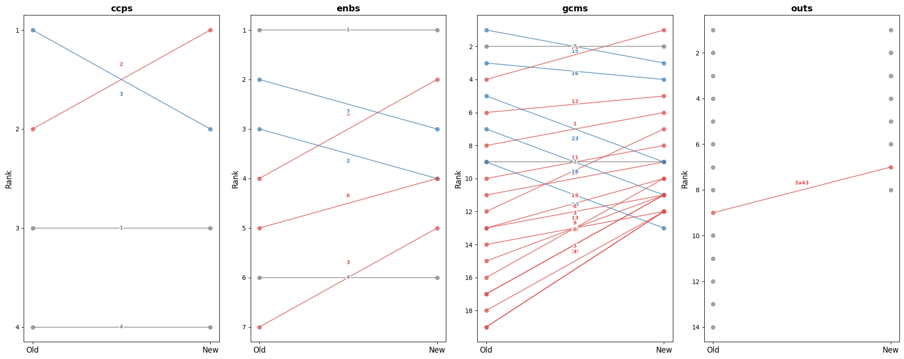

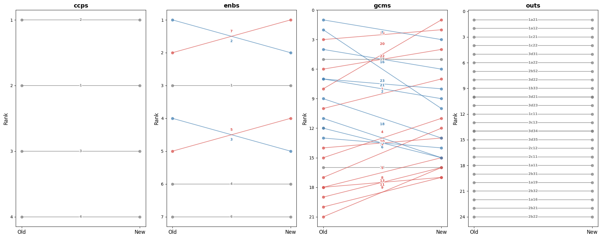

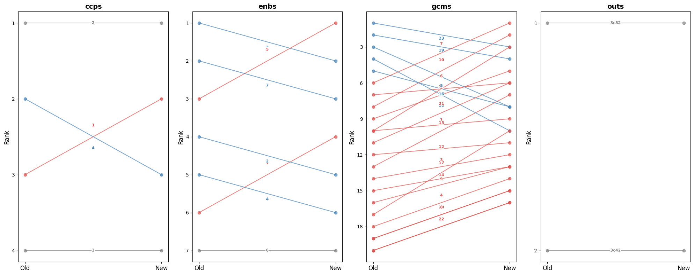

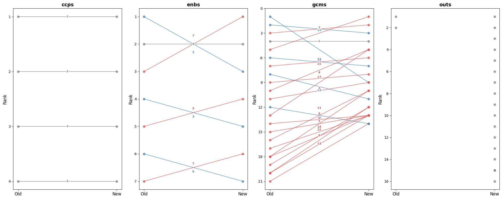

``` python
plot_rank_changes(dfs[dfs.evl_id == '760568a15e144bcfb88dbbd50247dc51'])
```

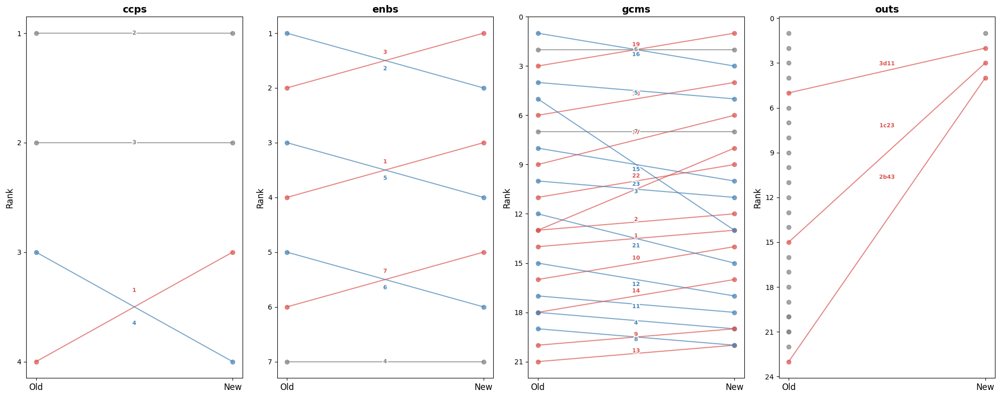

``` python
q = 'mapping_type == "gcms" and evl_id == "760568a15e144bcfb88dbbd50247dc51"'
print(dfs.query(q)[['mapping_type', 'theme_id', 'score_old', 'score_new', 'rank_old', 'rank_new']])
info_evl('760568a15e144bcfb88dbbd50247dc51')
```

        mapping_type theme_id  score_old  score_new  rank_old  rank_new
    97          gcms        1       0.28       0.20      14.0      13.0
    98          gcms       10       0.22       0.18      16.0      14.0
    99          gcms       11       0.18       0.05      17.0      18.0
    100         gcms       12       0.25       0.06      15.0      17.0
    101         gcms       13       0.05       0.03      21.0      20.0
    102         gcms       14       0.15       0.08      18.0      16.0
    103         gcms       15       0.48       0.30       8.0      10.0
    104         gcms       16       0.91       0.82       1.0       3.0
    105         gcms       17       0.45       0.55       9.0       6.0
    106         gcms       18       0.58       0.65       6.0       4.0
    107         gcms       19       0.85       0.88       3.0       1.0
    108         gcms        2       0.31       0.22      13.0      12.0
    109         gcms       20       0.31       0.38      13.0       8.0
    110         gcms       21       0.32       0.15      12.0      15.0
    111         gcms       22       0.35       0.32      11.0       9.0
    112         gcms       23       0.68       0.20       5.0      13.0
    113         gcms        3       0.38       0.25      10.0      11.0
    114         gcms        4       0.15       0.04      18.0      19.0
    115         gcms        5       0.72       0.62       4.0       5.0
    116         gcms        6       0.88       0.85       2.0       2.0
    117         gcms        7       0.52       0.45       7.0       7.0
    118         gcms        8       0.12       0.03      19.0      20.0
    119         gcms        9       0.08       0.04      20.0      19.0

### THEMATIC EVALUATION OF IOM’S LABOUR MIGRATION AND MOBILITY STRATEGY AND INITIATIVES

**Year:** 2023 | **Organization:** IOM | **Countries:** Worldwide

**Documents:** 5 available\
**ID:** `760568a15e144bcfb88dbbd50247dc51`

``` python
print(dfs[dfs.evl_id == '760568a15e144bcfb88dbbd50247dc51'][['mapping_type', 'theme_id', 'rank_old', 'rank_new', 'rank_diff']].query('mapping_type == "gcms"'))
```

        mapping_type theme_id  rank_old  rank_new  rank_diff
    97          gcms        1      14.0      13.0        1.0
    98          gcms       10      16.0       NaN        NaN
    99          gcms       10       NaN      14.0        NaN
    100         gcms       11      17.0       NaN        NaN
    101         gcms       11       NaN      18.0        NaN
    102         gcms       12      15.0       NaN        NaN
    103         gcms       12       NaN      17.0        NaN
    104         gcms       13      21.0       NaN        NaN
    105         gcms       13       NaN      20.0        NaN
    106         gcms       14      18.0       NaN        NaN
    107         gcms       14       NaN      16.0        NaN
    108         gcms       15       8.0      10.0       -2.0
    109         gcms       16       1.0       NaN        NaN
    110         gcms       16       NaN       3.0        NaN
    111         gcms       17       9.0       NaN        NaN
    112         gcms       17       NaN       6.0        NaN
    113         gcms       18       6.0       NaN        NaN
    114         gcms       18       NaN       4.0        NaN
    115         gcms       19       3.0       NaN        NaN
    116         gcms       19       NaN       1.0        NaN
    117         gcms        2      13.0      12.0        1.0
    118         gcms       20      13.0       NaN        NaN
    119         gcms       20       NaN       8.0        NaN
    120         gcms       21      12.0       NaN        NaN
    121         gcms       21       NaN      15.0        NaN
    122         gcms       22      11.0       NaN        NaN
    123         gcms       22       NaN       9.0        NaN
    124         gcms       23       5.0       NaN        NaN
    125         gcms       23       NaN      13.0        NaN
    126         gcms        3      10.0      11.0       -1.0
    127         gcms        4      18.0      19.0       -1.0
    128         gcms        5       4.0       5.0       -1.0
    129         gcms        6       2.0       NaN        NaN
    130         gcms        6       NaN       2.0        NaN
    131         gcms        7       7.0       NaN        NaN
    132         gcms        7       NaN       7.0        NaN
    133         gcms        8      19.0       NaN        NaN
    134         gcms        8       NaN      20.0        NaN
    135         gcms        9      20.0      19.0        1.0

``` python
for rpt in r
plot_rank_changes(dfs[dfs.evl_id == '0d4309b702e00faac631be8d609934ce'])
```

``` python
top_changed[top_changed].xs('enbs', level='mapping_type')
```

    evl_id
    8dd2261100ff5d714e73b411eed043d5    True
    1d7e6d2d445145d1d350b48b72b36681    True
    760568a15e144bcfb88dbbd50247dc51    True
    316c47c9dc19c820f3217434d4b93b28    True
    0d4309b702e00faac631be8d609934ce    True
    e8d9427f4a9094f68e17307faa567d8b    True
    75bad4665ed458cce78740e3d86f72d0    True
    f409b3f9a0671ec69a8591c425a45c1d    True
    a493c447cff3e03ca94024335d5c5c7a    True
    06fd0949dc874f388686461c19d2669c    True
    e21305a89aeb76fafa8f4270392d463a    True
    Name: changed, dtype: bool

``` python
top_changed[top_changed].xs('ccps', level='mapping_type')
```

    evl_id
    22cac1c000836253adc445993e101560    True
    dba9eb1220368d28682d8531108e767d    True
    891448b7a4bf12763ea0579dd67e289d    True
    4c04ec0d3e651f7616190c6fc2dcfc18    True
    Name: changed, dtype: bool

``` python
#top_changed[top_changed].reset_index().query("mapping_type == 'enbs'")
```

``` python
import seaborn as sns
import matplotlib.pyplot as plt

fig, axes = plt.subplots(1, df.mapping_type.nunique(), figsize=(20, 8), sharey=False)
for ax, (mt, grp) in zip(axes, df.groupby('mapping_type')):
    colors = ['#d9534f' if x > 0 else 'steelblue' for x in grp.score_diff]
    ax.barh(grp.theme_id.astype(str), grp.score_diff, color=colors)
    ax.axvline(0, color='black', linewidth=0.8)
    ax.set_title(mt)
    ax.set_xlabel('Score diff')
    ax.set_ylabel('Theme ID')
plt.tight_layout()
plt.show()
```

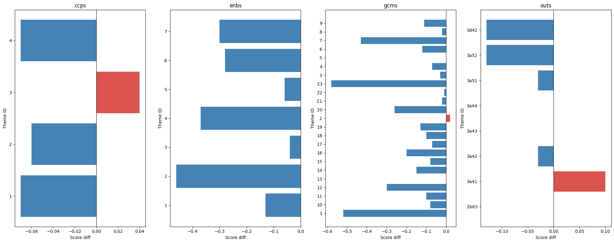

``` python
from matplotlib.patheffects import withStroke

fig, axes = plt.subplots(1, df.mapping_type.nunique(), figsize=(20, 8), sharey=False)
for ax, (mt, grp) in zip(axes, df.groupby('mapping_type')):
    for _, row in grp.iterrows():
        color = 'steelblue' if row.rank_diff < 0 else '#d9534f' if row.rank_diff > 0 else 'grey'
        ax.plot([0, 1], [row.rank_old, row.rank_new], marker='o', color=color, alpha=0.7)
        mid_y = (row.rank_old + row.rank_new) / 2
        offset = -0.15 * row.rank_diff
        ax.text(0.5, mid_y + offset, row.theme_id, ha='center', va='center', fontsize=8, fontweight='bold',
                color=color, path_effects=[withStroke(linewidth=3, foreground='white')])
    ax.set_xticks([0, 1])
    ax.set_xticklabels(['Old', 'New'], fontsize=12)
    ax.invert_yaxis()
    ax.set_title(mt, fontsize=14, fontweight='bold')
    ax.set_ylabel('Rank', fontsize=12)
plt.tight_layout()
plt.show()
```


I’ve remapped all $`current_res` reports, so I can compare mappings for
all of them. What kind of questions could we ask? - “does GCM 23
systematically get lower rank on average?”

##### 🤖Reply🤖<!-- SOLVEIT_SEPARATOR_7f3a9b2c -->

🧠🧠🧠🧠🧠🧠🧠🧠🧠🧠🧠🧠🧠🧠

Great starting point! Here are some useful directions:

**Systematic bias / directional shifts** - Does a specific theme
(e.g. GCM 23) consistently score lower / rank lower across reports? -
Which themes show the most consistent direction of change (always up or
always down)? - Are score drops concentrated in specific mapping types
(e.g. `gcms` more affected than `ccps`)?

**Magnitude of change** - Which themes have the largest average
`|score_diff|` across reports? - What’s the distribution of `pct_change`
— are most changes small noise or substantial? - Are there outlier
reports where changes are much larger than average?

**Rank stability** - Which themes are most rank-stable (low variance in
`rank_diff`) across reports? - How often does the top-ranked theme
change between old and new?

**Report-level** - Which reports changed the most overall (e.g. mean
`|score_diff|` per report)? - Are there reports where the set of “high
relevance” themes (e.g. score \> 0.5) changed substantially?

**Cross-mapping consistency** - Do reports that show a big drop in a GCM
theme also show a drop in the related SRF output?

------------------------------------------------------------------------

Your GCM 23 question is a good one to start with — it’s essentially:
*across all reports, what is the mean `rank_diff` for GCM 23?* Shall I
write that up, along with a small summary table for all themes?

``` python
df = compare_mappings(current_res[0], DATA_PATH/'results', LATEST_TAG_PATH).pipe(add_diffs).pipe(add_ranks).pipe(add_pct_change)
df.head()
```

<div>
<style scoped>
    .dataframe tbody tr th:only-of-type {
        vertical-align: middle;
    }
&#10;    .dataframe tbody tr th {
        vertical-align: top;
    }
&#10;    .dataframe thead th {
        text-align: right;
    }
</style>

<table class="dataframe" data-quarto-postprocess="true" data-border="1">
<thead>
<tr style="text-align: right;">
<th data-quarto-table-cell-role="th"></th>
<th data-quarto-table-cell-role="th">mapping_type</th>
<th data-quarto-table-cell-role="th">theme_id</th>
<th data-quarto-table-cell-role="th">theme_title_x</th>
<th data-quarto-table-cell-role="th">score_old</th>
<th data-quarto-table-cell-role="th">theme_title_y</th>
<th data-quarto-table-cell-role="th">score_new</th>
<th data-quarto-table-cell-role="th">score_diff</th>
<th data-quarto-table-cell-role="th">is_new</th>
<th data-quarto-table-cell-role="th">is_dropped</th>
<th data-quarto-table-cell-role="th">rank_old</th>
<th data-quarto-table-cell-role="th">rank_new</th>
<th data-quarto-table-cell-role="th">rank_diff</th>
<th data-quarto-table-cell-role="th">pct_change</th>
</tr>
</thead>
<tbody>
<tr>
<td data-quarto-table-cell-role="th">0</td>
<td>ccps</td>
<td>1</td>
<td>Integrity, Transparency and Accountability</td>
<td>0.45</td>
<td>Integrity, Transparency and Accountability</td>
<td>0.38</td>
<td>-0.07</td>
<td>False</td>
<td>False</td>
<td>2.0</td>
<td>3.0</td>
<td>-1.0</td>
<td>-15.555556</td>
</tr>
<tr>
<td data-quarto-table-cell-role="th">1</td>
<td>ccps</td>
<td>2</td>
<td>Equality, Diversity &amp; Inclusion</td>
<td>0.72</td>
<td>Equality, Diversity &amp; Inclusion</td>
<td>0.66</td>
<td>-0.06</td>
<td>False</td>
<td>False</td>
<td>1.0</td>
<td>1.0</td>
<td>0.0</td>
<td>-8.333333</td>
</tr>
<tr>
<td data-quarto-table-cell-role="th">2</td>
<td>ccps</td>
<td>3</td>
<td>Protection-centred</td>
<td>0.38</td>
<td>Protection-centred</td>
<td>0.42</td>
<td>0.04</td>
<td>False</td>
<td>False</td>
<td>3.0</td>
<td>2.0</td>
<td>1.0</td>
<td>10.526316</td>
</tr>
<tr>
<td data-quarto-table-cell-role="th">3</td>
<td>ccps</td>
<td>4</td>
<td>Environmental Sustainability</td>
<td>0.12</td>
<td>Environmental Sustainability</td>
<td>0.05</td>
<td>-0.07</td>
<td>False</td>
<td>False</td>
<td>4.0</td>
<td>4.0</td>
<td>0.0</td>
<td>-58.333333</td>
</tr>
<tr>
<td data-quarto-table-cell-role="th">4</td>
<td>enbs</td>
<td>1</td>
<td>Workforce</td>
<td>0.28</td>
<td>Workforce</td>
<td>0.15</td>
<td>-0.13</td>
<td>False</td>
<td>False</td>
<td>6.0</td>
<td>6.0</td>
<td>0.0</td>
<td>-46.428571</td>
</tr>
</tbody>
</table>

</div>

``` python
dfs = pd.concat([
    compare_mappings(
        d, 
        DATA_PATH/'results', 
        LATEST_TAG_PATH).pipe(add_diffs).pipe(add_ranks).pipe(add_pct_change) 
    for d in current_res])
```

``` python
dfs = pd.concat([
    compare_mappings(d, DATA_PATH/'results', LATEST_TAG_PATH).pipe(add_diffs).pipe(add_ranks).pipe(add_pct_change)
    for d in current_res], ignore_index=True)
```

``` python
dfs.head()
```

<div>
<style scoped>
    .dataframe tbody tr th:only-of-type {
        vertical-align: middle;
    }
&#10;    .dataframe tbody tr th {
        vertical-align: top;
    }
&#10;    .dataframe thead th {
        text-align: right;
    }
</style>

<table class="dataframe" data-quarto-postprocess="true" data-border="1">
<thead>
<tr style="text-align: right;">
<th data-quarto-table-cell-role="th"></th>
<th data-quarto-table-cell-role="th">mapping_type</th>
<th data-quarto-table-cell-role="th">theme_id</th>
<th data-quarto-table-cell-role="th">theme_title_x</th>
<th data-quarto-table-cell-role="th">score_old</th>
<th data-quarto-table-cell-role="th">theme_title_y</th>
<th data-quarto-table-cell-role="th">score_new</th>
<th data-quarto-table-cell-role="th">score_diff</th>
<th data-quarto-table-cell-role="th">is_new</th>
<th data-quarto-table-cell-role="th">is_dropped</th>
<th data-quarto-table-cell-role="th">rank_old</th>
<th data-quarto-table-cell-role="th">rank_new</th>
<th data-quarto-table-cell-role="th">rank_diff</th>
<th data-quarto-table-cell-role="th">pct_change</th>
</tr>
</thead>
<tbody>
<tr>
<td data-quarto-table-cell-role="th">0</td>
<td>ccps</td>
<td>1</td>
<td>Integrity, Transparency and Accountability</td>
<td>0.45</td>
<td>Integrity, Transparency and Accountability</td>
<td>0.38</td>
<td>-0.07</td>
<td>False</td>
<td>False</td>
<td>2.0</td>
<td>3.0</td>
<td>-1.0</td>
<td>-15.555556</td>
</tr>
<tr>
<td data-quarto-table-cell-role="th">1</td>
<td>ccps</td>
<td>2</td>
<td>Equality, Diversity &amp; Inclusion</td>
<td>0.72</td>
<td>Equality, Diversity &amp; Inclusion</td>
<td>0.66</td>
<td>-0.06</td>
<td>False</td>
<td>False</td>
<td>1.0</td>
<td>1.0</td>
<td>0.0</td>
<td>-8.333333</td>
</tr>
<tr>
<td data-quarto-table-cell-role="th">2</td>
<td>ccps</td>
<td>3</td>
<td>Protection-centred</td>
<td>0.38</td>
<td>Protection-centred</td>
<td>0.42</td>
<td>0.04</td>
<td>False</td>
<td>False</td>
<td>3.0</td>
<td>2.0</td>
<td>1.0</td>
<td>10.526316</td>
</tr>
<tr>
<td data-quarto-table-cell-role="th">3</td>
<td>ccps</td>
<td>4</td>
<td>Environmental Sustainability</td>
<td>0.12</td>
<td>Environmental Sustainability</td>
<td>0.05</td>
<td>-0.07</td>
<td>False</td>
<td>False</td>
<td>4.0</td>
<td>4.0</td>
<td>0.0</td>
<td>-58.333333</td>
</tr>
<tr>
<td data-quarto-table-cell-role="th">4</td>
<td>enbs</td>
<td>1</td>
<td>Workforce</td>
<td>0.28</td>
<td>Workforce</td>
<td>0.15</td>
<td>-0.13</td>
<td>False</td>
<td>False</td>
<td>6.0</td>
<td>6.0</td>
<td>0.0</td>
<td>-46.428571</td>
</tr>
</tbody>
</table>

</div>

``` python
dfs[(dfs.mapping_type=='gcms') & (dfs.theme_id=='23')]['pct_change'].describe()
```

    count    20.000000
    mean    -65.511802
    std      23.376751
    min     -86.956522
    25%     -79.801829
    50%     -74.264706
    75%     -61.572967
    max     -15.294118
    Name: pct_change, dtype: float64

``` python
dfs[(dfs.mapping_type=='gcms') & (dfs.theme_id=='23')].score_diff.describe()
```

    count    20.000000
    mean     -0.435000
    std       0.188582
    min      -0.800000
    25%      -0.572500
    50%      -0.440000
    75%      -0.345000
    max      -0.130000
    Name: score_diff, dtype: float64

### Scores diff

``` python
dfs[(dfs.mapping_type=='gcms') & (dfs.theme_id=='23')].score_diff.hist()
```

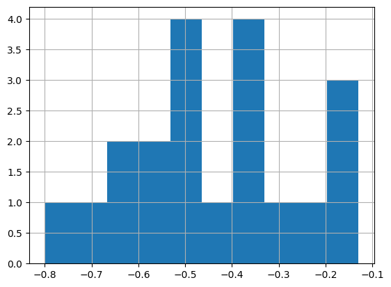

``` python
import seaborn as sns, matplotlib.pyplot as plt

gcm_dfs = dfs[dfs.mapping_type=='gcms'].copy()
gcm_dfs['theme_id'] = gcm_dfs['theme_id'].astype(int)
gcm_dfs = gcm_dfs.sort_values('theme_id')

f, ax = plt.subplots(figsize=(14, 6))
sns.violinplot(data=gcm_dfs, x='theme_id', y='score_diff', hue='theme_id', legend=False, bw_adjust=.5, cut=1, linewidth=1, palette="Set3")

ax.axhline(0, color='red', linewidth=0.8, linestyle='--')
ax.set(xlabel='GCM objective', ylabel='score diff (new − old)')
sns.despine(left=True, bottom=True)
plt.tight_layout()
```


``` python
def plot_score_diffs(dfs, mapping_type, xlabel='Theme', col='score_diff'):
    "Violin plot of score diffs (new − old) per theme for a given mapping type"
    d = dfs[dfs.mapping_type==mapping_type].copy()
    d['theme_id'] = d['theme_id'].astype(int)
    d = d.sort_values('theme_id')
    f, ax = plt.subplots(figsize=(14, 6))
    sns.violinplot(data=d, x='theme_id', y=col, hue='theme_id', legend=False, bw_adjust=.5, cut=1, linewidth=1, palette="Set3")
    ax.axhline(0, color='red', linewidth=0.8, linestyle='--')
    ax.set(xlabel=xlabel, ylabel=f'{col} (new − old)', title=mapping_type)
    sns.despine(left=True, bottom=True)
    plt.tight_layout()
```

``` python
plot_score_diffs(dfs, 'gcms', 'GCM objective')
```


``` python
plot_score_diffs(dfs, 'gcms', 'GCM objective')
```

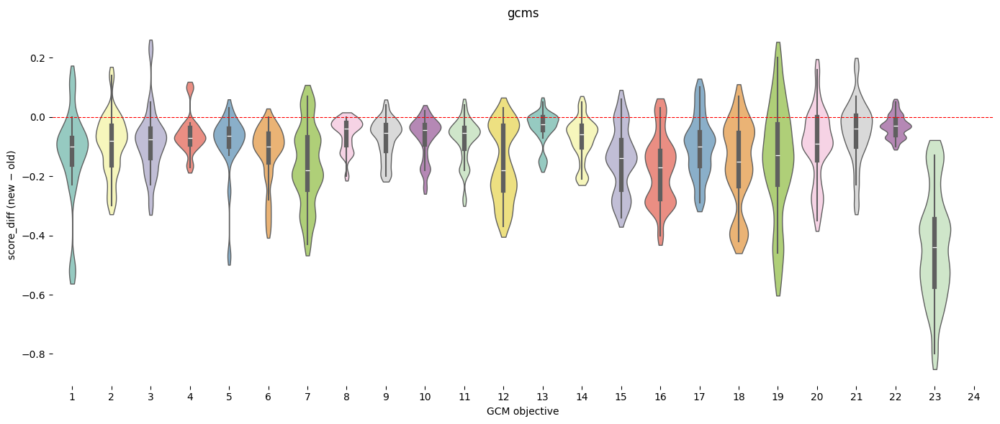

``` python
plot_score_diffs(dfs, 'enbs', 'SRF Enablers')
```

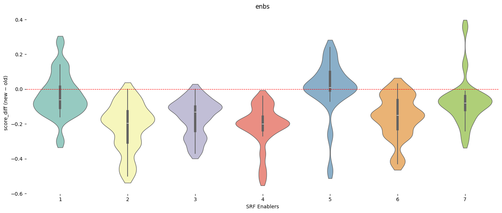

``` python
plot_score_diffs(dfs, 'ccps', 'SRF Cross-Cutting Priorities')
```


``` python
dfs.columns
```

    Index(['mapping_type', 'theme_id', 'theme_title_x', 'score_old',
           'theme_title_y', 'score_new', 'score_diff', 'is_new', 'is_dropped',
           'rank_old', 'rank_new', 'rank_diff', 'pct_change'],
          dtype='str')

### Ranks diff

``` python
plot_score_diffs(dfs, 'gcms', 'GCM Objectives', col='rank_diff')
```


``` python
plot_score_diffs(dfs, 'enbs', 'SRF Enablers', col='rank_diff')
```


``` python
plot_score_diffs(dfs, 'ccps', 'SRF Cross-Cutting Priorities', col='rank_diff')
```

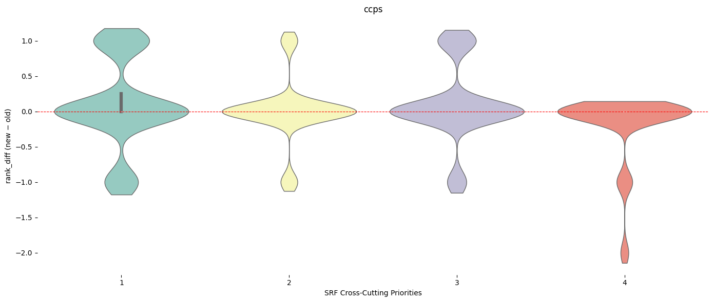

``` python
plot_score_diffs(dfs[dfs.rank_old <= 3], 'gcms', 'GCM Objectives', col='rank_diff')
```

Let’s try to answer this question: How often does the top-ranked theme
change between old and new?

##### 🤖Reply🤖<!-- SOLVEIT_SEPARATOR_7f3a9b2c -->

We need to track, per report and mapping type, whether the top-ranked
theme changed. We’ll need an `eval_id` column first — let me rebuild
`dfs` with that, then answer the question.

``` python
dfs = pd.concat([
    compare_mappings(d, DATA_PATH/'results', LATEST_TAG_PATH).pipe(add_diffs).pipe(add_ranks).pipe(add_pct_change).assign(eval_id=d)
    for d in current_res], ignore_index=True)
```

Then:

``` python
def top_theme(df, rank_col): return df[df[rank_col]==1].set_index(['eval_id','mapping_type'])['theme_id']

top_old = top_theme(dfs, 'rank_old')
top_new = top_theme(dfs, 'rank_new')
top_changed = (top_old != top_new).rename('changed')
top_changed.groupby('mapping_type').mean().mul(100).round(1).rename('% reports where top theme changed')
```

``` python
dfs = pd.concat([
    compare_mappings(d, DATA_PATH/'results', LATEST_TAG_PATH).pipe(add_diffs).pipe(add_ranks).pipe(add_pct_change).assign(eval_id=d)
    for d in current_res], ignore_index=True)
```

``` python
def top_theme(df, rank_col): return df[df[rank_col]==1].set_index(['eval_id','mapping_type'])['theme_id']

top_old = top_theme(dfs, 'rank_old')
top_new = top_theme(dfs, 'rank_new')
top_changed = (top_old != top_new).rename('changed')
top_changed.groupby('mapping_type').mean().mul(100).round(1).rename('% reports where top theme changed')
```

    mapping_type
    ccps    20.0
    enbs    55.0
    gcms    25.0
    outs    20.0
    Name: % reports where top theme changed, dtype: float64

### Reports and mapping type where top ranked theme changed

``` python
print(top_changed[top_changed].reset_index()[['eval_id','mapping_type']].sort_values('mapping_type'))
```

                                 eval_id mapping_type
    20  4c04ec0d3e651f7616190c6fc2dcfc18         ccps
    5   22cac1c000836253adc445993e101560         ccps
    18  891448b7a4bf12763ea0579dd67e289d         ccps
    15  dba9eb1220368d28682d8531108e767d         ccps
    0   8dd2261100ff5d714e73b411eed043d5         enbs
    1   1d7e6d2d445145d1d350b48b72b36681         enbs
    2   760568a15e144bcfb88dbbd50247dc51         enbs
    21  e21305a89aeb76fafa8f4270392d463a         enbs
    17  06fd0949dc874f388686461c19d2669c         enbs
    8   316c47c9dc19c820f3217434d4b93b28         enbs
    16  a493c447cff3e03ca94024335d5c5c7a         enbs
    10  0d4309b702e00faac631be8d609934ce         enbs
    12  e8d9427f4a9094f68e17307faa567d8b         enbs
    13  75bad4665ed458cce78740e3d86f72d0         enbs
    14  f409b3f9a0671ec69a8591c425a45c1d         enbs
    11  0d4309b702e00faac631be8d609934ce         gcms
    9   316c47c9dc19c820f3217434d4b93b28         gcms
    6   22cac1c000836253adc445993e101560         gcms
    3   760568a15e144bcfb88dbbd50247dc51         gcms
    22  e21305a89aeb76fafa8f4270392d463a         gcms
    7   22cac1c000836253adc445993e101560         outs
    19  891448b7a4bf12763ea0579dd67e289d         outs
    4   760568a15e144bcfb88dbbd50247dc51         outs
    23  e21305a89aeb76fafa8f4270392d463a         outs

``` python
def plot_rank_changes(df):
    "Slope chart of rank changes (old → new) per mapping type, coloured by direction"
    fig, axes = plt.subplots(1, df.mapping_type.nunique(), figsize=(20, 8), sharey=False)
    for ax, (mt, grp) in zip(axes, df.groupby('mapping_type')):
        for _, row in grp.iterrows():
            color = 'steelblue' if row.rank_diff < 0 else '#d9534f' if row.rank_diff > 0 else 'grey'
            ax.plot([0, 1], [row.rank_old, row.rank_new], marker='o', color=color, alpha=0.7)
            ax.text(0.5, (row.rank_old + row.rank_new) / 2 + (-0.15 * row.rank_diff), row.theme_id,
                    ha='center', va='center', fontsize=8, fontweight='bold', color=color,
                    path_effects=[withStroke(linewidth=3, foreground='white')])
        ax.set_xticks([0, 1])
        ax.set_xticklabels(['Old', 'New'], fontsize=12)
        ax.invert_yaxis()
        ax.set_title(mt, fontsize=14, fontweight='bold')
        ax.set_ylabel('Rank', fontsize=12)
    plt.tight_layout()
    plt.show()
```

``` python
#dfs[dfs.eval_id == '0d4309b702e00faac631be8d609934ce']
```

``` python
plot_rank_changes(dfs[dfs.eval_id == '0d4309b702e00faac631be8d609934ce'])
```

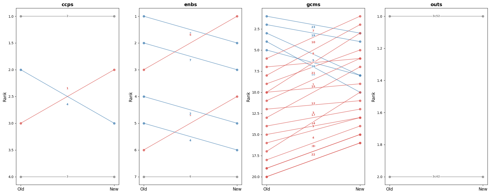

``` python
def plot_score_diffs_bar(df):
    "Bar chart of score diffs (new − old) per theme, coloured by direction, faceted by mapping type"
    fig, axes = plt.subplots(1, df.mapping_type.nunique(), figsize=(20, 8), sharey=False)
    for ax, (mt, grp) in zip(axes, df.groupby('mapping_type')):
        ax.barh(grp.theme_id.astype(str), grp.score_diff, color=['#d9534f' if x > 0 else 'steelblue' for x in grp.score_diff])
        ax.axvline(0, color='black', linewidth=0.8)
        ax.set(title=mt, xlabel='Score diff', ylabel='Theme ID')
    plt.tight_layout()
    plt.show()
```

``` python
plot_score_diffs_bar(dfs[dfs.eval_id == '0d4309b702e00faac631be8d609934ce'])
```


``` python
def plot_scores_comparison(df, eval_id, mapping_type):
    "Grouped bar chart of old vs new scores per theme for a given report and mapping type"
    title = info_eval(eval_id).meta['Title']
    title_pretty = title if len(title) < 80 else title[:80] + '...'
    d = df[(df.eval_id==eval_id) & (df.mapping_type==mapping_type)].copy()
    d['theme_id'] = d['theme_id'].astype(int)
    d = d.sort_values('theme_id')
    x = range(len(d))
    f, ax = plt.subplots(figsize=(14, 5))
    ax.bar([i-0.2 for i in x], d.score_old, width=0.4, label='old', color='steelblue', alpha=0.8)
    ax.bar([i+0.2 for i in x], d.score_new, width=0.4, label='new', color='#d9534f', alpha=0.8)
    ax.set_xticks(list(x))
    ax.set_xticklabels(d.theme_id)
    ax.set(xlabel='Theme ID', ylabel='Score', title=f'{mapping_type} — {title_pretty}')
    ax.legend()
    plt.tight_layout()
```

``` python
plot_scores_comparison(dfs, '316c47c9dc19c820f3217434d4b93b28', 'gcms')
```


``` python
plot_scores_comparison(dfs, '316c47c9dc19c820f3217434d4b93b28', 'enbs')
```


``` python
df_top_changed = top_changed[top_changed].reset_index()[['eval_id','mapping_type']]
```

``` python
for id_ in df_top_changed[df_top_changed.mapping_type == 'gcms'].eval_id:
    plot_scores_comparison(dfs, id_, 'gcms')
```

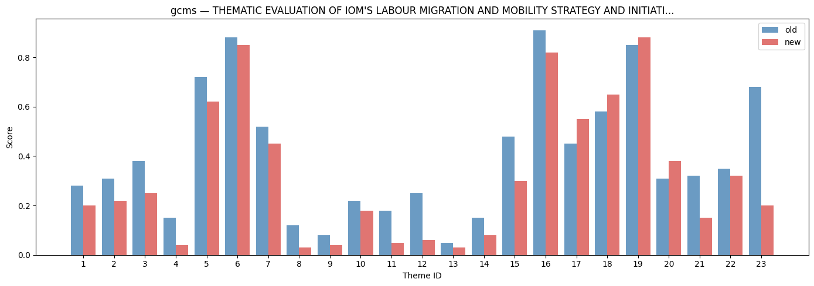

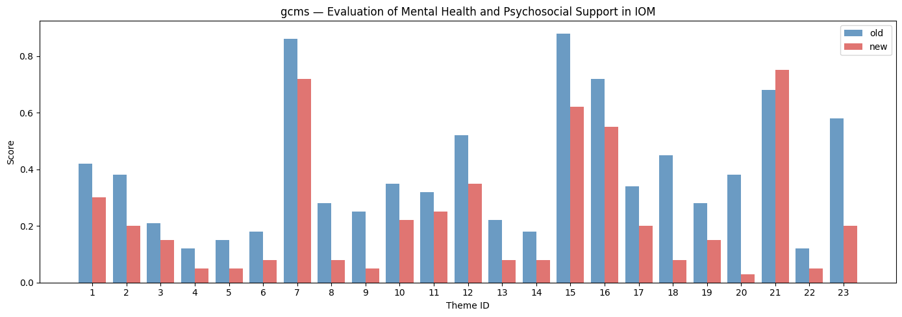


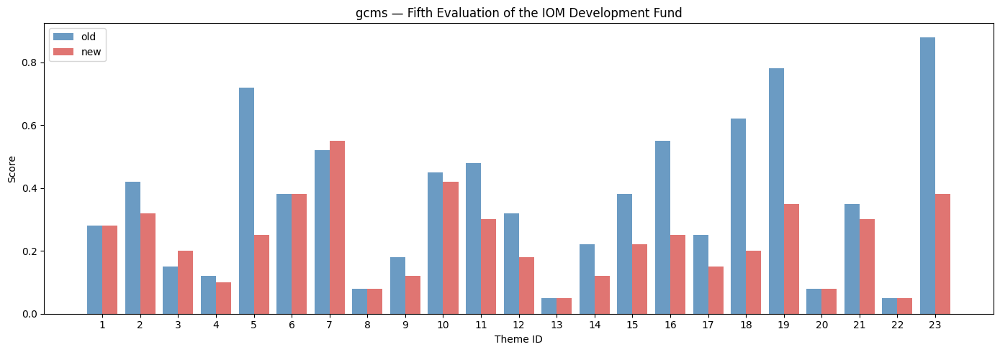


``` python
for id_ in df_top_changed[df_top_changed.mapping_type == 'enbs'].eval_id:
    plot_scores_comparison(dfs, id_, 'enbs')
```


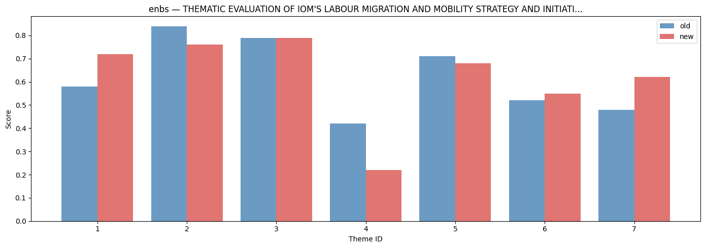

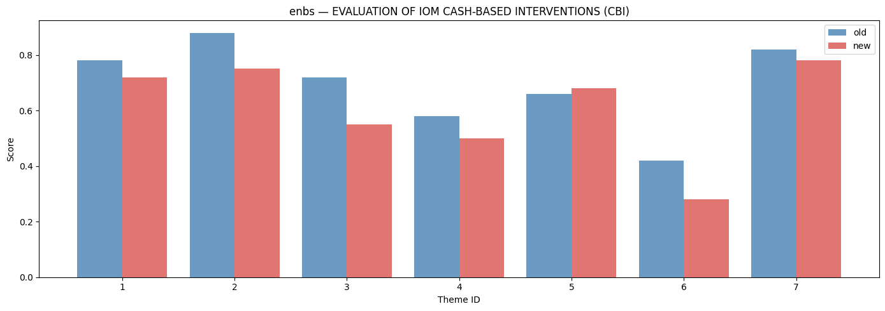

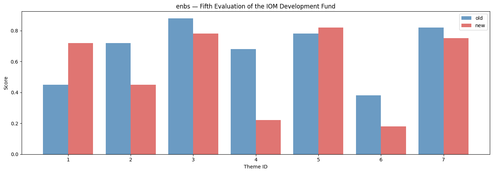


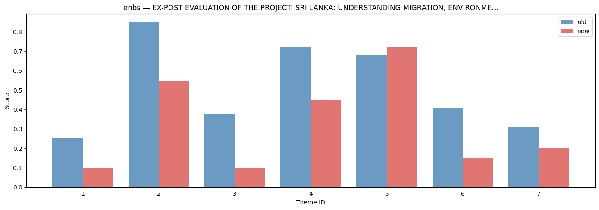


``` python
for id_ in df_top_changed[df_top_changed.mapping_type == 'ccps'].eval_id:
    plot_scores_comparison(dfs, id_, 'ccps')
```


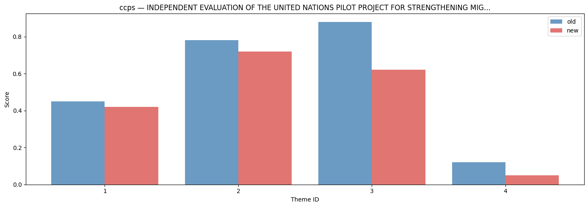

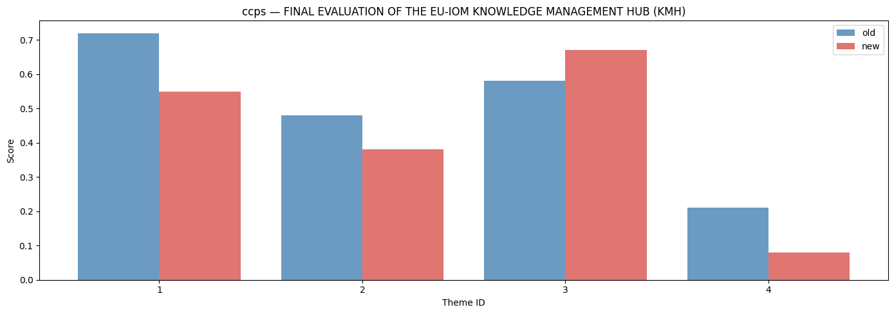

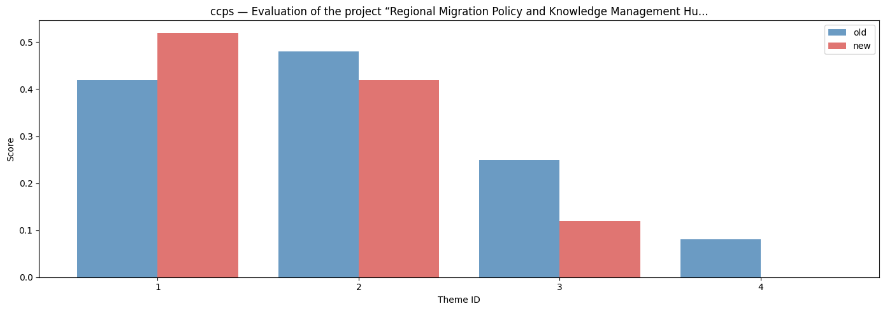
