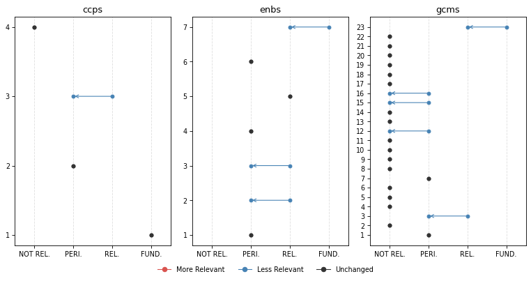
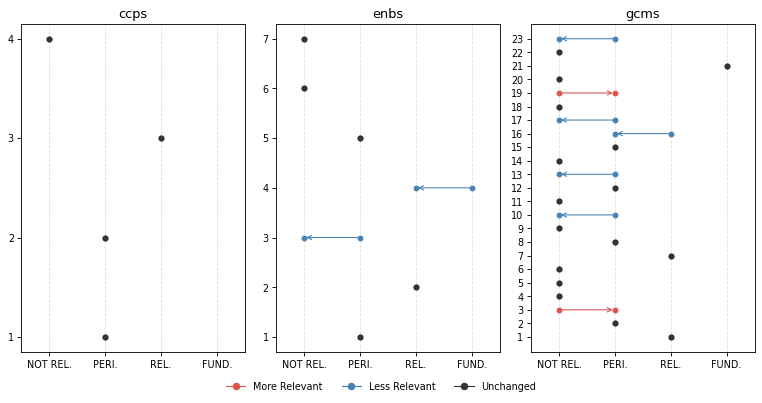
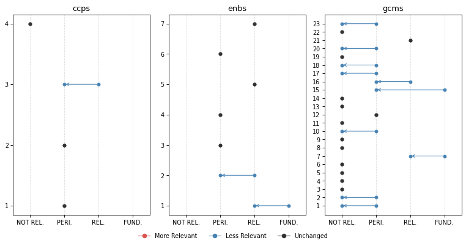
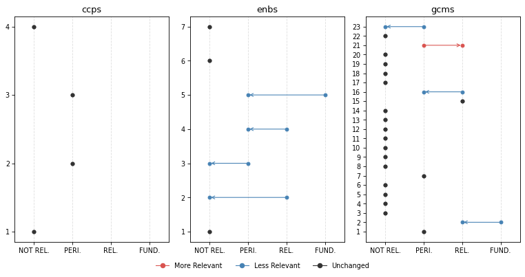
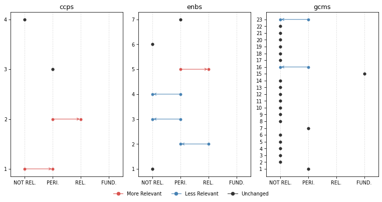
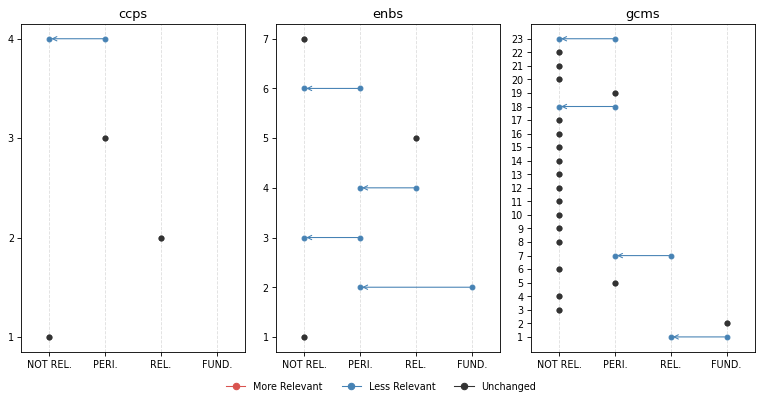

# Change Analysis


<!-- WARNING: THIS FILE WAS AUTOGENERATED! DO NOT EDIT! -->

[Click here](https://iom-tagapp-beta.pla.sh) to access the **IOM TAGGING
(BETA) PLATFORM**

``` python
from iomeval.llm_eval.changes import *

from fastcore.all import *
from iomeval.readers import load_evals
from pathlib import Path
```

``` python
p = Path().home() / 'iomeval/data/requester_by_report_id.json'
lut = p.read_json()
evls_test = L(lut.keys())

ROOT_PATH = Path.home() / 'iomeval'
DATA_PATH = ROOT_PATH / 'data'
RESULTS_PATH = DATA_PATH/ 'results'
EVALS_PATH = ROOT_PATH / 'nbs/files/test/evaluations.json'

# Contains latest backed up data before new deployment
LATEST_TAG_PATH = Path.home() / 'tagapp/backups/20260311_115159/data'

evals = load_evals(EVALS_PATH)
```

``` python
dfs = all_deltas(evls_test, RESULTS_PATH, LATEST_TAG_PATH)
```

``` python
who = set(lut.values())
who
```

    {'Andres', 'Davide', 'elma', 'ljeoma', 'pip', 'rogers'}

``` python
# Automaticall generate changes report cells for all reports
rpts = [k for k,v in lut.items() if v=='Davide']
for rpt in rpts: await gen_report_cells(rpt, dfs, LATEST_TAG_PATH, RESULTS_PATH)
```

## What we changed?

1.  First of all, we **improved the consistency of what section of an
    evaluation report the model reads**. A “curation” step was added to
    the process in which a human selects the sections of the report that
    are more relevant to the tagging. This step used to be automatic (it
    was based on the “parsing” prompt that you reviewed) but we realized
    that several mistakes were being made by the model (probably because
    of the diversity in formatting and structure of evaluation reports,
    which not always follow a precise template). This is a major change
    with likely general consequences on the tagging. *Feedback from
    testers on which sections of the report should be fed to the model
    was considered*.

Secondly, we made changes to the tagging prompts based on your feedback.
Here are the main modifications (minor ones are not listed here but are
available in the files used for the review):

2.  **Excerpt-based analysis clarification**: Following the point above
    on the new report “curation” step, we asked the model to be explicit
    on the fact that only specific section are accessed (executive
    summary, introduction, background, evaluation scope, conclusions,
    recommendations, lessons learnt) in order not to give a false
    impression that the full report was being fed to the model. Hedged
    language is required throughout (e.g., “the excerpts suggest …”,
    “based on the sections reviewed …”). *This follows up on comments
    from several testers - some asking more precise quotation outputs
    (something not possible at this stage - sorry!). The reasoning now
    is more transparent on the fact that the model is not reading the
    whole report (like a human would do when tagging; remember also that
    in earlier experiments, feeding the whole report to the model was
    inflating scores throughout and making the model unusable)*.

3.  **GCM 23 downgrading**: Added an important note on GCM Objective 23
    clarifying its revised scoring treatment. *This follows up on
    feedback from different testers suggesting that relevance with
    respect to this objective may have been exaggerated by the model*.

4.  **SRF enablers reframing**: Introduced a critical distinction
    between enablers as institutional capacity versus programmatic
    tools. *This follows up on a point raised by Pip*.

5.  **Relevance score range relabelling**: Tags now use “Not Relevant”,
    “Peripheral” (formerly “Supplementary”), “Relevant”, and
    “Fundamental”. *This follows up on suggestion from Andres*.

6.  **Terminology warning on “Findings”** — Analysts must not use
    “finding(s)” in their own analytical language, as this term carries
    a specific formal meaning in IOM evaluation reports. It may only be
    referenced when it appears in report excerpts themselves. *This
    clarification stems from Andres flagging overly broad or imprecise
    uses of “findings” generated by the LLM*.

7.  **GCM descriptions added**: The description of the GCM objective
    used by the model is now fully in line with the GCM UN resolution
    document. *This is something we realized upon auditing the script*.
    For instance:

<!-- -->

    # Objective 1
    ## Title: Collect and utilize accurate and disaggregated data as a basis for evidence-based policies
    We commit to strengthen the global evidence base on international migration by improving and investing in the collection, analysis and dissemination of accurate , ...
    To realize this commitment, we will draw from the following actions:
    ## Associated actions
    - a. Elaborate and implement ...
    - b. ...
    ...

Here are links to
[new](https://github.com/franckalbinet/iomeval/tree/main/nbs/files/prompts)
and
[previous](https://github.com/franckalbinet/iomeval/tree/main/nbs/files/prompts/legacy)
versions of the prompts.

How did these changes affect tagging?

## Score changes overview

**Based on all reports tagged so far (20)**. This is to give you a
general sense of how the behavior of the model changed.

### GCM objectives

*Note: You might be unfamiliar with this type of visualization. It’s
called a [violin plot](https://en.wikipedia.org/wiki/Violin_plot). A
violin plot combines a box plot with a smoothed estimate of the score
distribution, making it easier to spot not just the median and spread,
but also whether scores cluster around one or several values, something
a box plot alone would miss.*

``` python
plot_score_diffs(dfs, 'gcms', 'GCM objective', figsize=(12, 6), dpi=77)
```


### SRF Enablers

``` python
plot_score_diffs(dfs, 'enbs', 'SRF Enablers', figsize=(8, 3), dpi=77)
```


### SRF Cross-Cutting Priorities

``` python
plot_score_diffs(dfs, 'ccps', 'SRF Cross-Cutting Priorities', figsize=(8, 3), dpi=77)
```


## Rank changes overview

Among all themes where previous relevance score was `> 0.83`
(**FUNDAMENTAL**), what percentage of them have undergone a change in
rank (`rank_diff != 0`)

``` python
dfs[dfs.score_old > 0.83].groupby('mapping_type').apply(lambda x: 100 * (x.rank_diff != 0).sum() / len(x)).round(1).sort_values()
```

    mapping_type
    ccps    16.7
    gcms    34.3
    outs    40.7
    enbs    44.4
    dtype: float64

## Our interpretation

The score changes overview charts show a general decrease of the scores.
In other words, the **model became more conservative** following the
various changes made to the prompts.

The reduction in scores is more pronounced and generalized for GCM
objectives, possibly due to the additional details on **GCM objectives**
(change 7 above) that now the model has access to. However, the
reductions yet remain moderate in magnitude, suggesting the prompt
revisions recalibrated the model’s behaviour without disrupting it
fundamentally. The dramatic average score reduction for GCM objective 23
is something intended. *It means that the changes to the prompt worked,
although your feedback will say if further calibration is needed*.

**SRF Enablers** showed the highest rank instability (44.4%). This is
also expected due to their reframing in the prompt (change 4).

**CCPs** were relatively unaffected by the changes in terms of average
scores and ranking, which is consistent with the fact that none of the
changes specifically targeted CCP scoring logic.

**Caveat**: the current general analysis is based on 20 reports only.
Patterns, especially for the objectives less covered by our sample of
reports, should be interpreted with caution.

## Inputs we need from you

- Do you agree with the overall interpretation of the changes?
- Do you find the new behaviour to be improved?
- Please check, in the reports you asked us to tag, how the new
  behaviour has changed the items classified as fundamental. Do you find
  that accuracy and sensitivity have improved? Do you find the new
  reasonings better?

## Per evaluation report

**REMINDER**, our “RELEVANCE SCORE FRAMEWORK” is as follows: - score \>=
0.84: **FUNDAMENTAL** - 0.66 \<= score \< 0.83: **RELEVANT** - 0.34 \<=
score \< 0.66: **PERIPHERAL** - score \< 0.34: **NOT RELEVANT**

### Evaluation of IOM Accountability to Affected Populations

``` python
plot_band_changes(dfs[dfs.evl_id == '6c3c2cf3fa479112967612b0baddab72'], figsize=(10, 5), dpi=77)
```



**Fundamental Themes** | | Mapping | Theme | Score | |—|—|—|—| | old |
ccps | 1: Integrity, Transparency and Accountability | 0.91 | | old |
enbs | 7: Internal systems | 0.85 | | old | gcms | 23: Strengthen
International Cooperation And Global Partnerships For Safe, Orderly And
Regular Migration | 0.85 | | new | ccps | 1: Integrity, Transparency and
Accountability | 0.85 |

**⬇️ No Longer Fundamental**

#### ENBS 7: Internal systems

<table>
<thead>
<tr>
<th>score_old</th>
<th>score_new</th>
<th>rank_old</th>
<th>rank_new</th>
<th>rank_diff</th>
</tr>
</thead>
<tbody>
<tr>
<td>0.85</td>
<td>0.82</td>
<td>1</td>
<td>1</td>
<td>0</td>
</tr>
</tbody>
</table>

<details>

<summary>

Reasoning (old)
</summary>

This report would likely be essential for a synthesis on internal
systems and organizational infrastructure. The evaluation’s primary
focus is assessing IOM’s AAP Framework—an institutional system
comprising policy (IN/285), guidance, resources, and coordination
mechanisms. Key findings directly address: the absence of a formal
monitoring and evaluation framework; gaps in standard tools and
procedures; lack of integration of AAP into the project cycle; the need
for institutionalization of CFM systems into ‘corporate systems’; and
data protection compliance challenges. The conclusions note that IOM
lacks ‘a formal result matrix or a theory of change for AAP’ and relies
on ‘a collection of indicators from different institutional monitoring
frameworks.’ Recommendations 3, 7, and 8 specifically address developing
monitoring frameworks, standardizing tools and templates, and
integrating CFM systems into corporate infrastructure. For synthesis
specialists examining IOM’s internal systems capacities, this report
provides substantial evidence on how institutional frameworks are
developed, implemented, and monitored. The analysis of system
fragmentation, the discussion of policy-practice gaps, and the
recommendations on standardization and integration would be particularly
valuable. Pay close attention to the findings on monitoring frameworks,
the analysis of CFM system fragmentation in findings, and
Recommendations 2, 3, 7, and 8.
</details>

------------------------------------------------------------------------

<details>

<summary>

Reasoning (new)
</summary>

Based on the excerpts reviewed, this report would likely contribute
meaningful evidence to a synthesis on Enabler 7 (Internal Systems), and
appears to be one of the two most relevant Enablers for this report. The
evaluation explicitly examines IOM’s institutional systems and
organizational infrastructure for AAP — including the adequacy of the
AAP policy framework (IN/285), the monitoring and evaluation
architecture, CFM systems and their integration into corporate systems,
the project cycle, and compliance with mandatory instructions. These are
assessed as organizational systems, not merely as programmatic tools.
The excerpts suggest substantive analysis of: the absence of a formal
strategy and M&E framework; the fragmented and non-standardized nature
of CFM systems across the organization; the lack of integration of AAP
into the IOM project cycle; inadequate institutional compliance
monitoring; and the need for minimum standards and quality control.
Recommendations 1, 3, 5, and 8 directly address institutional systems —
including clarifying mandatory policy scope, developing a theory of
change and M&E framework, standardizing CFM systems, and integrating AAP
into corporate systems. The conclusions section appears particularly
rich in institutional systems analysis, noting gaps in policy
monitoring, strategic planning, and organizational infrastructure. A
synthesis specialist would likely want to prioritize the conclusions and
recommendations sections, particularly those addressing the AAP
Framework architecture, CFM standardization, and the monitoring
framework — as these appear most directly relevant to IOM’s internal
systems capacity. The full report may contain additional relevant
evidence beyond what the excerpts reveal.
</details>

#### GCMS 23: Strengthen international cooperation and global partnerships for safe, orderly and regular migration

<table>
<thead>
<tr>
<th>score_old</th>
<th>score_new</th>
<th>rank_old</th>
<th>rank_new</th>
<th>rank_diff</th>
</tr>
</thead>
<tbody>
<tr>
<td>0.85</td>
<td>0.72</td>
<td>1</td>
<td>1</td>
<td>0</td>
</tr>
</tbody>
</table>

<details>

<summary>

Reasoning (old)
</summary>

This report would likely be essential for a synthesis on GCM Objective
23, specifically regarding inter-agency coordination and partnerships.
The evaluation explicitly examines ‘collective accountability’ as a core
concept, assessing IOM’s collaboration with United Nations agencies and
partners on AAP. The conclusions state that ‘collective accountability
emerged as a frequent and important concept’ with specific instances of
effective inter-agency coordination described, including joint CFM
initiatives. Recommendation 9 directly addresses continued collaboration
and engagement on collective accountability, ‘actively participating in
coordination structures on AAP, such as IASC-promoted initiatives or
initiatives developed in other inter-agency coordination spaces, both at
the global and country level.’ The report discusses IOM participation in
IASC AAP coordination and inter-agency leadership training. Key sections
for synthesis specialists include: the conclusions on collective
accountability, Recommendation 9 and its associated activities, and the
findings on IASC engagement. This provides direct evidence on
implementation of Action 23e (partnerships that address migration policy
issues) and the broader goal of international cooperation in migration
governance.
</details>

------------------------------------------------------------------------

<details>

<summary>

Reasoning (new)
</summary>

Based on the excerpts reviewed, this report would likely contribute
meaningful evidence to a synthesis on GCM Objective 23, specifically
regarding IOM’s institutional role in inter-agency coordination and
collective accountability mechanisms. The report appears to
substantively examine IOM’s engagement with IASC coordination
structures, inter-agency AAP working groups, and collective
accountability frameworks — themes that connect to the governance and
partnership dimensions of GCM Objective 23. The concept of ‘collective
accountability’ is described as a ‘frequent and important concept’
throughout the evaluation, with analysis of how IOM coordinates with
other UN agencies and partners on joint CFMs and needs data.
Recommendation 9 explicitly addresses continued engagement in
inter-agency coordination spaces (IASC-promoted initiatives, global and
country-level coordination structures), and the conclusions discuss
IOM’s participation in IASC as bringing benefits in resource
mobilization and awareness. These elements appear to connect to actions
23a (supporting collective GCM implementation) and 23e
(bilateral/multilateral partnerships on migration policy). However, a
synthesis specialist should note that this report examines inter-agency
coordination primarily as an operational feature of AAP delivery rather
than as a governance mechanism for GCM implementation per se — the
international cooperation discussed is largely programmatic coordination
rather than global migration governance architecture. The sections on
collective accountability in the conclusions, and Recommendation 9 with
its associated activities, would appear most relevant for human
reviewers to prioritize. The full report may contain additional evidence
on inter-agency coordination beyond what the excerpts reveal.
</details>

### Final Evaluation of the EU-IOM Joint Initiative for migrant protection and reintegration in the horn of Africa

``` python
plot_band_changes(dfs[dfs.evl_id == '49d2fba781b6a7c0d94577479636ee6f'], figsize=(10, 5), dpi=77)
```



**Fundamental Themes** | | Mapping | Theme | Score | |—|—|—|—| | old |
enbs | 4: Data and evidence | 0.84 | | old | gcms | 21: Cooperate In
Facilitating Safe And Dignified Return And Readmission, As Well As
Sustainable Reintegration | 0.95 | | new | gcms | 21: Cooperate In
Facilitating Safe And Dignified Return And Readmission, As Well As
Sustainable Reintegration | 0.97 |

**⬇️ No Longer Fundamental**

#### ENBS 4: Data and evidence

<table>
<thead>
<tr>
<th>score_old</th>
<th>score_new</th>
<th>rank_old</th>
<th>rank_new</th>
<th>rank_diff</th>
</tr>
</thead>
<tbody>
<tr>
<td>0.84</td>
<td>0.72</td>
<td>1</td>
<td>1</td>
<td>0</td>
</tr>
</tbody>
</table>

<details>

<summary>

Reasoning (old)
</summary>

This report would likely be essential for a synthesis on Enabler 4 (Data
and Evidence). The evaluation explicitly examines the Regional Data Hub
(RDH) as a core programme component, with substantial findings on data
production, capacity-building for data collection, and the use of
evidence in policymaking. The executive summary highlights that ‘efforts
of the JI-HoA regarding migration data were of particular relevance and
importance to the stakeholders,’ and the conclusions emphasize
‘important contributions to the availability of data and research on
migration trends in the region.’ Specific Outcome 1 findings address
‘increased use of data in policymaking, strategies, processes and
plans.’ The evaluation also examines the programme’s own M&E work,
noting it ‘provided important evidence for programming’ and discussing
the RSS+ methodology for measuring reintegration sustainability.
Recommendation 4 explicitly calls for ‘support to the Regional Data Hub’
and Recommendation 7 addresses continuing to ‘test and adjust the tools
used to measure the sustainability of reintegration’ and conducting
‘additional impact evaluations.’ For a synthesis specialist, the
Specific Outcome 1 findings, conclusions section on data contributions,
and Recommendations 4 and 7 would be particularly valuable for
understanding IOM’s data systems, evidence generation, and
organizational capacity for evidence-based decision-making.
</details>

------------------------------------------------------------------------

<details>

<summary>

Reasoning (new)
</summary>

Based on the excerpts reviewed, this report would likely contribute
meaningful evidence to a synthesis on Enabler 4 (Data and Evidence), and
this is one of the stronger candidates for a higher score. Importantly,
the JI-HoA explicitly included a ‘Migration Data’ pillar and established
the East and Horn of Africa Regional Data Hub (RDH) as a core programme
component — and the evaluation appears to assess the effectiveness of
these data systems and capacity-building efforts at a level that goes
beyond purely programmatic tool use. The excerpts suggest the evaluation
examined whether data generated by the RDH was actually used in
policymaking (Result 1.1), whether governments developed increased
capacity for data collection and analysis, and whether the RDH’s
methodologies and indicators were harmonized across the region.
Stakeholders are noted to have ‘explicitly appreciated the work of the
Regional Data Hub in terms of data production and capacity-building.’
Recommendation 7 specifically addresses continuing to test and adjust
tools for measuring reintegration sustainability (RSS+ methodology), and
Recommendation 4 recommends continued support to the RDH. The
conclusions section also discusses the JI-HoA’s contributions to ‘the
availability of data and research on migration trends in the region’ as
a distinct impact area. While the data systems evaluated are specific to
this programme rather than IOM-wide, the RDH represents an institutional
data infrastructure investment that a synthesis specialist on IOM’s Data
and Evidence Enabler would likely find relevant. The sections on
Specific Outcome 1, the Migration Data pillar activities in Table 2, and
the conclusions on data contributions appear most worth prioritizing for
human review.
</details>

### Evaluation of Mental Health and Psychosocial Support in IOM

``` python
plot_band_changes(dfs[dfs.evl_id == '22cac1c000836253adc445993e101560'], figsize=(10, 5), dpi=77)
```



**Fundamental Themes** | | Mapping | Theme | Score | |—|—|—|—| | old |
enbs | 1: Workforce | 0.85 | | old | gcms | 15: Provide access to basic
services for migrants | 0.88 | | old | gcms | 7: Address and Reduce
Vulnerabilities in Migration | 0.86 |

**⬇️ No Longer Fundamental**

#### ENBS 1: Workforce

<table>
<thead>
<tr>
<th>score_old</th>
<th>score_new</th>
<th>rank_old</th>
<th>rank_new</th>
<th>rank_diff</th>
</tr>
</thead>
<tbody>
<tr>
<td>0.85</td>
<td>0.78</td>
<td>1</td>
<td>1</td>
<td>0</td>
</tr>
</tbody>
</table>

<details>

<summary>

Reasoning (old)
</summary>

This report would likely be essential for a synthesis on Enabler 1
(Workforce). The evaluation explicitly examines IOM MHPSS workforce
capacity as a central concern, with multiple findings, conclusions, and
recommendations directly addressing staffing levels, technical capacity,
staff wellbeing, supervision, and professional development. The
Efficiency section dedicates substantial analysis to ‘insufficient
resourcing of technical staff capacity at global and regional levels’
being ‘a significant risk for quality assurance, staff wellbeing and
sustainability.’ A dedicated subsection on ‘Staff Wellbeing Highlighted
in Data Collection’ addresses vicarious traumatization risks, role
clarity, and staff care pathways. Recommendations 4-6 specifically
address resourcing central technical staff, establishing Regional
Thematic Specialists, and building organizational capacity. The report
identifies gaps in supervisory roles, barriers to professional
advancement, and the need for appropriate contract levels (P3 and
above). For a synthesis specialist, the Efficiency section (pages
49-50), the Staff Wellbeing subsection, and Recommendations 4-6 (pages
55-56) provide direct evidence on IOM’s workforce planning, staff
support systems, and capacity gaps in a specialized technical area.
</details>

------------------------------------------------------------------------

<details>

<summary>

Reasoning (new)
</summary>

Based on the excerpts reviewed, this report would likely contribute
meaningful evidence to a synthesis on Enabler 1 (Workforce).
Importantly, the evaluation appears to examine IOM’s MHPSS staffing and
capacity as an organizational concern — not merely as a programmatic
delivery mechanism. The excerpts suggest substantive institutional-level
analysis of workforce gaps, staff wellbeing, professional development,
and the adequacy of technical capacity at HQ and regional levels. This
distinction makes it potentially relevant to the Enabler. Specifically,
the efficiency and sustainability conclusions appear to directly address
IOM’s organizational capacity to staff and support its MHPSS function:
the evaluation notes that IOM MHPSS operates across 80+ countries with
only two core staff and no Regional Technical Specialists (RTS),
describes this as ‘a significant risk for future sustainability’ and
staff wellbeing, and flags the absence of staff above P3 level as a
structural concern. Recommendations 4, 5, and 6 explicitly call for
resourcing central and regional technical staff capacity, establishing
career pathways, and ensuring adequate supervision — all of which speak
to IOM’s workforce planning and people management systems as
organizational capacities. The annual Summer School in Pisa and
capacity-building activities also suggest some analysis of professional
development. For a synthesis specialist, the efficiency and
sustainability sections of the conclusions, along with Recommendations
4–6, would appear to be the most valuable starting points for deeper
review. The report’s focus is on MHPSS specifically rather than IOM’s
workforce broadly, which limits its generalizability, but the
institutional framing of staffing gaps and workforce sustainability
makes it more than a purely programmatic account.
</details>

#### GCMS 15: Provide access to basic services for migrants

<table>
<thead>
<tr>
<th>score_old</th>
<th>score_new</th>
<th>rank_old</th>
<th>rank_new</th>
<th>rank_diff</th>
</tr>
</thead>
<tbody>
<tr>
<td>0.88</td>
<td>0.62</td>
<td>1</td>
<td>3</td>
<td>-2</td>
</tr>
</tbody>
</table>

<details>

<summary>

Reasoning (old)
</summary>

This report would likely be essential for a synthesis on GCM Objective
15, particularly Action 15e on health needs including mental health. The
evaluation explicitly examines MHPSS service provision as a core theme,
noting IOM ‘overseeing 148 programmes in 83 countries in 2023, which
reached approximately 1.5 million beneficiaries.’ The Executive Summary
highlights ‘community-based model uniquely suited to the experiences and
needs of migrants’ and ‘the spectrum of IOM interventions across layers
of the IASC MHPSS pyramid – from broad, community support to focused and
more specialized psychological and psychiatric care.’ The Conclusions
section on Relevance emphasizes ‘locally driven and community-grounded
approaches tailored to the needs of affected populations’ and ‘tools and
resources clearly articulating the MHPSS approach.’ The report directly
addresses culturally-sensitive service delivery, capacity building of
service providers, and access barriers—all core themes under Action 15e.
Pay close attention to: Executive Summary on service delivery scale and
approach; Coherence conclusions on IASC pyramid alignment; Impact
conclusions on service delivery outcomes; Recommendations 7-8 on
knowledge centers and resources for service provision.
</details>

------------------------------------------------------------------------

<details>

<summary>

Reasoning (new)
</summary>

The excerpts suggest meaningful peripheral-to-relevant content for GCM
Objective 15, particularly action 15e on incorporating health needs of
migrants in national and local health care policies, facilitating
non-discriminatory access, and promoting physical and mental health of
migrants. The report’s core subject — MHPSS programming for migrants —
directly relates to mental health service access. The evaluation
discusses IOM’s work across 83 countries reaching approximately 1.5
million beneficiaries, systems strengthening, and capacity building for
sustained service delivery. References to health assessments,
community-based approaches, and integration with national health systems
are relevant to action 15e. However, the report is primarily an
institutional evaluation of IOM’s MHPSS approach rather than an analysis
of migrant access to basic services broadly. The mental health dimension
of service access is well-covered, but other basic services (education,
legal aid, etc.) are not the focus. A synthesis specialist on Objective
15 — particularly its mental health dimension — might find the
conclusions on effectiveness and sustainability, and the case studies,
worth reviewing, though the report’s institutional focus limits its
direct contribution.
</details>

#### GCMS 7: Address and reduce vulnerabilities in migration

<table>
<thead>
<tr>
<th>score_old</th>
<th>score_new</th>
<th>rank_old</th>
<th>rank_new</th>
<th>rank_diff</th>
</tr>
</thead>
<tbody>
<tr>
<td>0.86</td>
<td>0.72</td>
<td>2</td>
<td>2</td>
<td>0</td>
</tr>
</tbody>
</table>

<details>

<summary>

Reasoning (old)
</summary>

This report would likely be essential for a synthesis on GCM Objective
7. The evaluation explicitly examines MHPSS as a comprehensive approach
to addressing psychological vulnerabilities of migrants, with
‘community-based and inter-disciplinary approach’ targeting
‘particularly the most vulnerable.’ The Executive Summary states IOM
MHPSS reflects ‘attention to all stages of migration, socio-relational
and inter-cultural approaches to the needs of affected populations and
beneficiaries (particularly the most vulnerable).’ The Conclusions
emphasize ‘locally driven and community-grounded approaches tailored to
the needs of affected populations and vulnerable groups.’ Key findings
address identification and assistance to vulnerable migrants,
child-sensitive and gender-responsive approaches, unaccompanied
children, and psychosocial recovery—directly relating to Actions 7b, 7c,
7e, and 7f. The case studies (Ukraine/Poland emergencies, Colombia
transition/recovery) provide operational examples. Pay close attention
to: Executive Summary on vulnerable populations approach; Conclusions
sections on Relevance and Coherence; Effectiveness section discussing
integrated approaches across thematic areas; Recommendations 4-6 on
technical capacity for vulnerability responses.
</details>

------------------------------------------------------------------------

<details>

<summary>

Reasoning (new)
</summary>

Based on the excerpts reviewed, this report would likely contribute
meaningful evidence to a synthesis on GCM Objective 7. The evaluation
appears to substantively examine MHPSS programming for migrants in
vulnerable situations across the migration cycle — including
emergency-affected populations, returnees, displaced persons,
trafficking victims, and other vulnerable groups. The excerpts suggest
that IOM’s MHPSS approach explicitly targets ‘the most vulnerable’
across all stages of migration, with attention to gender-responsive and
child-sensitive approaches (actions 7b, 7c, 7f). The report discusses
psychological and counselling services, access to care, and protection
referrals — directly relevant to action 7c on gender-responsive
migration policies including psychological counselling. The case studies
(Ukraine/Poland, West and Central Africa, Colombia) appear to illustrate
MHPSS responses to vulnerability in different migration contexts. The
conclusions on relevance and effectiveness sections, and Recommendation
6 on building organizational capacity, would likely be most valuable for
a synthesis specialist to review. The report’s focus is primarily
institutional/organizational rather than policy-level vulnerability
reduction, which limits the score somewhat, but the programmatic content
on serving vulnerable migrants appears substantive.
</details>

### Impact evaluation of the UN Secretary General’s Peacebuilding Fund-supported East Darfur Assalaya-Sheiria-Yassin Triangle of Peace and Coexistence project

``` python
plot_band_changes(dfs[dfs.evl_id == 'e8d9427f4a9094f68e17307faa567d8b'], figsize=(10, 5), dpi=77)
```



**Fundamental Themes** | | Mapping | Theme | Score | |—|—|—|—| | old |
enbs | 5: Learning and Innovation | 0.85 | | old | gcms | 2: Minimize
the adverse drivers and structural factors that compel people to leave
their country of origin | 0.88 |

**⬇️ No Longer Fundamental**

#### ENBS 5: Learning and Innovation

<table>
<thead>
<tr>
<th>score_old</th>
<th>score_new</th>
<th>rank_old</th>
<th>rank_new</th>
<th>rank_diff</th>
</tr>
</thead>
<tbody>
<tr>
<td>0.85</td>
<td>0.38</td>
<td>1</td>
<td>2</td>
<td>-1</td>
</tr>
</tbody>
</table>

<details>

<summary>

Reasoning (old)
</summary>

This report would likely be essential for a synthesis on Learning and
Innovation. The evaluation explicitly fills an evidence gap, noting that
‘virtually no impact evaluation evidence exists’ for bundled
peacebuilding interventions that have ‘become increasingly common in
recent years.’ The report represents organizational learning about what
works in fragile contexts—providing the first rigorous evidence on
bundled programming effectiveness. The conclusions section explicitly
states this is ‘a first piece of evidence supporting the effectiveness
of the bundled approach’ and calls for ‘future research’ to unpack
treatment components. The report demonstrates IOM’s capacity to generate
actionable learning through rigorous evaluation methods in challenging
environments. For a synthesis specialist, Section 7 (Discussion) and
Section 8 (Conclusion) are particularly valuable, as they situate
findings within broader knowledge gaps and identify implications for
programming. The methodology section demonstrates innovation in applying
quasi-experimental designs in conflict settings. The finding that
PBF-supported interventions reduced land conflicts and improved service
outcomes represents concrete evidence that can inform future programming
decisions across fragile contexts.
</details>

------------------------------------------------------------------------

<details>

<summary>

Reasoning (new)
</summary>

The excerpts reviewed contain some content that could peripherally
inform a synthesis on Enabler 5, primarily through the evaluation’s
explicit framing around filling an evidence gap on bundled peacebuilding
programming. The report notes that ‘virtually no impact evaluation
evidence exists’ on the effectiveness of bundled multi-agency
interventions of this type, and positions itself as generating new
knowledge to inform future programming design. The discussion section
and conclusion explicitly call for future research to unpack which
components of the treatment bundle drive results, suggesting a learning
orientation. Additionally, the quasi-experimental research design using
IOM’s DTM data represents a methodological innovation in fragile-context
evaluation. However, these elements reflect the evaluation’s
contribution to the broader evidence base rather than an assessment of
IOM’s organizational learning and innovation systems or knowledge
management practices as institutional capacities. There is no analysis
of how IOM captures, shares, or scales learning across its operations.
The content here is programmatic rather than institutional. A synthesis
specialist focused on IOM’s Learning and Innovation Enabler would find
only marginal value, primarily in the report’s framing of evidence gaps
and its methodological approach — worth considering only if evidence
from other sources is limited.
</details>

#### GCMS 2: Minimize the adverse drivers and structural factors that compel people to leave their country of origin

<table>
<thead>
<tr>
<th>score_old</th>
<th>score_new</th>
<th>rank_old</th>
<th>rank_new</th>
<th>rank_diff</th>
</tr>
</thead>
<tbody>
<tr>
<td>0.88</td>
<td>0.82</td>
<td>1</td>
<td>1</td>
<td>0</td>
</tr>
</tbody>
</table>

<details>

<summary>

Reasoning (old)
</summary>

This report would likely be essential for a synthesis on GCM Objective
2. The evaluation explicitly examines a peacebuilding intervention
designed to address root causes of displacement and conflict in Darfur—a
primary driver of migration. The project’s theory of change directly
targets adverse drivers: land conflicts, weak governance, lack of basic
services, and inter-communal disputes. Key findings show reduced land
conflicts (one fewer conflict per 14 households), increased school
enrollment (11 percentage points higher), and improved service
satisfaction. The report provides direct evidence on addressing
structural factors (Actions 2b, 2d, 2f) including rule of law,
governance, education, and creating peaceful societies. Sections to
review: Executive Summary for outcome statistics; Section 6 for detailed
findings on conflict reduction and service provision; Section 7
Discussion for analysis of intervention scope and limitations; Section 8
Conclusion for programmatic implications. The bundled intervention
approach (combining dispute resolution, services, governance support)
offers valuable evidence on integrated programming to address
displacement drivers.
</details>

------------------------------------------------------------------------

<details>

<summary>

Reasoning (new)
</summary>

Based on the excerpts reviewed, this report would likely contribute
meaningful evidence to a synthesis on GCM Objective 2. The entire
evaluation appears centered on a peacebuilding intervention explicitly
designed to address structural drivers of displacement and conflict in
Darfur — including land disputes, weak governance, lack of basic
services, and inter-communal tensions. These align closely with Action
2b (investing in programmes addressing poverty, food security,
education, rule of law, good governance, and peaceful societies) and
Action 2f (strengthening collaboration between humanitarian and
development actors). The project’s theory of change, described in
Section 2, directly targets conditions that compel people to leave —
land conflicts, lack of services, insecurity — and the evaluation
measures whether these were reduced. The qualitative results in Section
6.7 explicitly show residents attributing stability and population
retention to improved services and conflict resolution. The discussion
in Section 7 also engages with the limits of local peacebuilding when
national-level drivers remain unaddressed. For a synthesis specialist,
Sections 2 (theory of change), 6.1 (conflict results), 6.7 (qualitative
results on services and stability), and 7 (discussion of local
vs. national drivers) would appear particularly valuable as starting
points. It is possible the full report contains additional relevant
evidence beyond what the excerpts reveal.
</details>

### MALDIVES: STRENGTHENING GOVERNMENT CAPACITY IN MIGRATION HEALTH POLICY DEVELOPMENT

``` python
plot_band_changes(dfs[dfs.evl_id == 'a493c447cff3e03ca94024335d5c5c7a'], figsize=(10, 5), dpi=77)
```



**Fundamental Themes** | | Mapping | Theme | Score | |—|—|—|—| | old |
gcms | 15: Provide access to basic services for migrants | 0.88 | | new
| gcms | 15: Provide access to basic services for migrants | 0.88 |

### EX-POST EVALUATION OF THE PROJECT: SRI LANKA: UNDERSTANDING MIGRATION, ENVIRONMENTAL DEGRADATION AND CLIMATE CHANGE

``` python
plot_band_changes(dfs[dfs.evl_id == '06fd0949dc874f388686461c19d2669c'], figsize=(10, 5), dpi=77)
```



**Fundamental Themes** | | Mapping | Theme | Score | |—|—|—|—| | old |
enbs | 2: Partnership | 0.85 | | old | gcms | 1: Collect and utilize
accurate and disaggregated data as a basis for evidence-based policies |
0.85 | | old | gcms | 2: Minimize the adverse drivers and structural
factors that compel people to leave their country of origin | 0.92 | |
new | gcms | 2: Minimize the adverse drivers and structural factors that
compel people to leave their country of origin | 0.88 |

**⬇️ No Longer Fundamental**

#### ENBS 2: Partnership

<table>
<thead>
<tr>
<th>score_old</th>
<th>score_new</th>
<th>rank_old</th>
<th>rank_new</th>
<th>rank_diff</th>
</tr>
</thead>
<tbody>
<tr>
<td>0.85</td>
<td>0.55</td>
<td>1</td>
<td>2</td>
<td>-1</td>
</tr>
</tbody>
</table>

<details>

<summary>

Reasoning (old)
</summary>

This report would likely be essential for a synthesis on Partnership.
Partnership development and management appears as a core theme
throughout the evaluation, with strategic partnerships explicitly cited
as ‘critical role in the effective implementation of the project.’ The
evaluation examines IOM’s partnerships with local NGOs (Janathakshan,
SAFE Foundation, IPS), government entities (Ministry of Environment,
Divisional Secretariat offices), and UN agencies (FAO, WFP). The
Coherence section (Score 4.5) directly addresses how ‘robust
communication and collaboration with key partners’ ensured
well-integrated interventions. Recommendations explicitly call for
‘enhancing partnerships within the UN system’ and maintaining
relationships with UNDP. For synthesis specialists, the findings on
partnership models, the coherence assessment, and recommendations on
strengthening UN system partnerships would be particularly valuable. The
report provides direct evidence on how IOM leverages local partners for
implementation and coordinates within the UN system on migration-climate
issues.
</details>

------------------------------------------------------------------------

<details>

<summary>

Reasoning (new)
</summary>

The excerpts reviewed contain recurring references to partnerships —
with local NGOs (Janathakshan, SAFE Foundation), government ministries,
UN agencies (FAO, WFP, UNDP), and academic institutions — and these
partnerships appear to have been assessed as part of the project
evaluation. However, applying the critical institutional
vs. programmatic distinction, the partnerships described appear to
function primarily as delivery mechanisms for the MECC Project rather
than as the object of an evaluation of IOM’s institutional partnership
capacity. The evaluation assesses how well partnerships contributed to
project outcomes (e.g., ‘strategic partnerships with local NGOs played a
critical role’), but does not appear to examine IOM’s broader
partnership frameworks, equity of partnership arrangements, or
organization-wide partnership systems. The coherence section and some
recommendations touch on UN system collaboration, which edges toward
institutional-level analysis. A synthesis specialist focused on IOM’s
Partnership Enabler might find marginal value in the coherence section
and the recommendations on strengthening UN system partnerships, but
should note that the partnership content is largely programmatic in
framing. This is a borderline case — scored in the PERIPHERAL range
given the programmatic rather than institutional orientation of the
partnership analysis visible in the excerpts.
</details>

#### GCMS 1: Collect and utilize accurate and disaggregated data as a basis for evidence-based policies

<table>
<thead>
<tr>
<th>score_old</th>
<th>score_new</th>
<th>rank_old</th>
<th>rank_new</th>
<th>rank_diff</th>
</tr>
</thead>
<tbody>
<tr>
<td>0.85</td>
<td>0.72</td>
<td>2</td>
<td>2</td>
<td>0</td>
</tr>
</tbody>
</table>

<details>

<summary>

Reasoning (old)
</summary>

This report would likely be essential for a synthesis on GCM
Objective 1. The MECC Project’s core focus was generating evidence on
the migration-climate change nexus to inform policy. The project
produced an ‘In-depth research report on human mobility and climate
change’ (Output 1.1) and built upon a 2018 joint rapid assessment
covering 10 districts. Key findings indicate the research filled
‘critical information gaps’ and enabled ‘evidence-based migration
policies.’ The executive summary notes successful development of data on
migration patterns and climate change impacts. For synthesis
specialists, pay close attention to: (1) the research methodology
section describing data collection across climatic zones; (2) findings
on how the research informed the National Climate Change Policy 2023;
(3) the Participatory Vulnerability and Capability Analysis Framework
(PVCA) used for community-level assessment. Actions 1a (improving
migration data), 1j (country-specific migration profiles), and 1k
(research on migration-sustainability interrelationship) are directly
addressed.
</details>

------------------------------------------------------------------------

<details>

<summary>

Reasoning (new)
</summary>

Based on the excerpts reviewed, this report would likely contribute
meaningful evidence to a synthesis on GCM Objective 1. The MECC Project
appears to have been substantially grounded in research and data
generation — the excerpts describe a joint rapid assessment
(IOM/FAO/WFP) that identified evidence gaps on climate-migration
linkages, and Output 1.1 explicitly calls for an ‘in-depth research
report on human mobility and climate change.’ The project appears to
have generated primary research data that is now being used by
university researchers, suggesting data dissemination and use. The
evaluation also employed disaggregated data approaches
(gender-disaggregated community assessments). These elements relate to
GCM Actions 1d (data on effects of migration), 1k (research on
migration-sustainable development interrelationship), and potentially 1j
(country-specific migration profiles). However, data collection and
analysis appear to be instrumental to the project’s policy objectives
rather than the primary focus of the evaluation itself. Synthesis
specialists would likely want to review the sections on Output 1.1 and
the research methodology, as well as the discussion of how research
findings fed into policy — framed as pointers for further review rather
than definitive characterizations.
</details>
