<!-- WARNING: THIS FILE WAS AUTOGENERATED! DO NOT EDIT! -->

``` python
from fastcore.all import *
from iomeval.readers import find_eval, load_evals, eval_url, get_report_urls
from mistocr.core import read_pgs

import pandas as pd
from iomeval.pipeline import run_pipeline, batch_run

pd.set_option('display.max_colwidth', None)
```

``` python
models = [
    'claude-sonnet-4-5',
    'claude-sonnet-4-6', 
    'claude-opus-4-5-20251101'
    ]
```

``` python
#DATA_PATH = Path('../../data')
```

``` python
DATA_PATH = Path().home() / 'iomeval/data'
```

``` python
#EVALS_PATH = Path('../files/test/evaluations.json')
```

``` python
EVALS_PATH = Path().home() / 'iomeval/nbs/files/test/evaluations.json'
```

``` python
evals = load_evals(EVALS_PATH)
```

``` python
!ls ../../../tagapp/backups/20260311_115159/data
```

    06fd0949dc874f388686461c19d2669c.json  760568a15e144bcfb88dbbd50247dc51.json
    0d4309b702e00faac631be8d609934ce.json  891448b7a4bf12763ea0579dd67e289d.json
    1d7e6d2d445145d1d350b48b72b36681.json  8dd2261100ff5d714e73b411eed043d5.json
    22cac1c000836253adc445993e101560.json  9992310969aa2f428bc8aba29f865cf3.json
    316c47c9dc19c820f3217434d4b93b28.json  a493c447cff3e03ca94024335d5c5c7a.json
    4341695461234eee3deb51ac68871109.json  dba9eb1220368d28682d8531108e767d.json
    49d2fba781b6a7c0d94577479636ee6f.json  e21305a89aeb76fafa8f4270392d463a.json
    4c04ec0d3e651f7616190c6fc2dcfc18.json  e8d9427f4a9094f68e17307faa567d8b.json
    56e6f2bc9f55a0c6d07341ddde1283db.json  f409b3f9a0671ec69a8591c425a45c1d.json
    6c3c2cf3fa479112967612b0baddab72.json  legacy
    75bad4665ed458cce78740e3d86f72d0.json  tagapp.db

``` python
#LATEST_TAG_PATH = Path('../../../tagapp/backups/20260311_115159/data')
```

``` python
LATEST_TAG_PATH = Path.home() / 'tagapp/backups/20260311_115159/data'
```

Above we retrieve the id of the reports that are currently “tagged”. I
have new versions of the prompts, and would like: - to re-run on this
subset using the new version of the prompts - to create a new dialog
where we want to monitor what changed by report themes, … maybe
collecting statistics as percentage of increase/decrease score per theme
id, theme, reports, …

Can we discuss the approach, steps we have to go through?

##### 🤖Reply🤖<!-- SOLVEIT_SEPARATOR_7f3a9b2c -->

🧠🧠🧠🧠🧠🧠🧠🧠🧠🧠🧠🧠🧠🧠🧠🧠🧠🧠🧠🧠🧠🧠🧠🧠🧠🧠🧠🧠🧠🧠🧠🧠🧠🧠🧠🧠🧠🧠🧠🧠🧠🧠🧠🧠🧠🧠🧠🧠🧠🧠🧠🧠🧠

Great idea! Here’s how I’d break this down:

**Phase 1: Re-run mappings with new prompts**

1.  **Backup current results** — copy the 20 result JSONs from
    `data/results/` somewhere safe (you already have the tagapp backup,
    but having the pipeline-side results too is useful)
2.  **Re-run mappings only** — use
    [`run_pipeline`](https://franckalbinet.github.io/iomeval/pipeline.html#run_pipeline)
    or
    [`batch_run`](https://franckalbinet.github.io/iomeval/pipeline.html#batch_run)
    with `force={'enbs','ccps','gcms','outs'}` on just those 20 IDs, so
    it skips download/OCR/curation but re-does all LLM mapping steps
3.  **Save new results** — they’ll overwrite in `data/results/` as usual

**Phase 2: Compare old vs new (new dialog)**

1.  **Load both result sets** — old from the tagapp backup, new from
    `data/results/`
2.  **Per-mapping-type comparison** — for each of `enbs`, `ccps`,
    `gcms`, `outs`:
    - Match by `theme_id` within each report
    - Compute score deltas (`new - old`)
3.  **Aggregate statistics** — e.g. mean/median score change per
    theme_id, per report, per mapping type; % of scores that
    increased/decreased/stayed same
4.  **Visualize** — heatmaps or tables showing which themes/reports
    shifted most

A few questions before we start:

- For Phase 1, do you want to re-run **all four** mapping types, or only
  specific ones (e.g. just GCMs)?
- For comparison, should we use the tagapp backup (`20260311_115159`) as
  the “old” baseline, or do you also have the corresponding files in
  `data/results/` from before the prompt change?

``` python
def get_deployed_ids(backup_path):
    "List of report IDs currently deployed (from tagapp backup)"
    return Path(backup_path).ls(file_exts='.json').map(lambda p: p.stem)
```

``` python
current_res = get_deployed_ids(LATEST_TAG_PATH)
current_res
```

    ['8dd2261100ff5d714e73b411eed043d5', '1d7e6d2d445145d1d350b48b72b36681', '760568a15e144bcfb88dbbd50247dc51', '22cac1c000836253adc445993e101560', '4341695461234eee3deb51ac68871109', '9992310969aa2f428bc8aba29f865cf3', '316c47c9dc19c820f3217434d4b93b28', '0d4309b702e00faac631be8d609934ce', 'e8d9427f4a9094f68e17307faa567d8b', '75bad4665ed458cce78740e3d86f72d0', 'f409b3f9a0671ec69a8591c425a45c1d', 'dba9eb1220368d28682d8531108e767d', '56e6f2bc9f55a0c6d07341ddde1283db', '49d2fba781b6a7c0d94577479636ee6f', 'a493c447cff3e03ca94024335d5c5c7a', '06fd0949dc874f388686461c19d2669c', '6c3c2cf3fa479112967612b0baddab72', '891448b7a4bf12763ea0579dd67e289d', '4c04ec0d3e651f7616190c6fc2dcfc18', 'e21305a89aeb76fafa8f4270392d463a']

``` python
def load_result(eval_id, base_path):
    "Load a result JSON by eval_id from base_path"
    return (Path(base_path)/f'{eval_id}.json').read_json()
```

``` python
load_result('8dd2261100ff5d714e73b411eed043d5', DATA_PATH / 'results').keys()
```

    dict_keys(['id', 'report_url', 'meta', 'docs', 'curation_status', 'selected_headings', 'mappings', 'timestamp'])

``` python
def is_remapped(eval_id, base_path, backup_path):
    "Check if report mappings differ between current results and deployed backup"
    current = load_result(eval_id, base_path)
    deployed = load_result(eval_id, backup_path)
    return current.get('mappings') != deployed.get('mappings')
```

``` python
is_remapped('8dd2261100ff5d714e73b411eed043d5', DATA_PATH/'results', LATEST_TAG_PATH)
```

    True

``` python
test_id = current_res[0]
test_id
```

    '8dd2261100ff5d714e73b411eed043d5'

## Tagging

``` python
#result = await batch_run(evals, ids=[test_id], base_path=str(DATA_PATH), force={'enbs','ccps','gcms','outs'})
```

    iomeval.pipeline - INFO - 8dd22611... completed

``` python
result = await batch_run(evals, ids=[test_id], base_path=str(DATA_PATH), 
                         force={'enbs','ccps','gcms','outs'}, verbose=True, model=models[1])
```

    iomeval.pipeline - INFO - Mapping enablers...
    iomeval.pipeline - INFO - Mapping CCPs...
    iomeval.pipeline - INFO - Mapping GCM objectives...
    iomeval.pipeline - INFO - Mapping outputs...
    iomeval.pipeline - INFO - Pipeline complete!
    iomeval.pipeline - INFO - 8dd22611... completed

``` python
[d for d in current_res if not is_remapped(d, DATA_PATH/'results', LATEST_TAG_PATH)]
```

    ['1d7e6d2d445145d1d350b48b72b36681',
     '9992310969aa2f428bc8aba29f865cf3',
     '316c47c9dc19c820f3217434d4b93b28',
     '0d4309b702e00faac631be8d609934ce',
     'dba9eb1220368d28682d8531108e767d',
     '56e6f2bc9f55a0c6d07341ddde1283db',
     'e21305a89aeb76fafa8f4270392d463a']

``` python
def load_batch_run(base_path, n=1, timestamp=None):
    "Load a batch run log by timestamp, or the n latest if None (1 returns single item, n>1 returns list)"
    if timestamp is not None:
        p = base_path / 'batch_runs' / f'{timestamp}.json'
        return p.stem, p.read_json()
    runs = sorted((base_path / 'batch_runs').ls())
    if n == 1: return runs[-1].stem, runs[-1].read_json()
    return [(p.stem, p.read_json()) for p in runs[-n:]]
```

``` python
load_batch_run(DATA_PATH, n=2)
```

    [('2026-03-30_07-55',
      {'completed': [],
       'awaiting_curation': ['e44d4da3db4b05546ab895646ea887f7',
        '451307f75ec691f785aae3fc561cb2c2',
        '0b30d5ad03936002105b06b00fde286a',
        'dcfe1190de68baba8c8159c0d21d4c83',
        'e8c73b7846f7f67bb9c2d832965b099a',
        '7bea93435fa1f151fa50a7a13d78164c',
        '02f98b11fa245d4ce287abb546219143',
        '4d81bab783f4d905bd1ed69311f07ba3',
        'c74ce783caa0cef2b5edf412210d7da1',
        'a21c76f7ab4d088e0566a918ef338a30'],
       'failed': [],
       'skipped': []}),
     ('2026-03-30_08-06',
      {'completed': [],
       'awaiting_curation': ['56cb2ae8cc6d4189929489eac1dd04ec',
        'e0c42c400c7d9f73c764093cf49b9981',
        '5619ac682e7d1d3c352b7ac06f85659c',
        '9b57ca02a1ec0a59e588bb42d92d2c1f',
        '0c83986d12b9d8a2aa0d7063a7823d4b',
        '1faa0e0900f51b1204eb9d817c8fbf62',
        '48af58ec756a347647ea362998185c83',
        '2218e649cb281bbff45e44a540f950a4'],
       'failed': [],
       'skipped': []})]

``` python
current_res[1:]
```

    ['1d7e6d2d445145d1d350b48b72b36681', '760568a15e144bcfb88dbbd50247dc51', '22cac1c000836253adc445993e101560', '4341695461234eee3deb51ac68871109', '9992310969aa2f428bc8aba29f865cf3', '316c47c9dc19c820f3217434d4b93b28', '0d4309b702e00faac631be8d609934ce', 'e8d9427f4a9094f68e17307faa567d8b', '75bad4665ed458cce78740e3d86f72d0', 'f409b3f9a0671ec69a8591c425a45c1d', 'dba9eb1220368d28682d8531108e767d', '56e6f2bc9f55a0c6d07341ddde1283db', '49d2fba781b6a7c0d94577479636ee6f', 'a493c447cff3e03ca94024335d5c5c7a', '06fd0949dc874f388686461c19d2669c', '6c3c2cf3fa479112967612b0baddab72', '891448b7a4bf12763ea0579dd67e289d', '4c04ec0d3e651f7616190c6fc2dcfc18', 'e21305a89aeb76fafa8f4270392d463a']

``` python
result = await batch_run(evals, ids=current_res[1:], base_path=str(DATA_PATH), 
                         force={'enbs','ccps','gcms','outs'}, verbose=False, model='claude-sonnet-4-6')
```

    iomeval.pipeline - INFO - 99923109... completed
    iomeval.pipeline - INFO - 316c47c9... completed
    iomeval.pipeline - INFO - e21305a8... completed
    iomeval.pipeline - INFO - 43416954... completed
    iomeval.pipeline - INFO - 0d4309b7... completed
    iomeval.pipeline - INFO - 6c3c2cf3... completed
    iomeval.pipeline - INFO - 06fd0949... completed
    iomeval.pipeline - INFO - a493c447... completed
    iomeval.pipeline - INFO - 22cac1c0... completed
    iomeval.pipeline - INFO - e8d9427f... completed
    iomeval.pipeline - INFO - dba9eb12... completed
    iomeval.pipeline - INFO - f409b3f9... completed
    iomeval.pipeline - INFO - 760568a1... completed
    iomeval.pipeline - INFO - 49d2fba7... completed
    iomeval.pipeline - INFO - 56e6f2bc... completed
    iomeval.pipeline - INFO - 4c04ec0d... completed
    iomeval.pipeline - INFO - 891448b7... completed
    iomeval.pipeline - INFO - 75bad466... completed
    iomeval.pipeline - INFO - 1d7e6d2d... completed

``` python
current_res
```

    ['8dd2261100ff5d714e73b411eed043d5', '1d7e6d2d445145d1d350b48b72b36681', '760568a15e144bcfb88dbbd50247dc51', '22cac1c000836253adc445993e101560', '4341695461234eee3deb51ac68871109', '9992310969aa2f428bc8aba29f865cf3', '316c47c9dc19c820f3217434d4b93b28', '0d4309b702e00faac631be8d609934ce', 'e8d9427f4a9094f68e17307faa567d8b', '75bad4665ed458cce78740e3d86f72d0', 'f409b3f9a0671ec69a8591c425a45c1d', 'dba9eb1220368d28682d8531108e767d', '56e6f2bc9f55a0c6d07341ddde1283db', '49d2fba781b6a7c0d94577479636ee6f', 'a493c447cff3e03ca94024335d5c5c7a', '06fd0949dc874f388686461c19d2669c', '6c3c2cf3fa479112967612b0baddab72', '891448b7a4bf12763ea0579dd67e289d', '4c04ec0d3e651f7616190c6fc2dcfc18', 'e21305a89aeb76fafa8f4270392d463a']

``` python
DATA_PATH /'results'/f'{current_res[0]}.json'
```

    Path('../../data/results/8dd2261100ff5d714e73b411eed043d5.json')

``` python
dest_dir = Path('../../../tagapp/tagapp/data')
```

    [Path('../../../tagapp/tagapp/data/8dd2261100ff5d714e73b411eed043d5.json'), Path('../../../tagapp/tagapp/data/1d7e6d2d445145d1d350b48b72b36681.json'), Path('../../../tagapp/tagapp/data/760568a15e144bcfb88dbbd50247dc51.json'), Path('../../../tagapp/tagapp/data/22cac1c000836253adc445993e101560.json'), Path('../../../tagapp/tagapp/data/legacy'), Path('../../../tagapp/tagapp/data/4341695461234eee3deb51ac68871109.json'), Path('../../../tagapp/tagapp/data/tagapp.db-wal'), Path('../../../tagapp/tagapp/data/tagapp.db'), Path('../../../tagapp/tagapp/data/9992310969aa2f428bc8aba29f865cf3.json'), Path('../../../tagapp/tagapp/data/316c47c9dc19c820f3217434d4b93b28.json'), Path('../../../tagapp/tagapp/data/0d4309b702e00faac631be8d609934ce.json'), Path('../../../tagapp/tagapp/data/e8d9427f4a9094f68e17307faa567d8b.json'), Path('../../../tagapp/tagapp/data/75bad4665ed458cce78740e3d86f72d0.json'), Path('../../../tagapp/tagapp/data/f409b3f9a0671ec69a8591c425a45c1d.json'), Path('../../../tagapp/tagapp/data/dba9eb1220368d28682d8531108e767d.json'), Path('../../../tagapp/tagapp/data/56e6f2bc9f55a0c6d07341ddde1283db.json'), Path('../../../tagapp/tagapp/data/49d2fba781b6a7c0d94577479636ee6f.json'), Path('../../../tagapp/tagapp/data/a493c447cff3e03ca94024335d5c5c7a.json'), Path('../../../tagapp/tagapp/data/06fd0949dc874f388686461c19d2669c.json'), Path('../../../tagapp/tagapp/data/6c3c2cf3fa479112967612b0baddab72.json'), Path('../../../tagapp/tagapp/data/891448b7a4bf12763ea0579dd67e289d.json'), Path('../../../tagapp/tagapp/data/4c04ec0d3e651f7616190c6fc2dcfc18.json'), Path('../../../tagapp/tagapp/data/tagapp.db-shm'), Path('../../../tagapp/tagapp/data/e21305a89aeb76fafa8f4270392d463a.json')]

Write a small function to copy a list of ids that happends to be the
stem of a {ids}.json file in a given directory to another directory?

##### 🤖Reply🤖<!-- SOLVEIT_SEPARATOR_7f3a9b2c -->

🧠🧠🧠🧠🧠

``` python
def copy_results(ids, src, dest):
    for id in ids: shutil.copy(src/f'{id}.json', dest/f'{id}.json')
```

You’ll need `import shutil` if not already imported.

``` python
import shutil
def cp_results(ids, src, dest):
    for id in ids: shutil.copy(src/f'{id}.json', dest/f'{id}.json')
```

``` python
TAGAPP_DATA = Path('../../../tagapp/tagapp/data')
cp_results(current_res, DATA_PATH/'results', TAGAPP_DATA)
```

### Input/output tokens and API limits

<table>
<colgroup>
<col style="width: 20%" />
<col style="width: 20%" />
<col style="width: 20%" />
<col style="width: 20%" />
<col style="width: 20%" />
</colgroup>
<thead>
<tr>
<th></th>
<th>Per report (total)</th>
<th>Per report/min (~3.5 min avg)</th>
<th>Max parallel (Tier 2)</th>
<th>Max parallel (Tier 3)</th>
</tr>
</thead>
<tbody>
<tr>
<td><strong>Input</strong> (non-cached)</td>
<td>~31K tok</td>
<td>~9K/min</td>
<td>450K / 9K ≈ <strong>50</strong></td>
<td>800K / 9K ≈ <strong>89</strong></td>
</tr>
<tr>
<td><strong>Output</strong></td>
<td>~10K tok</td>
<td>~3K/min</td>
<td>90K / 3K ≈ <strong>30</strong></td>
<td>160K / 3K ≈ <strong>53</strong></td>
</tr>
<tr>
<td><strong>Bottleneck</strong></td>
<td></td>
<td></td>
<td><strong>Output → ~30 parallel</strong></td>
<td><strong>Output → ~53 parallel</strong></td>
</tr>
</tbody>
</table>

So at Tier 2 you can comfortably run ~30 in parallel, at Tier 3 ~50. For
your 740 reports, that’s roughly **25 batches** (Tier 2) or **15
batches** (Tier 3).

What we really want is to limit **concurrent API calls**, not concurrent
reports. A semaphore (e.g. `asyncio.Semaphore(16)`) wrapping each
individual mapping call would cap the number of in-flight requests at
any moment, regardless of which step they’re on. That way you can launch
all 740 reports freely and the semaphore handles the rate limiting
naturally.

Are you using `asyncio` for the parallelism.

``` python
!ls ..
```

    00_core.ipynb         04_themes.ipynb    CRAFT.ipynb  files    sidebar.yml
    01_readers.ipynb      05_mapper.ipynb    _quarto.yml  index.ipynb  styles.css
    02_downloaders.ipynb  06_curator.ipynb   analysis     nbdev.yml
    03_extract.ipynb      07_pipeline.ipynb  cachy.jsonl  processing

Ok can we think together how to parallelize the tagging/mapping process?
Now we are using
[`batch_run`](https://franckalbinet.github.io/iomeval/pipeline.html#batch_run)
in “07_pipeline.ipynb” to either map a single or several reports. We
loop over this list and
[`run_pipeline`](https://franckalbinet.github.io/iomeval/pipeline.html#run_pipeline).
I thing we could improve it

##### 🤖Reply🤖<!-- SOLVEIT_SEPARATOR_7f3a9b2c -->

Great idea! Let’s think through this step by step.

From what I can see,
[`batch_run`](https://franckalbinet.github.io/iomeval/pipeline.html#batch_run)
processes reports sequentially (looping over IDs and calling
[`run_pipeline`](https://franckalbinet.github.io/iomeval/pipeline.html#run_pipeline)
for each). Each report makes 4 LLM API calls (enbs, ccps, gcms, outs),
and based on your earlier analysis, the bottleneck is output tokens per
minute.

The key question is: **where should we add concurrency?**

Two main options:

1.  **Report-level parallelism** — run multiple reports concurrently
    (each still does its 4 calls sequentially)
2.  **Call-level parallelism** — use a semaphore to limit concurrent API
    calls across all reports, letting the scheduler figure out the rest

As you noted earlier, option 2 with an `asyncio.Semaphore` is more
elegant — it caps in-flight API requests regardless of which report or
step they belong to.

Before we design anything, can you show me the current
[`batch_run`](https://franckalbinet.github.io/iomeval/pipeline.html#batch_run)
and
[`run_pipeline`](https://franckalbinet.github.io/iomeval/pipeline.html#run_pipeline)
code? I’d like to see how they’re structured now — particularly whether
they’re already async or purely synchronous.

Use your available tools to access the “batch_run” definition in
“07_pipeline.ipynb” dialog

##### 🤖Reply🤖<!-- SOLVEIT_SEPARATOR_7f3a9b2c -->

🧠🧠🧠🧠🧠

<details class="tool-usage-details">

<summary>

find_msgs(dname=‘/iomeval/nbs/07_pipeline’, re_pattern=‘batch_run’,
msg_type=‘code’)
</summary>

``` json
{
  "id": "toolu_011WistiWaSsF5jxEAHUC9R4",
  "call": {
    "function": "find_msgs",
    "arguments": {
      "dname": "/iomeval/nbs/07_pipeline",
      "re_pattern": "batch_run",
      "msg_type": "code"
    }
  },
  "result": "[{'id': '_9a36dbcc', 'time_run': '', 'is_exported': 1, 'skipped': 0, 'bookmark': {}, 'i_collapsed': 0, 'o_collapsed': 0, 'heading_collapsed': False, 'i_clamp': False, 'o_clamp': False, 'pinned': 0, 'run': {}, 'content': 'async def batch_run(\\n    evals,                        # List of Evaluation objects to process\\n    base_path:str=\\'../../data\\',   # Base directory (contains pdf/, md/, results/)\\n    year:str=None,                # Filter evaluations by year (e.g. \\'2023\\')\\n    ids:list=None,                # Filter evaluations by specific IDs\\n    force:bool|set=False,         # Force re-run: True for all, or set of step names\\n    stop_after:int=None,          # Stop after processing N reports (not yet implemented)\\n    delete_pdf:bool=False,        # Delete PDFs after OCR to save space\\n    add_img_desc:bool=True,       # Whether to add image descriptions during OCR\\n    fix_kwargs:dict=None,         # Extra kwargs for fix_hdgs in OCR\\n    desc_kwargs:dict=None,        # Extra kwargs for add_img_descs in OCR\\n    **kwargs                      # Additional arguments passed to run_pipeline function\\n) -> BatchResult:                 # Contains completed, awaiting_curation, failed, skipped lists\\n    \"Run pipeline on a batch of reports\"\\n    filtered = filter_evals(evals, year=year, ids=ids)\\n    result = BatchResult()\\n    \\n    for ev in filtered:\\n        try: report = load_report(ev.id, base_path=base_path)\\n        except FileNotFoundError: report = None\\n        \\n        if report and is_completed(report) and not force:\\n            logger.info(f\"{ev.id[:8]}... skipped (already completed)\")\\n            result.skipped.append(ev.id)\\n            continue\\n            \\n        url = eval_url(ev)\\n        if not url:\\n            logger.info(f\"{ev.id[:8]}... failed (no report URL)\")\\n            result.failed.append({\\'id\\': ev.id, \\'step\\': \\'url_lookup\\', \\'error\\': \\'Report URL not found\\'})\\n            continue\\n        \\n        pr = await run_pipeline(evals, url=url, base_path=base_path, force=force, delete_pdf=delete_pdf,\\n                                add_img_desc=add_img_desc, fix_kwargs=fix_kwargs, desc_kwargs=desc_kwargs, **kwargs)\\n        \\n        logger.info(f\"{ev.id[:8]}... {pr.status}\" + (f\" ({pr.step}: {pr.error})\" if pr.error else \"\"))\\n        \\n        if pr.status == \\'completed\\': result.completed.append(ev.id)\\n        elif pr.status == \\'awaiting_curation\\': result.awaiting_curation.append(ev.id)\\n        elif pr.status == \\'failed\\': result.failed.append({\\'id\\': ev.id, \\'step\\': pr.step, \\'error\\': pr.error})\\n\\n    timestamp = datetime.now().strftime(\\'%Y-%m-%d_%H-%M\\')\\n    save_path = Path(base_path)/\\'batch_runs\\'/f\\'{timestamp}.json\\'\\n    result.save(save_path)\\n    return result\\n', 'output': '', 'msg_type': 'code', 'input_tokens': 842, 'output_tokens': {}}, {'id': '_5584d135', 'time_run': '', 'is_exported': 0, 'skipped': 0, 'bookmark': {}, 'i_collapsed': 0, 'o_collapsed': 0, 'heading_collapsed': False, 'i_clamp': False, 'o_clamp': False, 'pinned': 0, 'run': {}, 'content': \"#| eval: false\\nresult = await batch_run(evals, report_urls, base_path='files/test', ids=test_ids,\\n                         add_img_desc=False, verbose=False, model='claude-haiku-4-5')\\nresult\\n\", 'output': '__main__ - INFO - 43416954... awaiting_curation\\n__main__ - INFO - 6c3c2cf3... skipped (already completed)\\n\\n<__main__.BatchResult>', 'msg_type': 'code', 'input_tokens': 165, 'output_tokens': {}}]"
}
```

</details>

Got it. Now let me also quickly grab
[`run_pipeline`](https://franckalbinet.github.io/iomeval/pipeline.html#run_pipeline)
to see the full picture:

<details class="tool-usage-details">

<summary>

find_msgs(dname=‘/iomeval/nbs/07_pipeline’, re_pattern=‘^async def
run_pipeline’, msg_type=‘code’)
</summary>

``` json
{
  "id": "toolu_01RGjYVWapK7HGKECGf5K5Tk",
  "call": {
    "function": "find_msgs",
    "arguments": {
      "dname": "/iomeval/nbs/07_pipeline",
      "re_pattern": "^async def run_pipeline",
      "msg_type": "code"
    }
  },
  "result": "[{'id': '_0dd9587d', 'time_run': '', 'is_exported': 1, 'skipped': 0, 'bookmark': {}, 'i_collapsed': 0, 'o_collapsed': 0, 'heading_collapsed': False, 'i_clamp': False, 'o_clamp': False, 'pinned': 0, 'run': {}, 'content': 'async def run_pipeline(evals:list,                  # List of `Evaluation` objects to search\\n                       url:str=None,                # URL of the evaluation PDF\\n                       id:str=None,                 # Evaluation ID\\n                       title:str=None,              # Evaluation title\\n                       base_path:str=\\'data\\',        # Base directory (contains pdf/, md/, results/)\\n                       add_img_desc:bool=True,      # Whether to add image descriptions during OCR\\n                       fix_kwargs:dict=None,        # Extra kwargs for fix_hdgs in OCR\\n                       desc_kwargs:dict=None,       # Extra kwargs for add_img_descs in OCR\\n                       force:bool|set=False,        # Force re-run: True for all, or set of step names\\n                       delete_pdf:bool=True,        # Delete PDF after OCR\\n                       verbose:bool=False,          # Print progress messages\\n                       **kwargs                     # Additional arguments passed to mapping functions\\n                      ) -> PipelineResult:          # Pipeline result with status and report\\n    \"Run pipeline as far as possible: download \u2192 ocr \u2192 [curate] \u2192 map_all\"\\n    if sum(x is not None for x in (url, id, title)) != 1:\\n        raise ValueError(\"Provide exactly one of: url, id, title\")\\n    base = Path(base_path)\\n    pdf_dst, md_dst, results_path = base/\\'pdf\\', base/\\'md\\', base/\\'results\\'\\n    log = logger.info if verbose else lambda x: None\\n    \\n    if url: report = Report.from_url(url, evals, results_path=results_path)\\n    elif id: report = Report.from_id(id, evals, results_path=results_path)\\n    else: report = Report.from_title(title, evals, results_path=results_path)\\n    \\n    try: report = load_report(report.id, base_path=base_path)\\n    except FileNotFoundError: pass\\n    \\n    try:\\n        if not report.md_path or should_force(force, \\'ocr\\'):\\n            if not report.pdf_path or should_force(force, \\'download\\'):\\n                log(\"Downloading PDF...\")\\n                report.download(dst=pdf_dst, force=should_force(force, \\'download\\'))\\n            log(\"Running OCR...\")\\n            await report.ocr(\\n                dst=md_dst, \\n                add_img_desc=add_img_desc, \\n                force=should_force(force, \\'ocr\\'), \\n                progress=verbose, \\n                fix_kwargs=fix_kwargs, \\n                desc_kwargs=desc_kwargs)\\n\\n        if delete_pdf and report.pdf_path:\\n            shutil.rmtree(report.pdf_path)\\n            report.pdf_path = None\\n                \\n        if report.curation_status != \\'sections_selected\\':\\n            report.save()\\n            log(\"Awaiting curation. Use curator app to select headings, then re-run.\")\\n            return PipelineResult(report, \\'awaiting_curation\\', step=\\'curation\\')\\n        \\n        log(\"Mapping enablers...\")\\n        report.map_enbs(force=should_force(force, \\'enbs\\'), **kwargs)\\n        log(\"Mapping CCPs...\")\\n        report.map_ccps(force=should_force(force, \\'ccps\\'), **kwargs)\\n        log(\"Mapping GCM objectives...\")\\n        report.map_gcms(force=should_force(force, \\'gcms\\'), **kwargs)\\n        log(\"Mapping outputs...\")\\n        report.map_outs(force=should_force(force, \\'outs\\'), **kwargs)\\n        log(\"Pipeline complete!\")\\n        return PipelineResult(report, \\'completed\\')\\n    \\n    except Exception as e:\\n        step = get_current_step(report)\\n        logger.error(f\"{report.id[:8]}... failed at {step}: {e}\\\\n{traceback.format_exc()}\")\\n        return PipelineResult(report, \\'failed\\', error=str(e), step=step)', 'output': '', 'msg_type': 'code', 'input_tokens': 1089, 'output_tokens': {}}]"
}
```

</details>

Good, I have the full picture. Here’s what I see:

**Current structure:** -
[`batch_run`](https://franckalbinet.github.io/iomeval/pipeline.html#batch_run)
loops over reports **sequentially** — `await run_pipeline(...)` one at a
time -
[`run_pipeline`](https://franckalbinet.github.io/iomeval/pipeline.html#run_pipeline)
itself calls the 4 mapping steps **sequentially** too - The mapping
methods (`map_enbs`, `map_ccps`, etc.) don’t appear to be `async`

So there are **two levels** where you could add parallelism:

1.  **Across reports** — run multiple
    [`run_pipeline`](https://franckalbinet.github.io/iomeval/pipeline.html#run_pipeline)
    calls concurrently (easy win)
2.  **Within a report** — run enbs/ccps/gcms concurrently (noting that
    `outs` depends on `gcms`)

The simplest and most impactful change would be **option 1**: wrap
[`run_pipeline`](https://franckalbinet.github.io/iomeval/pipeline.html#run_pipeline)
calls with `asyncio.gather` + a `Semaphore` in
[`batch_run`](https://franckalbinet.github.io/iomeval/pipeline.html#batch_run).

But before going further — are the `map_*` methods currently sync or
async? That affects whether option 2 is straightforward. Do you know
offhand, or shall I look it up?

The “map_themes” function is synchronous in the “05_mapper.ipynb” dialog

##### 🤖Reply🤖<!-- SOLVEIT_SEPARATOR_7f3a9b2c -->

<details class="tool-usage-details">

<summary>

find_msgs(dname=‘/iomeval/nbs/05_mapper’, re_pattern=‘def map_themes’,
msg_type=‘code’)
</summary>

``` json
{
  "id": "toolu_019v6dE66uC8QwsbB2ZjzR58",
  "call": {
    "function": "find_msgs",
    "arguments": {
      "dname": "/iomeval/nbs/05_mapper",
      "re_pattern": "def map_themes",
      "msg_type": "code"
    }
  },
  "result": "[{'id': '_76603e54', 'time_run': '', 'is_exported': 1, 'skipped': 0, 'bookmark': {}, 'i_collapsed': 0, 'o_collapsed': 0, 'heading_collapsed': False, 'i_clamp': False, 'o_clamp': False, 'pinned': 0, 'run': {}, 'content': 'def map_themes(system_blocks:list,             # Cached system blocks from mk_system_blocks\\n               themes:str,                     # Formatted themes text to score against\\n               prompt:str,                     # Mapping instruction prompt\\n               model:str=\\'claude-haiku-4-5\\',   # Model to use for completion\\n               response_format=ThemeScores,    # Pydantic model for structured output\\n               max_tokens:int=8192,            # Max tokens for completion\\n               temperature:float=0,            # Temperature for completion\\n               reasoning_effort:str=None,      # Reasoning effort for completion (low, medium, high)\\n               **kwargs                        # Additional kwargs for completion\\n              ) -> ModelResponse:              # LLM completion response with structured output\\n    \"Map report against themes using cached system blocks\"\\n    return completion(model=model, system=system_blocks, messages=[mk_msg(f\"{prompt}\\\\n\\\\n## Themes\\\\n\\\\n{themes}\")], \\n                      response_format=response_format, max_tokens=max_tokens, temperature=temperature, \\n                      reasoning_effort=reasoning_effort, **kwargs)', 'output': '', 'msg_type': 'code', 'input_tokens': 347, 'output_tokens': {}}]"
}
```

</details>

Thanks! So
[`map_themes`](https://franckalbinet.github.io/iomeval/mapper.html#map_themes)
calls `completion` (from `litellm`) synchronously.

To parallelize across reports, the simplest path is to make
[`map_themes`](https://franckalbinet.github.io/iomeval/mapper.html#map_themes)
async using `litellm`’s `acompletion` instead of `completion` — that’s a
one-word change. Then the `map_*` methods on
[`Report`](https://franckalbinet.github.io/iomeval/pipeline.html#report)
would become `async`, and in
[`batch_run`](https://franckalbinet.github.io/iomeval/pipeline.html#batch_run)
you could use `asyncio.gather` with a `Semaphore` to run multiple
reports concurrently.

Does `litellm` have an `acompletion` function available in your setup?
You can quickly check with:

``` python
from litellm import acompletion
```

But we’ll have to take care about the dependency of the SRF outputs
depending on GCM mapping.

##### 🤖Reply🤖<!-- SOLVEIT_SEPARATOR_7f3a9b2c -->

Exactly right — `map_outs` needs the GCM results first (to filter by top
GCM matches), so you can’t just fire all 4 mapping calls concurrently
within a report.

The natural grouping within a single report would be:

- **Phase 1** (parallel): `map_enbs`, `map_ccps`, `map_gcms` — all
  independent
- **Phase 2** (after phase 1): `map_outs` — depends on `map_gcms`

Does that match your understanding of the dependency? And are there any
other dependencies between the mapping steps I should be aware of?

## Diffs

``` python
is_remapped(test_id, DATA_PATH/'results', LATEST_TAG_PATH)
```

    True

``` python
def mappings_df(result):
    "Flatten a result's mappings into a DataFrame with one row per (mapping_type, theme)"
    rows = [{'mapping_type': mt, 'theme_id': m['theme_id'], 'theme_title': m['theme_title'], 'score': m['relevance_score']}
            for mt, maps in result.get('mappings', {}).items()
            for m in maps]
    return pd.DataFrame(rows)
```

``` python
print(mappings_df(load_result(test_id, DATA_PATH/'results')).head())
```

      mapping_type theme_id              theme_title  score
    0         enbs        1                Workforce   0.15
    1         enbs        2              Partnership   0.42
    2         enbs        3                  Funding   0.18
    3         enbs        4        Data and evidence   0.35
    4         enbs        5  Learning and Innovation   0.72

``` python
def compare_mappings(eval_id, base_path, backup_path):
    "Compare old and new mappings for a report, returning merged DataFrame with score_old/score_new"
    old = mappings_df(load_result(eval_id, backup_path)).rename(columns={'score': 'score_old'})
    new = mappings_df(load_result(eval_id, base_path)).rename(columns={'score': 'score_new'})
    return old.merge(new, on=['mapping_type', 'theme_id'], how='outer')
```

``` python
print(compare_mappings(test_id, DATA_PATH/'results', LATEST_TAG_PATH).head())
```

      mapping_type theme_id                               theme_title_x  \
    0         ccps        1  Integrity, Transparency and Accountability   
    1         ccps        2             Equality, Diversity & Inclusion   
    2         ccps        3                          Protection-centred   
    3         ccps        4                Environmental Sustainability   
    4         enbs        1                                   Workforce   

       score_old                               theme_title_y  score_new  
    0       0.45  Integrity, Transparency and Accountability       0.38  
    1       0.72             Equality, Diversity & Inclusion       0.66  
    2       0.38                          Protection-centred       0.42  
    3       0.12                Environmental Sustainability       0.05  
    4       0.28                                   Workforce       0.15  

``` python
compare_mappings(test_id, DATA_PATH/'results', LATEST_TAG_PATH).query("mapping_type=='gcms' and theme_id=='23'")
```

<div>
<style scoped>
    .dataframe tbody tr th:only-of-type {
        vertical-align: middle;
    }
&#10;    .dataframe tbody tr th {
        vertical-align: top;
    }
&#10;    .dataframe thead th {
        text-align: right;
    }
</style>

<table class="dataframe" data-quarto-postprocess="true" data-border="1">
<thead>
<tr style="text-align: right;">
<th data-quarto-table-cell-role="th"></th>
<th data-quarto-table-cell-role="th">mapping_type</th>
<th data-quarto-table-cell-role="th">theme_id</th>
<th data-quarto-table-cell-role="th">theme_title_x</th>
<th data-quarto-table-cell-role="th">score_old</th>
<th data-quarto-table-cell-role="th">theme_title_y</th>
<th data-quarto-table-cell-role="th">score_new</th>
</tr>
</thead>
<tbody>
<tr>
<td data-quarto-table-cell-role="th">27</td>
<td>gcms</td>
<td>23</td>
<td>Strengthen international cooperation and global partnerships for
safe, orderly and regular migration</td>
<td>0.68</td>
<td>Strengthen international cooperation and global partnerships for
safe, orderly and regular migration</td>
<td>0.1</td>
</tr>
</tbody>
</table>

</div>

``` python
def add_diffs(df):
    "Add score_diff and new/dropped flags to a comparison DataFrame"
    return df.assign(score_diff=df.score_new - df.score_old, is_new=df.score_old.isna(), is_dropped=df.score_new.isna())
```

``` python
def add_ranks(df):
    "Add old/new ranks (within each mapping_type, descending score) and rank_diff"
    df = df.copy()
    df['rank_old'] = df.groupby('mapping_type')['score_old'].rank(ascending=False, method='dense')
    df['rank_new'] = df.groupby('mapping_type')['score_new'].rank(ascending=False, method='dense')
    df['rank_diff'] = df['rank_old'] - df['rank_new']
    return df
```

``` python
def add_pct_change(df, min_score=0.05):
    "Add percentage change, treating old scores below min_score as NaN to avoid division noise"
    safe_old = df.score_old.where(df.score_old >= min_score)
    return df.assign(pct_change=(df.score_new - df.score_old) / safe_old * 100)
```

``` python
df = compare_mappings(test_id, DATA_PATH/'results', LATEST_TAG_PATH).pipe(add_diffs).pipe(add_ranks).pipe(add_pct_change)
```

``` python
df.head()
```

<div>
<style scoped>
    .dataframe tbody tr th:only-of-type {
        vertical-align: middle;
    }
&#10;    .dataframe tbody tr th {
        vertical-align: top;
    }
&#10;    .dataframe thead th {
        text-align: right;
    }
</style>

<table class="dataframe" data-quarto-postprocess="true" data-border="1">
<thead>
<tr style="text-align: right;">
<th data-quarto-table-cell-role="th"></th>
<th data-quarto-table-cell-role="th">mapping_type</th>
<th data-quarto-table-cell-role="th">theme_id</th>
<th data-quarto-table-cell-role="th">theme_title_x</th>
<th data-quarto-table-cell-role="th">score_old</th>
<th data-quarto-table-cell-role="th">theme_title_y</th>
<th data-quarto-table-cell-role="th">score_new</th>
<th data-quarto-table-cell-role="th">score_diff</th>
<th data-quarto-table-cell-role="th">is_new</th>
<th data-quarto-table-cell-role="th">is_dropped</th>
<th data-quarto-table-cell-role="th">rank_old</th>
<th data-quarto-table-cell-role="th">rank_new</th>
<th data-quarto-table-cell-role="th">rank_diff</th>
<th data-quarto-table-cell-role="th">pct_change</th>
</tr>
</thead>
<tbody>
<tr>
<td data-quarto-table-cell-role="th">0</td>
<td>ccps</td>
<td>1</td>
<td>Integrity, Transparency and Accountability</td>
<td>0.45</td>
<td>Integrity, Transparency and Accountability</td>
<td>0.38</td>
<td>-0.07</td>
<td>False</td>
<td>False</td>
<td>2.0</td>
<td>3.0</td>
<td>-1.0</td>
<td>-15.555556</td>
</tr>
<tr>
<td data-quarto-table-cell-role="th">1</td>
<td>ccps</td>
<td>2</td>
<td>Equality, Diversity &amp; Inclusion</td>
<td>0.72</td>
<td>Equality, Diversity &amp; Inclusion</td>
<td>0.66</td>
<td>-0.06</td>
<td>False</td>
<td>False</td>
<td>1.0</td>
<td>1.0</td>
<td>0.0</td>
<td>-8.333333</td>
</tr>
<tr>
<td data-quarto-table-cell-role="th">2</td>
<td>ccps</td>
<td>3</td>
<td>Protection-centred</td>
<td>0.38</td>
<td>Protection-centred</td>
<td>0.42</td>
<td>0.04</td>
<td>False</td>
<td>False</td>
<td>3.0</td>
<td>2.0</td>
<td>1.0</td>
<td>10.526316</td>
</tr>
<tr>
<td data-quarto-table-cell-role="th">3</td>
<td>ccps</td>
<td>4</td>
<td>Environmental Sustainability</td>
<td>0.12</td>
<td>Environmental Sustainability</td>
<td>0.05</td>
<td>-0.07</td>
<td>False</td>
<td>False</td>
<td>4.0</td>
<td>4.0</td>
<td>0.0</td>
<td>-58.333333</td>
</tr>
<tr>
<td data-quarto-table-cell-role="th">4</td>
<td>enbs</td>
<td>1</td>
<td>Workforce</td>
<td>0.28</td>
<td>Workforce</td>
<td>0.15</td>
<td>-0.13</td>
<td>False</td>
<td>False</td>
<td>6.0</td>
<td>6.0</td>
<td>0.0</td>
<td>-46.428571</td>
</tr>
</tbody>
</table>

</div>

``` python
df.sort_values('score_diff', key=abs, ascending=False).head(10)
```

<div>
<style scoped>
    .dataframe tbody tr th:only-of-type {
        vertical-align: middle;
    }
&#10;    .dataframe tbody tr th {
        vertical-align: top;
    }
&#10;    .dataframe thead th {
        text-align: right;
    }
</style>

<table class="dataframe" data-quarto-postprocess="true" data-border="1">
<thead>
<tr style="text-align: right;">
<th data-quarto-table-cell-role="th"></th>
<th data-quarto-table-cell-role="th">mapping_type</th>
<th data-quarto-table-cell-role="th">theme_id</th>
<th data-quarto-table-cell-role="th">theme_title_x</th>
<th data-quarto-table-cell-role="th">score_old</th>
<th data-quarto-table-cell-role="th">theme_title_y</th>
<th data-quarto-table-cell-role="th">score_new</th>
<th data-quarto-table-cell-role="th">score_diff</th>
<th data-quarto-table-cell-role="th">is_new</th>
<th data-quarto-table-cell-role="th">is_dropped</th>
<th data-quarto-table-cell-role="th">rank_old</th>
<th data-quarto-table-cell-role="th">rank_new</th>
<th data-quarto-table-cell-role="th">rank_diff</th>
<th data-quarto-table-cell-role="th">pct_change</th>
</tr>
</thead>
<tbody>
<tr>
<td data-quarto-table-cell-role="th">27</td>
<td>gcms</td>
<td>23</td>
<td>Strengthen international cooperation and global partnerships for
safe, orderly and regular migration</td>
<td>0.68</td>
<td>Strengthen international cooperation and global partnerships for
safe, orderly and regular migration</td>
<td>0.10</td>
<td>-0.58</td>
<td>False</td>
<td>False</td>
<td>6.0</td>
<td>10.0</td>
<td>-4.0</td>
<td>-85.294118</td>
</tr>
<tr>
<td data-quarto-table-cell-role="th">11</td>
<td>gcms</td>
<td>1</td>
<td>Collect and utilize accurate and disaggregated data as a basis for
evidence-based policies</td>
<td>0.72</td>
<td>Collect and utilize accurate and disaggregated data as a basis for
evidence-based policies</td>
<td>0.20</td>
<td>-0.52</td>
<td>False</td>
<td>False</td>
<td>5.0</td>
<td>7.0</td>
<td>-2.0</td>
<td>-72.222222</td>
</tr>
<tr>
<td data-quarto-table-cell-role="th">12</td>
<td>gcms</td>
<td>1</td>
<td>Collect and utilize accurate and disaggregated data as a basis for
evidence-based policies</td>
<td>0.72</td>
<td>Collect and utilize accurate and disaggregated data as a basis for
evidence-based policies</td>
<td>0.20</td>
<td>-0.52</td>
<td>False</td>
<td>False</td>
<td>5.0</td>
<td>7.0</td>
<td>-2.0</td>
<td>-72.222222</td>
</tr>
<tr>
<td data-quarto-table-cell-role="th">5</td>
<td>enbs</td>
<td>2</td>
<td>Partnership</td>
<td>0.88</td>
<td>Partnership</td>
<td>0.42</td>
<td>-0.46</td>
<td>False</td>
<td>False</td>
<td>1.0</td>
<td>2.0</td>
<td>-1.0</td>
<td>-52.272727</td>
</tr>
<tr>
<td data-quarto-table-cell-role="th">32</td>
<td>gcms</td>
<td>7</td>
<td>Address and reduce vulnerabilities in migration</td>
<td>0.88</td>
<td>Address and reduce vulnerabilities in migration</td>
<td>0.45</td>
<td>-0.43</td>
<td>False</td>
<td>False</td>
<td>3.0</td>
<td>4.0</td>
<td>-1.0</td>
<td>-48.863636</td>
</tr>
<tr>
<td data-quarto-table-cell-role="th">7</td>
<td>enbs</td>
<td>4</td>
<td>Data and evidence</td>
<td>0.72</td>
<td>Data and evidence</td>
<td>0.35</td>
<td>-0.37</td>
<td>False</td>
<td>False</td>
<td>3.0</td>
<td>3.0</td>
<td>0.0</td>
<td>-51.388889</td>
</tr>
<tr>
<td data-quarto-table-cell-role="th">10</td>
<td>enbs</td>
<td>7</td>
<td>Internal systems</td>
<td>0.52</td>
<td>Internal systems</td>
<td>0.22</td>
<td>-0.30</td>
<td>False</td>
<td>False</td>
<td>4.0</td>
<td>4.0</td>
<td>0.0</td>
<td>-57.692308</td>
</tr>
<tr>
<td data-quarto-table-cell-role="th">15</td>
<td>gcms</td>
<td>12</td>
<td>Strengthen certainty and predictability in migration procedures for
appropriate screening, assessment and referral</td>
<td>0.42</td>
<td>Strengthen certainty and predictability in migration procedures for
appropriate screening, assessment and referral</td>
<td>0.12</td>
<td>-0.30</td>
<td>False</td>
<td>False</td>
<td>8.0</td>
<td>9.0</td>
<td>-1.0</td>
<td>-71.428571</td>
</tr>
<tr>
<td data-quarto-table-cell-role="th">9</td>
<td>enbs</td>
<td>6</td>
<td>Communication</td>
<td>0.38</td>
<td>Communication</td>
<td>0.10</td>
<td>-0.28</td>
<td>False</td>
<td>False</td>
<td>5.0</td>
<td>7.0</td>
<td>-2.0</td>
<td>-73.684211</td>
</tr>
<tr>
<td data-quarto-table-cell-role="th">24</td>
<td>gcms</td>
<td>20</td>
<td>Promote faster, safer and cheaper transfer of remittances and foster
financial inclusion of migrants</td>
<td>0.32</td>
<td>Promote faster, safer and cheaper transfer of remittances and foster
financial inclusion of migrants</td>
<td>0.06</td>
<td>-0.26</td>
<td>False</td>
<td>False</td>
<td>10.0</td>
<td>12.0</td>
<td>-2.0</td>
<td>-81.250000</td>
</tr>
</tbody>
</table>

</div>

``` python
import seaborn as sns
import matplotlib.pyplot as plt

fig, axes = plt.subplots(1, df.mapping_type.nunique(), figsize=(20, 8), sharey=False)
for ax, (mt, grp) in zip(axes, df.groupby('mapping_type')):
    colors = ['#d9534f' if x > 0 else 'steelblue' for x in grp.score_diff]
    ax.barh(grp.theme_id.astype(str), grp.score_diff, color=colors)
    ax.axvline(0, color='black', linewidth=0.8)
    ax.set_title(mt)
    ax.set_xlabel('Score diff')
    ax.set_ylabel('Theme ID')
plt.tight_layout()
plt.show()
```


``` python
from matplotlib.patheffects import withStroke

fig, axes = plt.subplots(1, df.mapping_type.nunique(), figsize=(20, 8), sharey=False)
for ax, (mt, grp) in zip(axes, df.groupby('mapping_type')):
    for _, row in grp.iterrows():
        color = 'steelblue' if row.rank_diff < 0 else '#d9534f' if row.rank_diff > 0 else 'grey'
        ax.plot([0, 1], [row.rank_old, row.rank_new], marker='o', color=color, alpha=0.7)
        mid_y = (row.rank_old + row.rank_new) / 2
        offset = -0.15 * row.rank_diff
        ax.text(0.5, mid_y + offset, row.theme_id, ha='center', va='center', fontsize=8, fontweight='bold',
                color=color, path_effects=[withStroke(linewidth=3, foreground='white')])
    ax.set_xticks([0, 1])
    ax.set_xticklabels(['Old', 'New'], fontsize=12)
    ax.invert_yaxis()
    ax.set_title(mt, fontsize=14, fontweight='bold')
    ax.set_ylabel('Rank', fontsize=12)
plt.tight_layout()
plt.show()
```

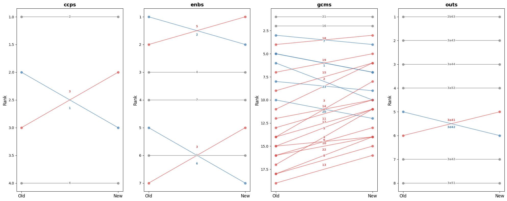

I’ve remapped all $`current_res` reports, so I can compare mappings for
all of them. What kind of questions could we ask? - “does GCM 23
systematically get lower rank on average?”

##### 🤖Reply🤖<!-- SOLVEIT_SEPARATOR_7f3a9b2c -->

🧠🧠🧠🧠🧠🧠🧠🧠🧠🧠🧠🧠🧠🧠

Great starting point! Here are some useful directions:

**Systematic bias / directional shifts** - Does a specific theme
(e.g. GCM 23) consistently score lower / rank lower across reports? -
Which themes show the most consistent direction of change (always up or
always down)? - Are score drops concentrated in specific mapping types
(e.g. `gcms` more affected than `ccps`)?

**Magnitude of change** - Which themes have the largest average
`|score_diff|` across reports? - What’s the distribution of `pct_change`
— are most changes small noise or substantial? - Are there outlier
reports where changes are much larger than average?

**Rank stability** - Which themes are most rank-stable (low variance in
`rank_diff`) across reports? - How often does the top-ranked theme
change between old and new?

**Report-level** - Which reports changed the most overall (e.g. mean
`|score_diff|` per report)? - Are there reports where the set of “high
relevance” themes (e.g. score \> 0.5) changed substantially?

**Cross-mapping consistency** - Do reports that show a big drop in a GCM
theme also show a drop in the related SRF output?

------------------------------------------------------------------------

Your GCM 23 question is a good one to start with — it’s essentially:
*across all reports, what is the mean `rank_diff` for GCM 23?* Shall I
write that up, along with a small summary table for all themes?

``` python
df = compare_mappings(current_res[0], DATA_PATH/'results', LATEST_TAG_PATH).pipe(add_diffs).pipe(add_ranks).pipe(add_pct_change)
df.head()
```

<div>
<style scoped>
    .dataframe tbody tr th:only-of-type {
        vertical-align: middle;
    }
&#10;    .dataframe tbody tr th {
        vertical-align: top;
    }
&#10;    .dataframe thead th {
        text-align: right;
    }
</style>

<table class="dataframe" data-quarto-postprocess="true" data-border="1">
<thead>
<tr style="text-align: right;">
<th data-quarto-table-cell-role="th"></th>
<th data-quarto-table-cell-role="th">mapping_type</th>
<th data-quarto-table-cell-role="th">theme_id</th>
<th data-quarto-table-cell-role="th">theme_title_x</th>
<th data-quarto-table-cell-role="th">score_old</th>
<th data-quarto-table-cell-role="th">theme_title_y</th>
<th data-quarto-table-cell-role="th">score_new</th>
<th data-quarto-table-cell-role="th">score_diff</th>
<th data-quarto-table-cell-role="th">is_new</th>
<th data-quarto-table-cell-role="th">is_dropped</th>
<th data-quarto-table-cell-role="th">rank_old</th>
<th data-quarto-table-cell-role="th">rank_new</th>
<th data-quarto-table-cell-role="th">rank_diff</th>
<th data-quarto-table-cell-role="th">pct_change</th>
</tr>
</thead>
<tbody>
<tr>
<td data-quarto-table-cell-role="th">0</td>
<td>ccps</td>
<td>1</td>
<td>Integrity, Transparency and Accountability</td>
<td>0.45</td>
<td>Integrity, Transparency and Accountability</td>
<td>0.38</td>
<td>-0.07</td>
<td>False</td>
<td>False</td>
<td>2.0</td>
<td>3.0</td>
<td>-1.0</td>
<td>-15.555556</td>
</tr>
<tr>
<td data-quarto-table-cell-role="th">1</td>
<td>ccps</td>
<td>2</td>
<td>Equality, Diversity &amp; Inclusion</td>
<td>0.72</td>
<td>Equality, Diversity &amp; Inclusion</td>
<td>0.66</td>
<td>-0.06</td>
<td>False</td>
<td>False</td>
<td>1.0</td>
<td>1.0</td>
<td>0.0</td>
<td>-8.333333</td>
</tr>
<tr>
<td data-quarto-table-cell-role="th">2</td>
<td>ccps</td>
<td>3</td>
<td>Protection-centred</td>
<td>0.38</td>
<td>Protection-centred</td>
<td>0.42</td>
<td>0.04</td>
<td>False</td>
<td>False</td>
<td>3.0</td>
<td>2.0</td>
<td>1.0</td>
<td>10.526316</td>
</tr>
<tr>
<td data-quarto-table-cell-role="th">3</td>
<td>ccps</td>
<td>4</td>
<td>Environmental Sustainability</td>
<td>0.12</td>
<td>Environmental Sustainability</td>
<td>0.05</td>
<td>-0.07</td>
<td>False</td>
<td>False</td>
<td>4.0</td>
<td>4.0</td>
<td>0.0</td>
<td>-58.333333</td>
</tr>
<tr>
<td data-quarto-table-cell-role="th">4</td>
<td>enbs</td>
<td>1</td>
<td>Workforce</td>
<td>0.28</td>
<td>Workforce</td>
<td>0.15</td>
<td>-0.13</td>
<td>False</td>
<td>False</td>
<td>6.0</td>
<td>6.0</td>
<td>0.0</td>
<td>-46.428571</td>
</tr>
</tbody>
</table>

</div>

``` python
dfs = pd.concat([
    compare_mappings(
        d, 
        DATA_PATH/'results', 
        LATEST_TAG_PATH).pipe(add_diffs).pipe(add_ranks).pipe(add_pct_change) 
    for d in current_res])
```

``` python
dfs = pd.concat([
    compare_mappings(d, DATA_PATH/'results', LATEST_TAG_PATH).pipe(add_diffs).pipe(add_ranks).pipe(add_pct_change)
    for d in current_res], ignore_index=True)
```

``` python
dfs.head()
```

<div>
<style scoped>
    .dataframe tbody tr th:only-of-type {
        vertical-align: middle;
    }
&#10;    .dataframe tbody tr th {
        vertical-align: top;
    }
&#10;    .dataframe thead th {
        text-align: right;
    }
</style>

<table class="dataframe" data-quarto-postprocess="true" data-border="1">
<thead>
<tr style="text-align: right;">
<th data-quarto-table-cell-role="th"></th>
<th data-quarto-table-cell-role="th">mapping_type</th>
<th data-quarto-table-cell-role="th">theme_id</th>
<th data-quarto-table-cell-role="th">theme_title_x</th>
<th data-quarto-table-cell-role="th">score_old</th>
<th data-quarto-table-cell-role="th">theme_title_y</th>
<th data-quarto-table-cell-role="th">score_new</th>
<th data-quarto-table-cell-role="th">score_diff</th>
<th data-quarto-table-cell-role="th">is_new</th>
<th data-quarto-table-cell-role="th">is_dropped</th>
<th data-quarto-table-cell-role="th">rank_old</th>
<th data-quarto-table-cell-role="th">rank_new</th>
<th data-quarto-table-cell-role="th">rank_diff</th>
<th data-quarto-table-cell-role="th">pct_change</th>
</tr>
</thead>
<tbody>
<tr>
<td data-quarto-table-cell-role="th">0</td>
<td>ccps</td>
<td>1</td>
<td>Integrity, Transparency and Accountability</td>
<td>0.45</td>
<td>Integrity, Transparency and Accountability</td>
<td>0.38</td>
<td>-0.07</td>
<td>False</td>
<td>False</td>
<td>2.0</td>
<td>3.0</td>
<td>-1.0</td>
<td>-15.555556</td>
</tr>
<tr>
<td data-quarto-table-cell-role="th">1</td>
<td>ccps</td>
<td>2</td>
<td>Equality, Diversity &amp; Inclusion</td>
<td>0.72</td>
<td>Equality, Diversity &amp; Inclusion</td>
<td>0.66</td>
<td>-0.06</td>
<td>False</td>
<td>False</td>
<td>1.0</td>
<td>1.0</td>
<td>0.0</td>
<td>-8.333333</td>
</tr>
<tr>
<td data-quarto-table-cell-role="th">2</td>
<td>ccps</td>
<td>3</td>
<td>Protection-centred</td>
<td>0.38</td>
<td>Protection-centred</td>
<td>0.42</td>
<td>0.04</td>
<td>False</td>
<td>False</td>
<td>3.0</td>
<td>2.0</td>
<td>1.0</td>
<td>10.526316</td>
</tr>
<tr>
<td data-quarto-table-cell-role="th">3</td>
<td>ccps</td>
<td>4</td>
<td>Environmental Sustainability</td>
<td>0.12</td>
<td>Environmental Sustainability</td>
<td>0.05</td>
<td>-0.07</td>
<td>False</td>
<td>False</td>
<td>4.0</td>
<td>4.0</td>
<td>0.0</td>
<td>-58.333333</td>
</tr>
<tr>
<td data-quarto-table-cell-role="th">4</td>
<td>enbs</td>
<td>1</td>
<td>Workforce</td>
<td>0.28</td>
<td>Workforce</td>
<td>0.15</td>
<td>-0.13</td>
<td>False</td>
<td>False</td>
<td>6.0</td>
<td>6.0</td>
<td>0.0</td>
<td>-46.428571</td>
</tr>
</tbody>
</table>

</div>

``` python
dfs[(dfs.mapping_type=='gcms') & (dfs.theme_id=='23')]['pct_change'].describe()
```

    count    20.000000
    mean    -65.511802
    std      23.376751
    min     -86.956522
    25%     -79.801829
    50%     -74.264706
    75%     -61.572967
    max     -15.294118
    Name: pct_change, dtype: float64

``` python
dfs[(dfs.mapping_type=='gcms') & (dfs.theme_id=='23')].score_diff.describe()
```

    count    20.000000
    mean     -0.435000
    std       0.188582
    min      -0.800000
    25%      -0.572500
    50%      -0.440000
    75%      -0.345000
    max      -0.130000
    Name: score_diff, dtype: float64

### Scores diff

``` python
dfs[(dfs.mapping_type=='gcms') & (dfs.theme_id=='23')].score_diff.hist()
```


``` python
import seaborn as sns, matplotlib.pyplot as plt

gcm_dfs = dfs[dfs.mapping_type=='gcms'].copy()
gcm_dfs['theme_id'] = gcm_dfs['theme_id'].astype(int)
gcm_dfs = gcm_dfs.sort_values('theme_id')

f, ax = plt.subplots(figsize=(14, 6))
sns.violinplot(data=gcm_dfs, x='theme_id', y='score_diff', hue='theme_id', legend=False, bw_adjust=.5, cut=1, linewidth=1, palette="Set3")

ax.axhline(0, color='red', linewidth=0.8, linestyle='--')
ax.set(xlabel='GCM objective', ylabel='score diff (new − old)')
sns.despine(left=True, bottom=True)
plt.tight_layout()
```

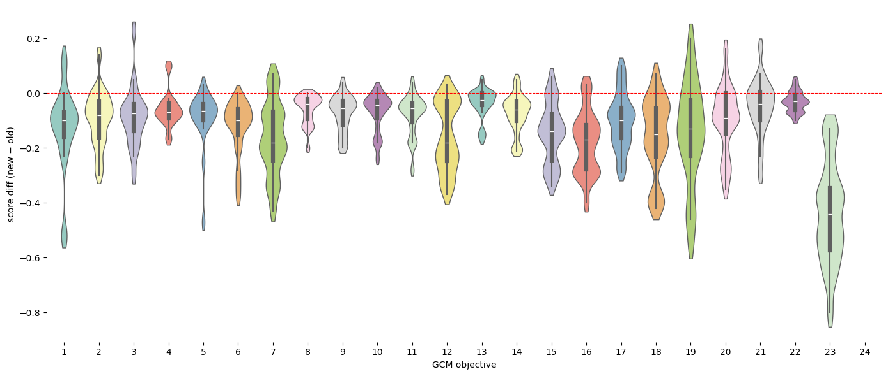

``` python
def plot_score_diffs(dfs, mapping_type, xlabel='Theme', col='score_diff'):
    "Violin plot of score diffs (new − old) per theme for a given mapping type"
    d = dfs[dfs.mapping_type==mapping_type].copy()
    d['theme_id'] = d['theme_id'].astype(int)
    d = d.sort_values('theme_id')
    f, ax = plt.subplots(figsize=(14, 6))
    sns.violinplot(data=d, x='theme_id', y=col, hue='theme_id', legend=False, bw_adjust=.5, cut=1, linewidth=1, palette="Set3")
    ax.axhline(0, color='red', linewidth=0.8, linestyle='--')
    ax.set(xlabel=xlabel, ylabel=f'{col} (new − old)', title=mapping_type)
    sns.despine(left=True, bottom=True)
    plt.tight_layout()
```

``` python
plot_score_diffs(dfs, 'gcms', 'GCM objective')
```


``` python
plot_score_diffs(dfs, 'gcms', 'GCM objective')
```


``` python
plot_score_diffs(dfs, 'enbs', 'SRF Enablers')
```


``` python
plot_score_diffs(dfs, 'ccps', 'SRF Cross-Cutting Priorities')
```

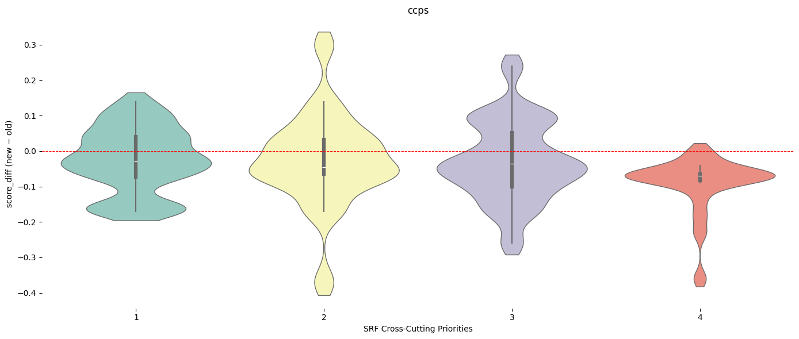

``` python
dfs.columns
```

    Index(['mapping_type', 'theme_id', 'theme_title_x', 'score_old',
           'theme_title_y', 'score_new', 'score_diff', 'is_new', 'is_dropped',
           'rank_old', 'rank_new', 'rank_diff', 'pct_change'],
          dtype='str')

### Ranks diff

``` python
plot_score_diffs(dfs, 'gcms', 'GCM Objectives', col='rank_diff')
```

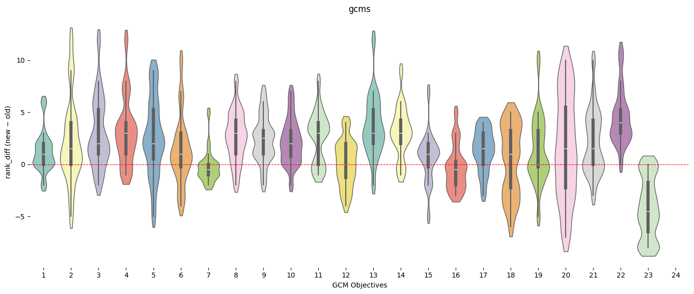

``` python
plot_score_diffs(dfs, 'enbs', 'SRF Enablers', col='rank_diff')
```

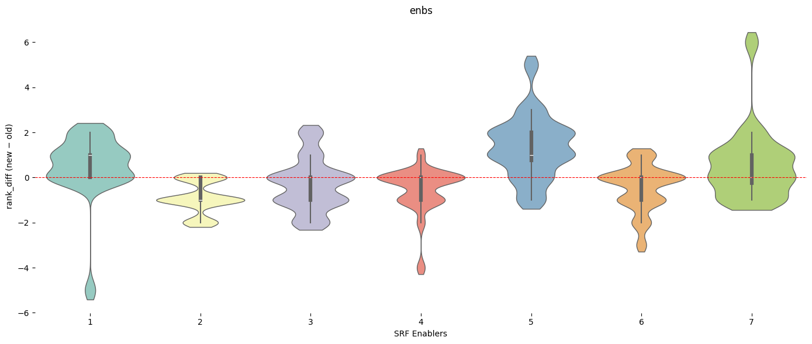

``` python
plot_score_diffs(dfs, 'ccps', 'SRF Cross-Cutting Priorities', col='rank_diff')
```


``` python
plot_score_diffs(dfs[dfs.rank_old <= 3], 'gcms', 'GCM Objectives', col='rank_diff')
```

Let’s try to answer this question: How often does the top-ranked theme
change between old and new?

##### 🤖Reply🤖<!-- SOLVEIT_SEPARATOR_7f3a9b2c -->

We need to track, per report and mapping type, whether the top-ranked
theme changed. We’ll need an `eval_id` column first — let me rebuild
`dfs` with that, then answer the question.

``` python
dfs = pd.concat([
    compare_mappings(d, DATA_PATH/'results', LATEST_TAG_PATH).pipe(add_diffs).pipe(add_ranks).pipe(add_pct_change).assign(eval_id=d)
    for d in current_res], ignore_index=True)
```

Then:

``` python
def top_theme(df, rank_col): return df[df[rank_col]==1].set_index(['eval_id','mapping_type'])['theme_id']

top_old = top_theme(dfs, 'rank_old')
top_new = top_theme(dfs, 'rank_new')
top_changed = (top_old != top_new).rename('changed')
top_changed.groupby('mapping_type').mean().mul(100).round(1).rename('% reports where top theme changed')
```

``` python
dfs = pd.concat([
    compare_mappings(d, DATA_PATH/'results', LATEST_TAG_PATH).pipe(add_diffs).pipe(add_ranks).pipe(add_pct_change).assign(eval_id=d)
    for d in current_res], ignore_index=True)
```

``` python
def top_theme(df, rank_col): return df[df[rank_col]==1].set_index(['eval_id','mapping_type'])['theme_id']

top_old = top_theme(dfs, 'rank_old')
top_new = top_theme(dfs, 'rank_new')
top_changed = (top_old != top_new).rename('changed')
top_changed.groupby('mapping_type').mean().mul(100).round(1).rename('% reports where top theme changed')
```

    mapping_type
    ccps    20.0
    enbs    55.0
    gcms    25.0
    outs    20.0
    Name: % reports where top theme changed, dtype: float64

### Reports and mapping type where top ranked theme changed

``` python
print(top_changed[top_changed].reset_index()[['eval_id','mapping_type']].sort_values('mapping_type'))
```

                                 eval_id mapping_type
    20  4c04ec0d3e651f7616190c6fc2dcfc18         ccps
    5   22cac1c000836253adc445993e101560         ccps
    18  891448b7a4bf12763ea0579dd67e289d         ccps
    15  dba9eb1220368d28682d8531108e767d         ccps
    0   8dd2261100ff5d714e73b411eed043d5         enbs
    1   1d7e6d2d445145d1d350b48b72b36681         enbs
    2   760568a15e144bcfb88dbbd50247dc51         enbs
    21  e21305a89aeb76fafa8f4270392d463a         enbs
    17  06fd0949dc874f388686461c19d2669c         enbs
    8   316c47c9dc19c820f3217434d4b93b28         enbs
    16  a493c447cff3e03ca94024335d5c5c7a         enbs
    10  0d4309b702e00faac631be8d609934ce         enbs
    12  e8d9427f4a9094f68e17307faa567d8b         enbs
    13  75bad4665ed458cce78740e3d86f72d0         enbs
    14  f409b3f9a0671ec69a8591c425a45c1d         enbs
    11  0d4309b702e00faac631be8d609934ce         gcms
    9   316c47c9dc19c820f3217434d4b93b28         gcms
    6   22cac1c000836253adc445993e101560         gcms
    3   760568a15e144bcfb88dbbd50247dc51         gcms
    22  e21305a89aeb76fafa8f4270392d463a         gcms
    7   22cac1c000836253adc445993e101560         outs
    19  891448b7a4bf12763ea0579dd67e289d         outs
    4   760568a15e144bcfb88dbbd50247dc51         outs
    23  e21305a89aeb76fafa8f4270392d463a         outs

``` python
def plot_rank_changes(df):
    "Slope chart of rank changes (old → new) per mapping type, coloured by direction"
    fig, axes = plt.subplots(1, df.mapping_type.nunique(), figsize=(20, 8), sharey=False)
    for ax, (mt, grp) in zip(axes, df.groupby('mapping_type')):
        for _, row in grp.iterrows():
            color = 'steelblue' if row.rank_diff < 0 else '#d9534f' if row.rank_diff > 0 else 'grey'
            ax.plot([0, 1], [row.rank_old, row.rank_new], marker='o', color=color, alpha=0.7)
            ax.text(0.5, (row.rank_old + row.rank_new) / 2 + (-0.15 * row.rank_diff), row.theme_id,
                    ha='center', va='center', fontsize=8, fontweight='bold', color=color,
                    path_effects=[withStroke(linewidth=3, foreground='white')])
        ax.set_xticks([0, 1])
        ax.set_xticklabels(['Old', 'New'], fontsize=12)
        ax.invert_yaxis()
        ax.set_title(mt, fontsize=14, fontweight='bold')
        ax.set_ylabel('Rank', fontsize=12)
    plt.tight_layout()
    plt.show()
```

``` python
#dfs[dfs.eval_id == '0d4309b702e00faac631be8d609934ce']
```

``` python
plot_rank_changes(dfs[dfs.eval_id == '0d4309b702e00faac631be8d609934ce'])
```


``` python
def info_eval(evl_id):
    return first([o for o in evals if o.id == evl_id])
```

``` python
info_eval('0d4309b702e00faac631be8d609934ce')
```

### Fifth Evaluation of the IOM Development Fund

**Year:** 2025 | **Organization:** IOM | **Countries:** Worldwide

**Documents:** 5 available\
**ID:** `0d4309b702e00faac631be8d609934ce`

``` python
def plot_score_diffs_bar(df):
    "Bar chart of score diffs (new − old) per theme, coloured by direction, faceted by mapping type"
    fig, axes = plt.subplots(1, df.mapping_type.nunique(), figsize=(20, 8), sharey=False)
    for ax, (mt, grp) in zip(axes, df.groupby('mapping_type')):
        ax.barh(grp.theme_id.astype(str), grp.score_diff, color=['#d9534f' if x > 0 else 'steelblue' for x in grp.score_diff])
        ax.axvline(0, color='black', linewidth=0.8)
        ax.set(title=mt, xlabel='Score diff', ylabel='Theme ID')
    plt.tight_layout()
    plt.show()
```

``` python
plot_score_diffs_bar(dfs[dfs.eval_id == '0d4309b702e00faac631be8d609934ce'])
```


``` python
def plot_scores_comparison(df, eval_id, mapping_type):
    "Grouped bar chart of old vs new scores per theme for a given report and mapping type"
    title = info_eval(eval_id).meta['Title']
    title_pretty = title if len(title) < 80 else title[:80] + '...'
    d = df[(df.eval_id==eval_id) & (df.mapping_type==mapping_type)].copy()
    d['theme_id'] = d['theme_id'].astype(int)
    d = d.sort_values('theme_id')
    x = range(len(d))
    f, ax = plt.subplots(figsize=(14, 5))
    ax.bar([i-0.2 for i in x], d.score_old, width=0.4, label='old', color='steelblue', alpha=0.8)
    ax.bar([i+0.2 for i in x], d.score_new, width=0.4, label='new', color='#d9534f', alpha=0.8)
    ax.set_xticks(list(x))
    ax.set_xticklabels(d.theme_id)
    ax.set(xlabel='Theme ID', ylabel='Score', title=f'{mapping_type} — {title_pretty}')
    ax.legend()
    plt.tight_layout()
```

``` python
plot_scores_comparison(dfs, '316c47c9dc19c820f3217434d4b93b28', 'gcms')
```


``` python
plot_scores_comparison(dfs, '316c47c9dc19c820f3217434d4b93b28', 'enbs')
```


``` python
df_top_changed = top_changed[top_changed].reset_index()[['eval_id','mapping_type']]
```

``` python
for id_ in df_top_changed[df_top_changed.mapping_type == 'gcms'].eval_id:
    plot_scores_comparison(dfs, id_, 'gcms')
```


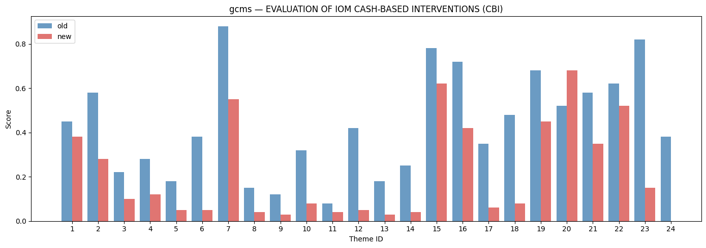


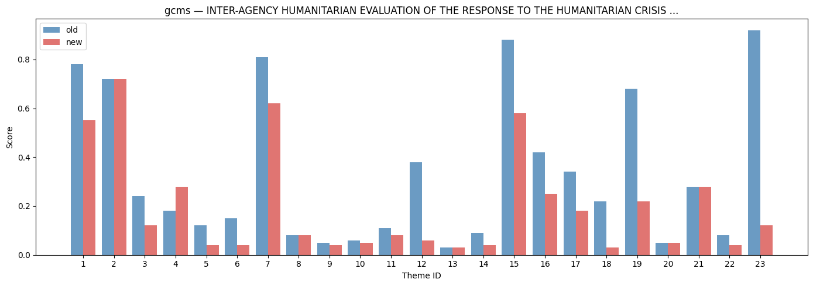

``` python
for id_ in df_top_changed[df_top_changed.mapping_type == 'enbs'].eval_id:
    plot_scores_comparison(dfs, id_, 'enbs')
```

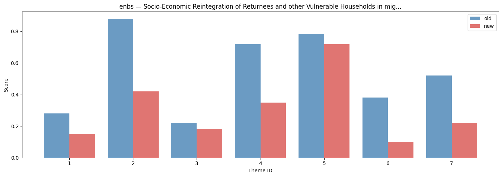

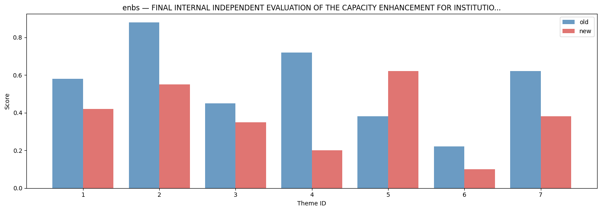


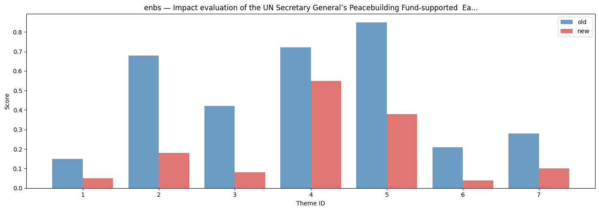

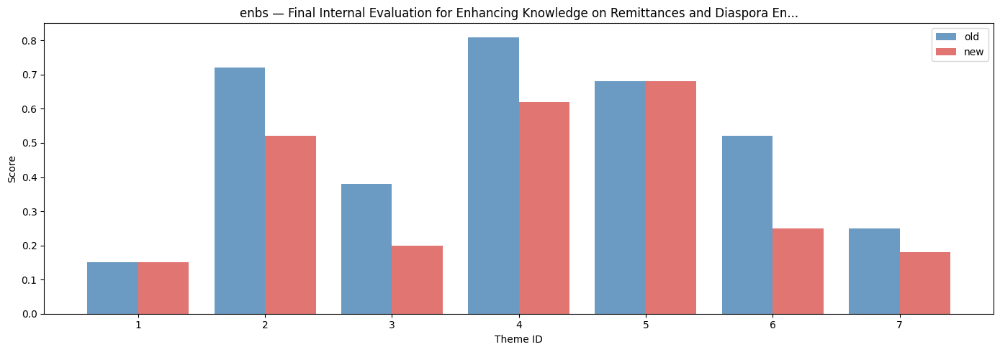

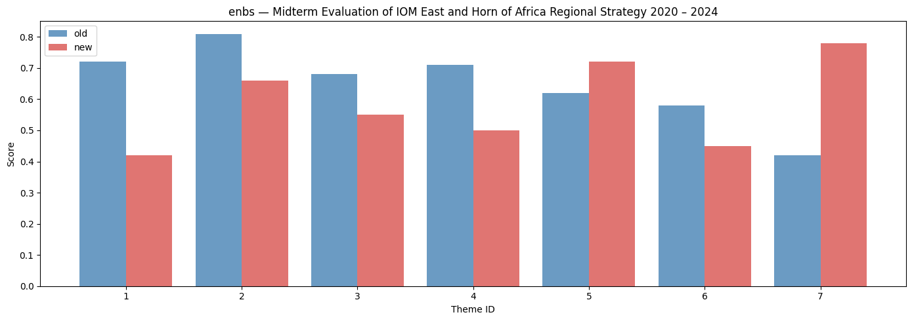

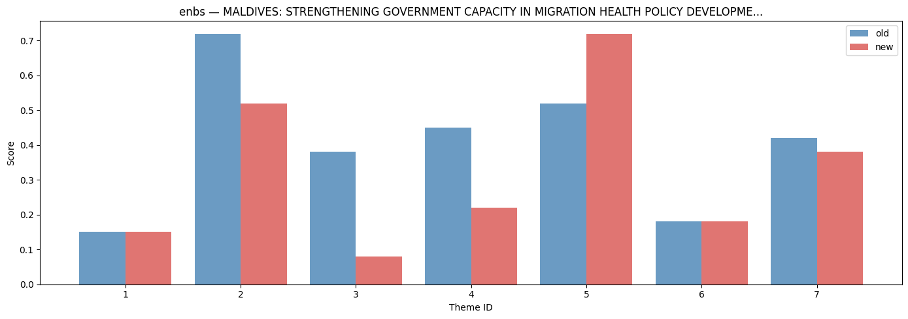


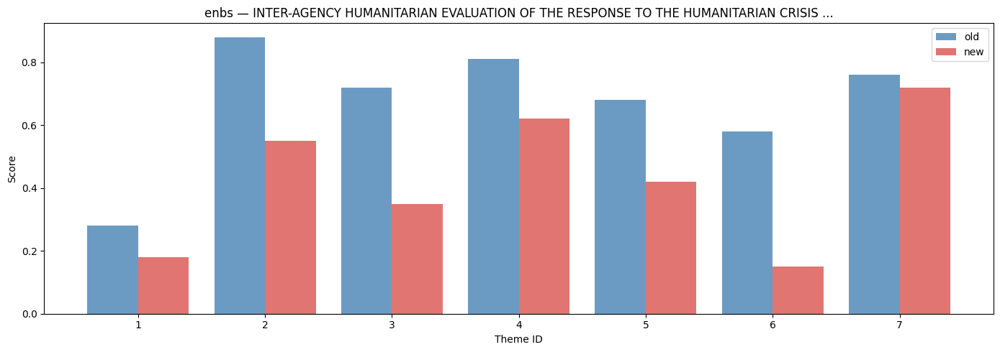

``` python
for id_ in df_top_changed[df_top_changed.mapping_type == 'ccps'].eval_id:
    plot_scores_comparison(dfs, id_, 'ccps')
```

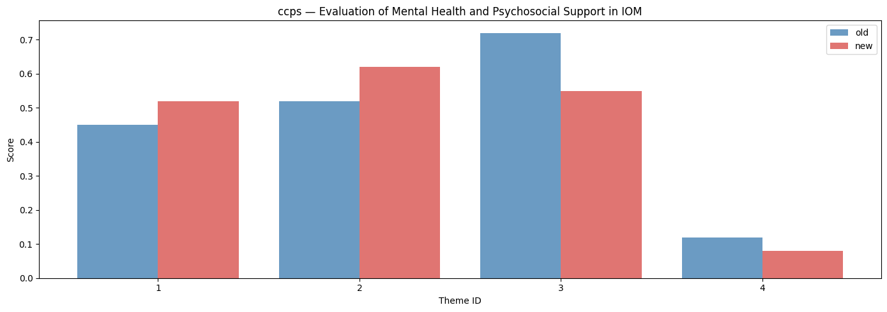


